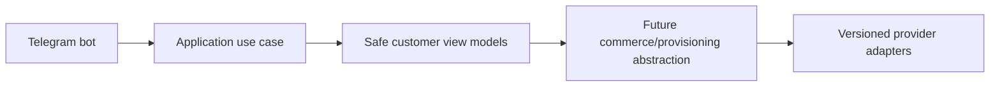

# VPN-SALE Commerce Platform

VPN-SALE is a production-grade, multi-channel subscription commerce platform for legitimate network-access services. Milestone 0 establishes architecture, documentation, local infrastructure, minimal application shells, and automated checks only; it intentionally does not implement real payments, panel provisioning, wallet accounting, or production authentication.

## Repository structure

- `apps/api` — FastAPI backend shell with health, readiness, version, and metrics endpoints.
- `apps/telegram-bot` — aiogram-ready Telegram bot shell for local polling and future webhooks.
- `apps/worker` — background worker shell for scheduled and queued jobs.
- `apps/customer-web`, `apps/admin-web`, `apps/reseller-web` — Next.js shells sharing design tokens and API client architecture.
- `packages/domain` — framework-independent domain contracts, state machines, and value objects.
- `packages/panel-adapters` — panel provider contracts and fake provider scaffolding only.
- `packages/payment-adapters` — payment provider contracts and fake provider scaffolding only.
- `packages/shared-typescript` — shared frontend API client and types.
- `packages/ui` — shared design tokens and UI primitives.
- `infra` — Docker Compose, reverse proxy, monitoring, backup, and deployment scaffolds.
- `docs` — product, architecture, security, operations, and milestone documentation.

## Initial setup

```bash
cp .env.example .env
python -m venv .venv
. .venv/bin/activate
python --version
pip install --upgrade pip
pip install -r requirements-dev.txt
npm install
```

Python 3.12 is the target runtime. If your machine defaults to another Python version, create the virtual environment with a Python 3.12 executable, for example `python3.12 -m venv .venv`.

## Database and cache startup

```bash
docker compose config
docker compose up -d postgres redis
```

## Migrations

```bash
. .venv/bin/activate
alembic -c apps/api/alembic.ini upgrade head
alembic -c apps/api/alembic.ini downgrade base
alembic -c apps/api/alembic.ini upgrade head
```

The initial Milestone 0 migration is intentionally safe and schema-neutral; later milestones add reviewed schema changes.

## Starting applications

Start the core API and reverse proxy:

```bash
docker compose up --build api reverse-proxy
```

Optional development profiles are disabled by default so they do not require future credentials:

```bash
docker compose --profile ops up --build worker
docker compose --profile telegram up --build telegram-bot
docker compose --profile web up --build customer-web admin-web reseller-web
```

Local endpoints:

```bash
curl http://localhost:8000/health
curl http://localhost:8000/ready
curl http://localhost:8000/version
curl http://localhost:8000/metrics
curl http://localhost:8080/health
```

## Running checks

```bash
. .venv/bin/activate
ruff format --check .
ruff check .
pyright
pytest
npm run lint
npm run typecheck
npm run test
npm run build
docker compose config
```

## Stopping and cleaning the environment

```bash
docker compose down
docker compose down --volumes --remove-orphans
```

Only use the second command when you intentionally want to delete local PostgreSQL and Redis development data.


## GitHub-native verification and Codespaces

Milestone 0 verification is designed to run in GitHub rather than requiring a developer's local computer. See `docs/GITHUB_DEVELOPMENT.md` for full browser-based instructions.

Authoritative CI workflow:

```bash
.github/workflows/verify.yml
```

Reusable verification scripts:

```bash
scripts/bootstrap-dev.sh
scripts/verify-backend.sh
scripts/verify-frontend.sh
scripts/verify-docker.sh
scripts/verify-all.sh
scripts/security-scan.sh
scripts/test-security-scan.sh
```

Open a Codespace from GitHub with **Code > Codespaces > Create codespace on current branch**. The dev container installs Python 3.12, Node.js 22, npm, Docker-in-Docker, GitHub CLI, curl, jq, PostgreSQL client, and Redis client. It runs `scripts/bootstrap-dev.sh` after creation.

The repository currently supports a temporary no-lockfile npm path. When GitHub Actions must use `npm install` because `package-lock.json` is absent, it uploads the generated lockfile as the `generated-package-lock` artifact without committing or pushing it. The first successful Codespaces bootstrap may also generate `package-lock.json`; commit it with:

```bash
git add package-lock.json
git commit -m "Add reproducible frontend dependency lockfile"
git push
```

## Milestone 0 boundaries

Implemented now: documentation, monorepo foundation, Docker Compose, PostgreSQL/Redis services, API/bot/worker/web shells, environment validation, logging, checks, smoke tests, CI, and fake provider interfaces.

Not implemented now: real panel calls, payment processing, wallet accounting, subscription creation, production authentication, real domains, production secrets, or customer data.

## Security baseline

Never commit panel URLs, usernames, passwords, API keys, cookies, real UUIDs, customer subscription links, production domains, or provider credentials. `.env.example` contains placeholders only.

Frontend dependency security is part of Milestone 0 verification. CI installs from `package-lock.json` with `npm ci` when the lockfile exists and runs `npm audit --audit-level=high`; critical and high advisories fail CI, while any non-blocking moderate advisory must be documented in `docs/SECURITY.md`.

## Milestone 1A identity foundation

Milestone 1A adds backend-only identity and access-control foundations: domain entities, account status transitions, identity/RBAC/session/audit schema, repository interfaces and SQLAlchemy implementations, Argon2id password hashing, opaque token hashing, and key-versioned encrypted-secret primitives. It intentionally does not add login routes, Telegram auth verification, MFA flows, frontend authentication pages, products, wallets, orders, payments, panel integrations, provisioning, or subscriptions.

## Milestone 1B-A administrator authentication

After migrations, bootstrap the first Super Admin explicitly:

```bash
python -m platform_api.cli bootstrap-admin --email admin@example.com
```

The command prompts without echoing the password. Protected automation may use `--password-stdin`; passwords are never accepted as normal command-line arguments. Admin authentication endpoints are under `/api/v1/admin/auth/...` and provide password login, MFA challenge verification, refresh rotation, logout/session inspection, and TOTP enrollment foundations.

## Milestone 1B-B admin security UI

The admin web app now contains focused authentication and security routes under `/auth/...`, `/security/...`, and `/states/...`. The frontend keeps access tokens in memory, uses HttpOnly refresh cookies with CSRF headers, and connects to `/api/v1/admin/auth/...` for login, MFA, refresh, profile, sessions, password change, recovery codes, and MFA settings.

## Milestone 1C-A customer authentication note
Customer Telegram Mini App authentication now verifies raw init data, links Telegram identities to internal customers, issues isolated customer access credentials, rotates opaque refresh-cookie sessions, enforces CSRF on cookie-authenticated state changes, rate limits sensitive operations, and records sanitized audit/security events. Commerce and customer UI remain out of scope.
## Milestone 1C-B1 customer Mini App UI
The customer web app now provides a Persian RTL Telegram Mini App shell with safe browser fallback, customer profile, session management, security information, memory-only access tokens, HttpOnly refresh-cookie integration, CSRF headers, single-flight refresh, and deterministic frontend checks. Commerce and Telegram bot `/start` remain out of scope.

## Milestone 1C-B2 Telegram bot foundation
The Telegram bot foundation supports explicit disabled, polling and secure webhook modes. Disabled mode is the default for CI and Docker verification and performs no Telegram network calls. Polling is for local development only. Webhook mode requires an HTTPS base URL, an environment-only secret token validated with constant-time comparison, request-size limits, allowed update configuration and update-id idempotency.

The `/start` flow normalizes trusted Bot API identity fields and calls a typed `RegisterOrUpdateTelegramBotUser` application use case. It does not create a browser session; Mini App authentication continues to verify raw Telegram initData through the existing backend flow. Usernames are never identity keys, and internal user UUIDs remain independent from Telegram user IDs.

The customer menu is an extensible registry with Persian defaults and English fallback preparation. Current working destinations are Mini App home, profile, sessions/security, help, language and privacy/about. Future commerce modules must register commands and menu items through feature modules and must not place product, pricing, payment or provisioning rules inside bot handlers.

Mini App URLs are generated by a centralized allowlisted builder. Tokens, initData, Telegram IDs, usernames, emails and internal UUIDs are never placed in URLs. Callback data is compact, typed and versioned. Logs and metrics use low-cardinality outcome fields and forbid raw updates, message text, identity fields and secrets.



## Milestone 1D-A identity administration backend
Milestone 1D-A adds backend-only administrator, role/permission, customer, audit-log, and security-event management APIs under `/api/v1/admin/management/...`. Authorization is permission-based and resolved from the database on every protected request so role and permission changes take effect without waiting for token expiry. Administrator invitation returns the plaintext invitation token once and stores only its hash. The management frontend, commerce, provider, wallet, payment, provisioning, analytics, reseller, and support features remain out of scope.

## Milestone 1D-B identity administration frontend
The admin web app now includes a Persian RTL management console under `/management` for identity and security operations backed by the Milestone 1D-A management APIs. It covers administrators, one-time invitations, roles, permissions, customers, administrator/customer sessions, audit logs, and security events. Navigation and actions are permission-aware, but the backend remains authoritative for every authorization check. Invitation plaintext is displayed once from ephemeral component memory only and is not stored in browser storage or URLs. Commerce, provider, wallet, payment, provisioning, reseller, and analytics features remain out of scope.

## Milestone 2-A catalog and pricing backend
Milestone 2-A adds backend catalog categories/products, immutable product versions, fixed/custom plan option snapshots, provider-neutral fulfillment requirements, versioned integer-rial pricing rules, customer price quotes with expiration/idempotency, and permission-protected admin catalog APIs. It intentionally does not add wallet, orders, payments, providers, provisioning or catalog frontend.

## Milestone 2-B1 administrator catalog console

The admin web app now includes a Persian RTL catalog-management console at `/catalog`. It covers category management, product identity, draft product-version editing, fixed and customizable plan editors, provider-neutral options and fulfillment requirements, price lists, structured pricing rules and tiers, administrative pricing preview, publication review, and safe catalog error states. It uses the Milestone 2-A admin catalog APIs and intentionally does not add customer storefront, checkout, wallet, order, payment, provider, server, allocation, provisioning, subscription-link, QR, reseller, or financial analytics functionality.

## Milestone 2-B2 customer storefront
The customer Mini App now includes a catalog storefront for real backend categories/products, fixed-plan selection, custom-plan building, non-persisted server price preview, immutable quote creation/detail, quote expiration/recalculation and bounded plan comparison. It does not implement checkout, wallet, orders, payments, providers, provisioning or subscription delivery.

## Milestone 3-A1 wallet and ledger backend
Milestone 3-A1 adds backend-only wallet/accounting foundations: one IRR wallet per customer, immutable balanced double-entry journal entries, integer-rial balance projections, buckets, expiring credit lots, reservations, administrative adjustments/reversals, freeze controls, wallet policy, customer wallet read APIs, administrator wallet/ledger APIs, and reconciliation. It intentionally does not add wallet frontend pages, checkout, orders, invoices, payment gateways, provider integrations, provisioning, subscriptions, QR/config delivery, withdrawals, coupons, referrals, or financial dashboards.

## Milestone 3-A2A customer wallet interface
Milestone 3-A2A adds customer-web wallet routes for `/wallet`, `/wallet/transactions`, transaction detail, `/wallet/credits`, `/wallet/reservations`, and `/wallet/policy`. The interface consumes the real Milestone 3-A1 customer wallet APIs, displays posted/reserved/available integer-rial balances with explicitly labelled derived toman text, maps cash and non-cash buckets safely, shows expiring credits, immutable transaction history, read-only reservations, wallet status, and future top-up policy. It intentionally adds no wallet charging, payment, checkout, orders, invoices, providers, provisioning, subscriptions, or admin financial console.

## Milestone 3-A2B administrator financial console
The admin web app now includes management routes for wallet discovery, wallet detail, immutable ledger inspection, manual credit/debit workflows, reversals, wallet freeze/unfreeze, credit lots, reservations, wallet policy, and reconciliation. The UI consumes the Milestone 3-A1 financial APIs, keeps rial as canonical money, labels derived toman values, stores no financial responses in browser storage, and adds no checkout, order, payment, provider, provisioning, subscription, or analytics functionality.

## Milestone 3-B1 order and checkout backend
Milestone 3-B1 adds backend-only order, checkout and invoice foundations. A customer can convert one active quote into one wallet-funded order, reserve wallet funds, confirm capture through the double-entry ledger, receive an immutable invoice snapshot, cancel before fulfillment with reservation release or compensating refund, and expose normalized ready-for-fulfillment outbox events. No customer/admin order UI, external payment gateway, provider allocation, service creation, subscriptions or QR/config delivery is implemented.

## Milestone 3-B2A customer checkout interface
Customer-web now exposes wallet-funded commerce routes for quote checkout, order history/detail/timeline and immutable invoice history/detail. Checkout references only server-issued quote references, displays backend quote/order/invoice snapshots, uses `WALLET` as the only working method, keeps idempotency and commerce responses memory-only, and never sends authoritative price fields or wallet balances. Successful confirmation displays paid invoice/order state and `READY_FOR_FULFILLMENT` as queued for future service creation, not delivered service. Eligible cancellation is confirmed through backend checkout cancellation and refund/reservation-release states are presented as compensating history. Telegram Mini App behavior reuses the existing safe shell; raw initData, auth tokens, CSRF values, references and idempotency values are not persisted in browser storage or URLs.

## Milestone 3-B2B administrator order administration interface
Admin-web now includes `/management/commerce`, order discovery/detail/snapshot/timeline/reconciliation, immutable invoice inspection, checkout-session inspection, wallet-payment and reservation inspection, reviewed administrator cancellation, refund-state presentation and sanitized fulfillment-outbox inspection. The interface consumes real admin commerce APIs, uses permission-aware navigation, keeps order/financial/fulfillment states separate, treats invoices and order snapshots as immutable, and stores no commerce responses, cancellation reasons or idempotency values in browser storage. Backend compatibility additions remain read-only or reviewed-command endpoints and do not add external payments, provider infrastructure, provisioning, subscriptions, QR/configuration delivery or analytics.

### Milestone 4-A1 payment core
The backend includes a provider-neutral payment core foundation with versioned adapter contracts, deterministic fake-adapter tests, payment method registry schema, webhook inbox schema, settlement/refund/reconciliation foundations and customer/admin API shells. It does not include real payment gateways, customer/admin payment UI or VPN provisioning.

## Milestone 4-A2A customer payment interface
Customer-web now exposes customer payment routes for wallet top-up, external order payment, secure payment return, and payment history/detail. The UI consumes the provider-neutral Milestone 4-A1 backend, keeps rial as canonical integer money, labels derived toman display, validates redirect actions, and never treats browser return parameters as proof of payment.

## Milestone 4-A2B1 note
Administrator payment operations are represented in admin-web as a safe operations console for payment methods, intents, attempts, verifications, settlements and webhook inbox records. The console preserves payment immutability, credential boundaries, backend-authoritative authorization, no browser persistence for payment data, sanitized webhook rendering, and no refund/reconciliation-repair or real-gateway scope.


### Milestone 4-A2B2 payment recovery operations
Milestone 4-A2B2 adds production-grade recovery controls around provider-neutral payments: refund eligibility, high-risk two-person refund approval, provider-verified refund attempts, compensating ledger boundaries, typed reconciliation, safe derived-state repair planning, late-settlement cases, unapplied payment liabilities and webhook dead-letter recovery. The implementation remains fake-adapter deterministic and does not add real gateways or direct financial mutation controls. See `docs/milestones/MILESTONE_4_A2B2_PLAN.md`.
