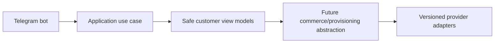

# Architecture

Modular monolith with strict boundaries. Clients call one backend. Domain/application code is independent of frameworks and providers. Critical events use transactional outbox. Idempotency protects payment, wallet, order, provisioning, webhook, refund, and reconciliation operations.

## Milestone 1A identity module boundaries

Identity domain objects live in `packages/domain` without FastAPI, SQLAlchemy, Telegram, Redis, or provider dependencies. Application-facing repository protocols expose domain objects only. SQLAlchemy models under the API package provide persistence mapping and constraints but do not contain business rules. Cryptographic infrastructure is isolated from domain entities so later use cases can depend on interfaces rather than framework routes.

## Milestone 1C-B2 Telegram bot foundation
The Telegram bot foundation supports explicit disabled, polling and secure webhook modes. Disabled mode is the default for CI and Docker verification and performs no Telegram network calls. Polling is for local development only. Webhook mode requires an HTTPS base URL, an environment-only secret token validated with constant-time comparison, request-size limits, allowed update configuration and update-id idempotency.

The `/start` flow normalizes trusted Bot API identity fields and calls a typed `RegisterOrUpdateTelegramBotUser` application use case. It does not create a browser session; Mini App authentication continues to verify raw Telegram initData through the existing backend flow. Usernames are never identity keys, and internal user UUIDs remain independent from Telegram user IDs.

The customer menu is an extensible registry with Persian defaults and English fallback preparation. Current working destinations are Mini App home, profile, sessions/security, help, language and privacy/about. Future commerce modules must register commands and menu items through feature modules and must not place product, pricing, payment or provisioning rules inside bot handlers.

Mini App URLs are generated by a centralized allowlisted builder. Tokens, initData, Telegram IDs, usernames, emails and internal UUIDs are never placed in URLs. Callback data is compact, typed and versioned. Logs and metrics use low-cardinality outcome fields and forbid raw updates, message text, identity fields and secrets.

## Milestone 2-A catalog boundary
Catalog routes depend on auth dependencies, catalog/pricing application code, framework-independent domain objects and repository-backed SQLAlchemy persistence. Pricing never calls Telegram, frontend, wallet, order, payment or provider code. Product definitions contain provider-neutral fulfillment requirements only.

### Alembic historical isolation
Normal Alembic upgrades must not import future feature ORM modules into shared metadata before old revisions run. Autogenerate may load current feature models, but historical revisions must execute against only the schema they owned.

## Milestone 2-B1 catalog administration note

Milestone 2-B1 adds an administrator-only catalog console in `apps/admin-web` that consumes the real Milestone 2-A catalog and pricing APIs. The backend remains authoritative for authorization, lifecycle transitions, publication validation, immutable published versions, price-list overlap, pricing validity, and concurrency conflicts. The frontend keeps access tokens in memory, sends CSRF headers for mutations, avoids storing draft API responses in browser storage, displays machine codes LTR, treats money as integer rial with explicit toman display, uses fixed-day duration labels, and keeps fulfillment requirements provider-neutral. Customer storefront, wallet/order/payment/provider/provisioning work remains out of scope.

## Milestone 2-B2 customer storefront
Customer-web now consumes the real Milestone 2-A catalog APIs for storefront, category, product detail, fixed/custom builder, comparison, non-persisted price preview and immutable quote detail. Business rules and authoritative pricing remain in backend catalog/pricing application and domain code; React modules perform only typed response validation, safe query normalization, usability validation and formatting. Checkout, wallet, order, payment, provider, provisioning and service-delivery modules are still absent.

## Milestone 3-A1 wallet and ledger backend
Wallet accounting is backend-only. API routes authenticate and authorize, then call typed wallet operations that post balanced integer-rial ledger entries and update projections transactionally. Customer wallet reads require customer sessions and expose only customer-facing references; administrator wallet and ledger routes require `wallets.*` or `ledger.*` permissions. Audit/security metadata is sanitized and must not contain raw tokens, idempotency keys, payment details, provider credentials, Telegram initData, or full request bodies. Reconciliation can detect projection mismatches and repair projections without mutating immutable journals or postings. Reservations protect available balance for future checkout but create no order, payment, provider call, or provisioning side effect.

## Milestone 3-A2A customer wallet interface
Customer-web now exposes the read-only customer wallet route family (`/wallet`, `/wallet/transactions`, transaction detail, `/wallet/credits`, `/wallet/reservations`, `/wallet/policy`) backed by the Milestone 3-A1 customer wallet APIs. Balances remain backend-authoritative integer rial values; the browser only validates safe response shape and formats explicitly labelled rial/toman displays. Wallet, auth, CSRF and Telegram initData values remain memory/cookie scoped according to the existing customer authentication model and are not stored in browser storage or URLs. The UI shows frozen/closed wallet states, safe account-status errors, bucket labels, credit expiration, reservations and future top-up policy, while payment, checkout, order, invoice, provider, provisioning and admin financial-console work remain deferred.

## Milestone 3-A2B administrator financial console note
Administrator financial routes under `/management/finance`, `/management/wallets`, and `/management/ledger` use the existing admin authentication architecture with memory-only access tokens, HttpOnly refresh cookies, CSRF on mutations, and backend permission enforcement. Rial remains canonical, derived toman is presentation-only, journal/posting data is read-only, idempotency keys are memory-only, and no wallet or ledger API response is persisted in browser storage. The console intentionally excludes checkout, orders, invoices, payments, provider operations, provisioning, subscriptions, and financial analytics dashboards.

## Milestone 3-B1 order and checkout backend
Order checkout is backend-only and wallet-funded. Customer tokens can create/confirm/cancel their own checkout sessions and read their own orders/invoices. Administrator APIs require `orders.read`, `orders.cancel`, `invoices.read` or `checkout.read`. Commercial snapshots and invoice money are immutable; corrections use cancellation and compensating wallet ledger entries. `order.ready_for_fulfillment.v1` outbox events are normalized and contain no provider, payment credential, token, server, inbound or subscription data. Future external payments and provisioning remain documented boundaries, not implemented behavior.

## Milestone 3-B2A customer checkout interface
Customer-web now exposes wallet-funded commerce routes for quote checkout, order history/detail/timeline and immutable invoice history/detail. Checkout references only server-issued quote references, displays backend quote/order/invoice snapshots, uses `WALLET` as the only working method, keeps idempotency and commerce responses memory-only, and never sends authoritative price fields or wallet balances. Successful confirmation displays paid invoice/order state and `READY_FOR_FULFILLMENT` as queued for future service creation, not delivered service. Eligible cancellation is confirmed through backend checkout cancellation and refund/reservation-release states are presented as compensating history. Telegram Mini App behavior reuses the existing safe shell; raw initData, auth tokens, CSRF values, references and idempotency values are not persisted in browser storage or URLs.

## Milestone 3-B2B administrator order administration interface
Admin-web now includes `/management/commerce`, order discovery/detail/snapshot/timeline/reconciliation, immutable invoice inspection, checkout-session inspection, wallet-payment and reservation inspection, reviewed administrator cancellation, refund-state presentation and sanitized fulfillment-outbox inspection. The interface consumes real admin commerce APIs, uses permission-aware navigation, keeps order/financial/fulfillment states separate, treats invoices and order snapshots as immutable, and stores no commerce responses, cancellation reasons or idempotency values in browser storage. Backend compatibility additions remain read-only or reviewed-command endpoints and do not add external payments, provider infrastructure, provisioning, subscriptions, QR/configuration delivery or analytics.

## Milestone 4-A1 payment dependency direction
Payment routes are thin and delegate to payment application/domain code, versioned adapter ports, repositories/unit-of-work, wallet/ledger/order ports and the transactional outbox. Provider-native payloads remain at the adapter boundary, and adapters cannot mutate wallet, ledger, invoice or order tables directly.

## Milestone 4-A2A customer payment interface
Customer payment UI modules are thin clients over backend payment, wallet, order and invoice APIs. Runtime validation, idempotency, redirect validation, return recovery and money formatting are separated from React rendering. The frontend never settles payments, credits wallets, marks invoices paid or provisions services.

## Milestone 4-A2B1 note
Administrator payment operations are represented in admin-web as a safe operations console for payment methods, intents, attempts, verifications, settlements and webhook inbox records. The console preserves payment immutability, credential boundaries, backend-authoritative authorization, no browser persistence for payment data, sanitized webhook rendering, and no refund/reconciliation-repair or real-gateway scope.

## Runtime configuration platform

Milestone 5-A centralizes branding, themes, content templates, feature flags, safe navigation, Telegram menus and media assets behind typed schemas and immutable release snapshots. Business authorization remains in backend services; frontend flags are presentation-only.

## Milestone 5-E support architecture
Support is implemented as a domain-owned conversation/ticket module. FastAPI routes remain thin; frontend and Telegram handlers do not contain business rules. PostgreSQL stores conversations, messages, assignments, SLA, attachments, merges, CSAT and notification/idempotency records. Realtime and Telegram delivery are downstream from committed durable records.

## Milestone 5-F knowledge and status platform
Knowledge and status rules are domain-owned, versioned and safe-by-default; FastAPI routes expose thin published projections only.

## Milestone 6-A2A provider write safety gate

Provider mutations remain disabled. The write-contract layer supports only sanitized preflight and dry-run planning for 3X-UI v3.5.0, Alireza X-UI v1.11.3 and PasarGuard panel v4.0.2. PasarGuard v5.1.0/OpenAPI/API-key assumptions from Milestone 6-A1 are invalidated and require re-certification against the corrected contract digest. No real panel write, provisioning, subscription delivery or configuration generation is enabled by default.

## Milestone 6-C2 service migrations
Service migration is modeled in the domain layer and executed through application workers that call only the certified provider-operation engine. Routes and UI surfaces never accept raw panel, node or inbound IDs from customers or resellers.

## Milestone 6-D2 fleet operations

Fleet operations add a typed hierarchy for providers, panels, nodes, inbounds and allocation targets; immutable health observations/evaluations; integer capacity snapshots/forecasts; maintenance, drain, evacuation, failover/recovery proposals, bounded bulk operations and typed runbooks. Fleet code orchestrates existing certified application services only and does not call provider transports directly. Customer/reseller exposure remains safe impact-only and never includes credentials, raw provider payloads, panel URLs or infrastructure identifiers.
