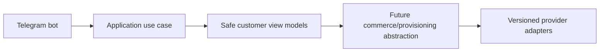

# Architecture

Modular monolith with strict boundaries. Clients call one backend. Domain/application code is independent of frameworks and providers. Critical events use transactional outbox. Idempotency protects payment, wallet, order, provisioning, webhook, refund, and reconciliation operations.

## Milestone 1A identity module boundaries

Identity domain objects live in `packages/domain` without FastAPI, SQLAlchemy, Telegram, Redis, or provider dependencies. Application-facing repository protocols expose domain objects only. SQLAlchemy models under the API package provide persistence mapping and constraints but do not contain business rules. Cryptographic infrastructure is isolated from domain entities so later use cases can depend on interfaces rather than framework routes.

## Milestone 1C-B2 Telegram bot foundation
The Telegram bot foundation supports explicit disabled, polling and secure webhook modes. Disabled mode is the default for CI and Docker verification and performs no Telegram network calls. Polling is for local development only. Webhook mode requires an HTTPS base URL, an environment-only secret token validated with constant-time comparison, request-size limits, allowed update configuration and update-id idempotency.

The `/start` flow normalizes trusted Bot API identity fields and calls a typed `RegisterOrUpdateTelegramBotUser` application use case. It does not create a browser session; Mini App authentication continues to verify raw Telegram initData through the existing backend flow. Usernames are never identity keys, and internal user UUIDs remain independent from Telegram user IDs.

The customer menu is an extensible registry with Persian defaults and English fallback preparation. Current working destinations are Mini App home, profile, sessions/security, help, language and privacy/about. Future commerce modules must register commands and menu items through feature modules and must not place product, pricing, payment or provisioning rules inside bot handlers.

Mini App URLs are generated by a centralized allowlisted builder. Tokens, initData, Telegram IDs, usernames, emails and internal UUIDs are never placed in URLs. Callback data is compact, typed and versioned. Logs and metrics use low-cardinality outcome fields and forbid raw updates, message text, identity fields and secrets.

## Milestone 2-A catalog boundary
Catalog routes depend on auth dependencies, catalog/pricing application code, framework-independent domain objects and repository-backed SQLAlchemy persistence. Pricing never calls Telegram, frontend, wallet, order, payment or provider code. Product definitions contain provider-neutral fulfillment requirements only.
