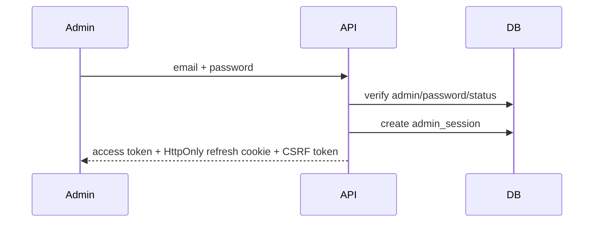
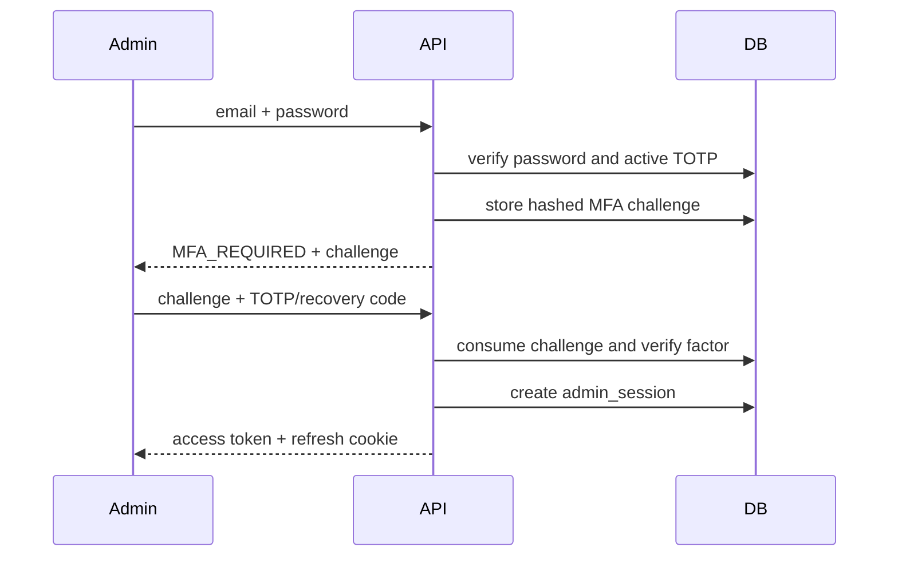
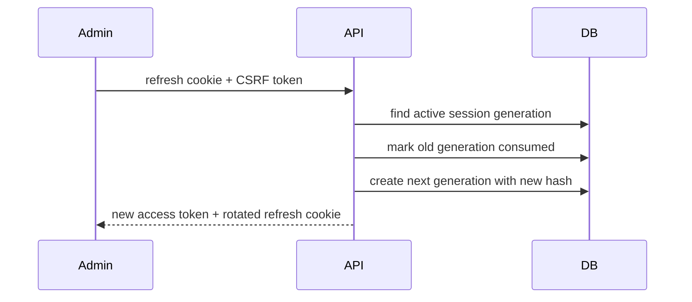
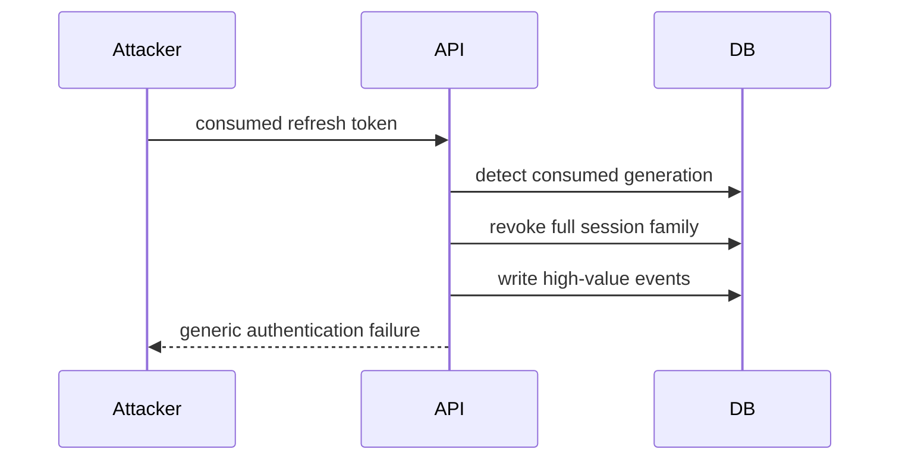
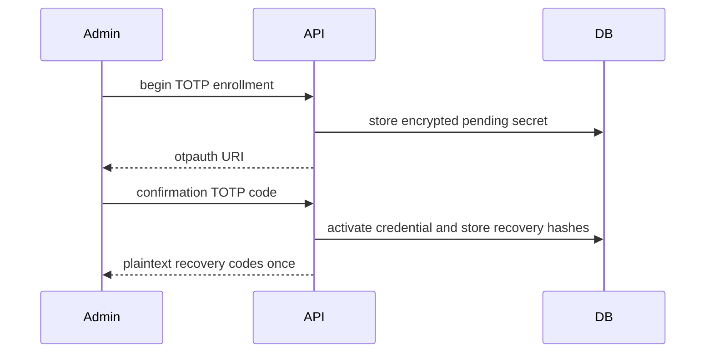
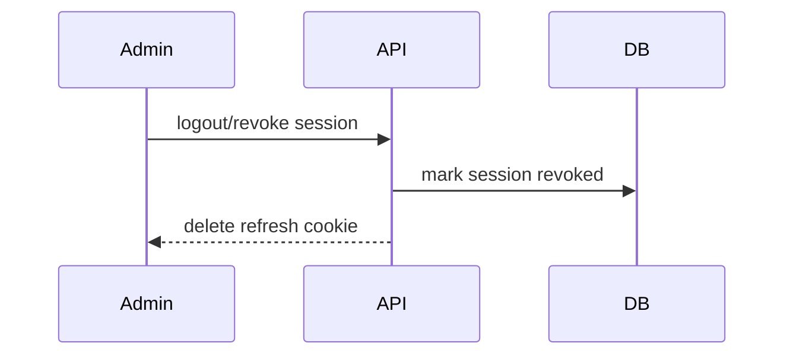

# Authentication

Customer auth will support Telegram Mini App init data verification, Telegram website login, optional email/passwordless identity, session history, and revocation. Admin auth will use email/password with Argon2id, optional/required TOTP, backup codes, refresh rotation, trusted devices, IP allowlists, and brute-force protection.

## Milestone 1A foundation

Milestone 1A implements only the data and cryptographic foundations for later authentication. User statuses are `PENDING`, `ACTIVE`, `SUSPENDED`, `BLOCKED`, and `DEACTIVATED`; admin statuses are `INVITED`, `ACTIVE`, `LOCKED`, and `DISABLED`. Legal transitions are explicit and reject undocumented moves. Password hashing uses Argon2id with configurable time, memory, and parallelism parameters. Refresh-token persistence stores only opaque token hashes and session lineage metadata; no login or refresh endpoint is implemented.

## Milestone 1B-A administrator authentication

Administrators are bootstrapped explicitly with `python -m platform_api.cli bootstrap-admin --email <address>` and a no-echo password prompt, or `--password-stdin` for CI tests. The command seeds RBAC, assigns `super_admin`, rejects duplicate active Super Admin bootstrap, and does not print credentials or MFA material.

Admin login uses normalized email lookup, Argon2id verification, generic external errors, failed-login counters, lockout, and keyed rate-limit identifiers. Successful password authentication creates a session immediately only when MFA is not enabled. When TOTP is enabled, the password step returns an opaque short-lived MFA challenge; a session is created only after TOTP or a recovery code succeeds.

Refresh rotation uses opaque refresh credentials in an HttpOnly cookie and stores only hashes. Reusing a consumed refresh credential revokes the session family and records audit/security events.

