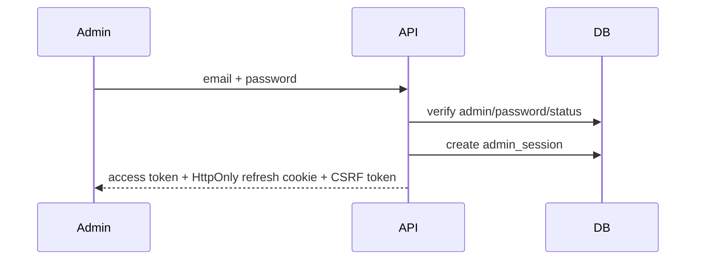
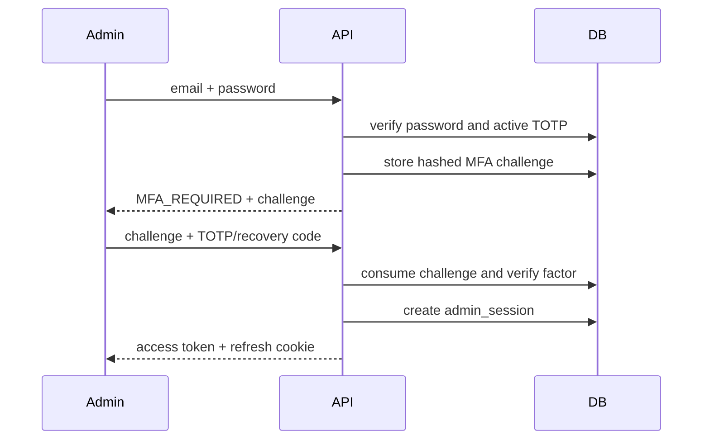
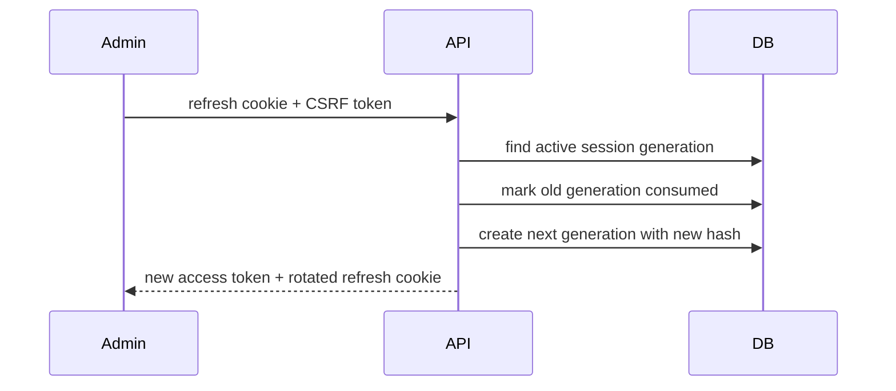
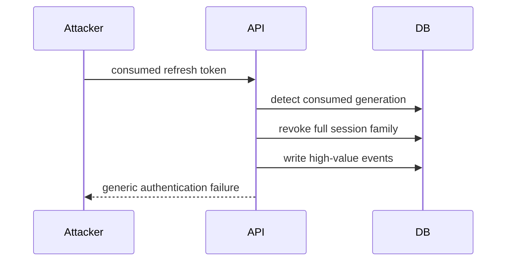
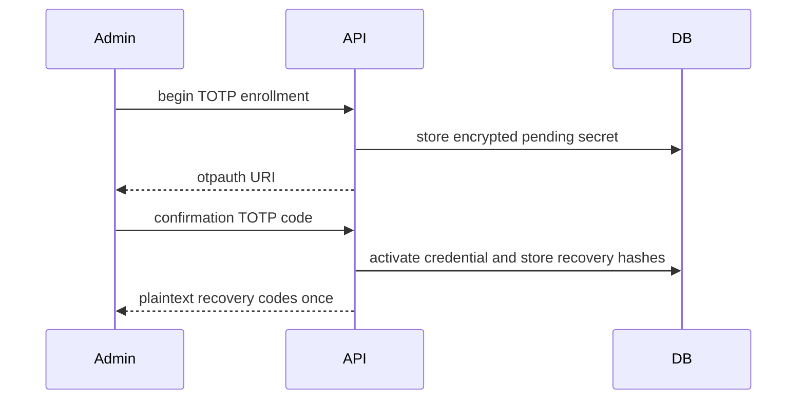
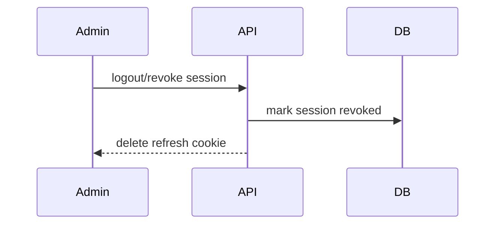
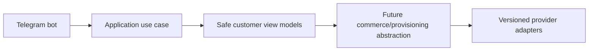

# Authentication

Customer auth will support Telegram Mini App init data verification, Telegram website login, optional email/passwordless identity, session history, and revocation. Admin auth will use email/password with Argon2id, optional/required TOTP, backup codes, refresh rotation, trusted devices, IP allowlists, and brute-force protection.

## Milestone 1A foundation

Milestone 1A implements only the data and cryptographic foundations for later authentication. User statuses are `PENDING`, `ACTIVE`, `SUSPENDED`, `BLOCKED`, and `DEACTIVATED`; admin statuses are `INVITED`, `ACTIVE`, `LOCKED`, and `DISABLED`. Legal transitions are explicit and reject undocumented moves. Password hashing uses Argon2id with configurable time, memory, and parallelism parameters. Refresh-token persistence stores only opaque token hashes and session lineage metadata; no login or refresh endpoint is implemented.

## Milestone 1B-A administrator authentication

Administrators are bootstrapped explicitly with `python -m platform_api.cli bootstrap-admin --email <address>` and a no-echo password prompt, or `--password-stdin` for CI tests. The command seeds RBAC, assigns `super_admin`, rejects duplicate active Super Admin bootstrap, and does not print credentials or MFA material.

Admin login uses normalized email lookup, Argon2id verification, generic external errors, failed-login counters, lockout, and keyed rate-limit identifiers. Successful password authentication creates a session immediately only when MFA is not enabled. When TOTP is enabled, the password step returns an opaque short-lived MFA challenge; a session is created only after TOTP or a recovery code succeeds.

Refresh rotation uses opaque refresh credentials in an HttpOnly cookie and stores only hashes. Reusing a consumed refresh credential revokes the session family and records audit/security events.

## Milestone 1B-B completed admin endpoint inventory

The administrator auth API now includes typed endpoints for login, MFA challenge verification, refresh, CSRF state, current profile, session listing, logout, selected-session revocation, revoke-all-other sessions, revoke-all sessions, password change, TOTP enrollment/confirmation, recovery-code regeneration, and MFA disablement.

Browser clients keep access tokens in memory only, send them with `Authorization`, and rely on the refresh credential only through the HttpOnly refresh cookie. Cookie-authenticated state-changing endpoints require `X-CSRF-Token`; the token is bound to the server-side admin session and rotates with refresh generations.

## Milestone 1C-A customer Telegram authentication
Customer Telegram Mini App authentication accepts only the raw init-data query string and verifies it server-side with the configured bot token. The verifier rejects malformed percent encoding, duplicate keys, missing hash/auth_date/user, malformed JSON, invalid Telegram IDs, invalid signatures, expired data, future timestamps, and oversized payloads. Usernames are profile data only and are never identity keys.

First verified Telegram login creates an internal customer `User`, `CustomerProfile`, and `TelegramAccount`, then atomically activates the PENDING customer. ACTIVE customers may authenticate; SUSPENDED, BLOCKED, and DEACTIVATED customers receive generic authentication failures with safe internal event reason codes.

Customer access tokens use customer-only issuer and audience values. Refresh credentials are opaque HttpOnly cookies stored only as hashes in `customer_sessions`. Refresh rotation consumes the old generation, creates the next generation, rotates CSRF state, and revokes the family when a consumed token is reused.
## Milestone 1C-B1 customer frontend authentication
The customer frontend bootstraps only from raw Telegram Mini App `initData`, posts it once to `/api/v1/customer/auth/telegram-mini-app`, stores returned access credentials in memory only, loads `/me` and `/sessions`, and relies on the backend HttpOnly refresh cookie. Refresh requests include `credentials: "include"` and `X-CSRF-Token`; parallel refresh attempts are collapsed into one in-flight promise and authorized requests retry at most once. Browser users receive a fallback shell, not a fake login.

## Milestone 1C-B2 Telegram bot foundation
The Telegram bot foundation supports explicit disabled, polling and secure webhook modes. Disabled mode is the default for CI and Docker verification and performs no Telegram network calls. Polling is for local development only. Webhook mode requires an HTTPS base URL, an environment-only secret token validated with constant-time comparison, request-size limits, allowed update configuration and update-id idempotency.

The `/start` flow normalizes trusted Bot API identity fields and calls a typed `RegisterOrUpdateTelegramBotUser` application use case. It does not create a browser session; Mini App authentication continues to verify raw Telegram initData through the existing backend flow. Usernames are never identity keys, and internal user UUIDs remain independent from Telegram user IDs.

The customer menu is an extensible registry with Persian defaults and English fallback preparation. Current working destinations are Mini App home, profile, sessions/security, help, language and privacy/about. Future commerce modules must register commands and menu items through feature modules and must not place product, pricing, payment or provisioning rules inside bot handlers.

Mini App URLs are generated by a centralized allowlisted builder. Tokens, initData, Telegram IDs, usernames, emails and internal UUIDs are never placed in URLs. Callback data is compact, typed and versioned. Logs and metrics use low-cardinality outcome fields and forbid raw updates, message text, identity fields and secrets.

## Milestone 1D-A identity administration
Milestone 1D-A introduces backend-only management APIs protected by database-resolved permissions. Effective permissions are loaded from active role assignments for each protected request, disabled/locked administrators are denied immediately, and final active Super Admin safeguards prevent disabling or stripping the last privileged administrator path. Administrator invitations store only token hashes and return plaintext tokens once. Customer management uses documented status transitions and revokes sessions on sensitive restrictions. Audit logs are query-only and append-oriented; security events add acknowledgment/resolution workflow state. Management UI and all commerce/provider functionality remain out of scope.

## Milestone 1D-B identity administration frontend
The administrator frontend adds permission-aware identity management pages for administrators, invitations, roles, permissions, customers, sessions, audit logs, and security events. The UI consumes the existing management APIs, reuses memory-only access tokens, HttpOnly refresh cookies, CSRF headers, and single-flight refresh, and never becomes the authoritative authorization layer. Direct unauthorized routes must show controlled forbidden states while backend permission checks remain decisive.

Invitation tokens are displayed exactly once from ephemeral component state, are never placed in URLs, localStorage, sessionStorage, logs, or analytics, and are cleared after acknowledgment. Audit metadata rendering is defensive and suppresses secret-like keys. Session pages show only normalized safe metadata returned by the backend. The security center supports acknowledgment/resolution language without implying that acknowledgment removes the underlying event.

## Milestone 2-B2 customer storefront authentication
Storefront browsing runs after the existing Mini App bootstrap. Protected preview and quote creation require the existing customer access token, refresh single-flight and CSRF lifecycle. Browser fallback remains explicit; no fake login or auth bypass is introduced.

## Milestone 3-A1 wallet and ledger backend
Wallet accounting is backend-only. API routes authenticate and authorize, then call typed wallet operations that post balanced integer-rial ledger entries and update projections transactionally. Customer wallet reads require customer sessions and expose only customer-facing references; administrator wallet and ledger routes require `wallets.*` or `ledger.*` permissions. Audit/security metadata is sanitized and must not contain raw tokens, idempotency keys, payment details, provider credentials, Telegram initData, or full request bodies. Reconciliation can detect projection mismatches and repair projections without mutating immutable journals or postings. Reservations protect available balance for future checkout but create no order, payment, provider call, or provisioning side effect.

## Milestone 3-A2A customer wallet interface
Customer-web now exposes the read-only customer wallet route family (`/wallet`, `/wallet/transactions`, transaction detail, `/wallet/credits`, `/wallet/reservations`, `/wallet/policy`) backed by the Milestone 3-A1 customer wallet APIs. Balances remain backend-authoritative integer rial values; the browser only validates safe response shape and formats explicitly labelled rial/toman displays. Wallet, auth, CSRF and Telegram initData values remain memory/cookie scoped according to the existing customer authentication model and are not stored in browser storage or URLs. The UI shows frozen/closed wallet states, safe account-status errors, bucket labels, credit expiration, reservations and future top-up policy, while payment, checkout, order, invoice, provider, provisioning and admin financial-console work remain deferred.

## Milestone 3-A2B administrator financial console note
Administrator financial routes under `/management/finance`, `/management/wallets`, and `/management/ledger` use the existing admin authentication architecture with memory-only access tokens, HttpOnly refresh cookies, CSRF on mutations, and backend permission enforcement. Rial remains canonical, derived toman is presentation-only, journal/posting data is read-only, idempotency keys are memory-only, and no wallet or ledger API response is persisted in browser storage. The console intentionally excludes checkout, orders, invoices, payments, provider operations, provisioning, subscriptions, and financial analytics dashboards.

## Milestone 3-B1 order and checkout backend
Order checkout is backend-only and wallet-funded. Customer tokens can create/confirm/cancel their own checkout sessions and read their own orders/invoices. Administrator APIs require `orders.read`, `orders.cancel`, `invoices.read` or `checkout.read`. Commercial snapshots and invoice money are immutable; corrections use cancellation and compensating wallet ledger entries. `order.ready_for_fulfillment.v1` outbox events are normalized and contain no provider, payment credential, token, server, inbound or subscription data. Future external payments and provisioning remain documented boundaries, not implemented behavior.

## Milestone 3-B2A customer checkout interface
Customer-web now exposes wallet-funded commerce routes for quote checkout, order history/detail/timeline and immutable invoice history/detail. Checkout references only server-issued quote references, displays backend quote/order/invoice snapshots, uses `WALLET` as the only working method, keeps idempotency and commerce responses memory-only, and never sends authoritative price fields or wallet balances. Successful confirmation displays paid invoice/order state and `READY_FOR_FULFILLMENT` as queued for future service creation, not delivered service. Eligible cancellation is confirmed through backend checkout cancellation and refund/reservation-release states are presented as compensating history. Telegram Mini App behavior reuses the existing safe shell; raw initData, auth tokens, CSRF values, references and idempotency values are not persisted in browser storage or URLs.

## Milestone 3-B2B administrator order administration interface
Admin-web now includes `/management/commerce`, order discovery/detail/snapshot/timeline/reconciliation, immutable invoice inspection, checkout-session inspection, wallet-payment and reservation inspection, reviewed administrator cancellation, refund-state presentation and sanitized fulfillment-outbox inspection. The interface consumes real admin commerce APIs, uses permission-aware navigation, keeps order/financial/fulfillment states separate, treats invoices and order snapshots as immutable, and stores no commerce responses, cancellation reasons or idempotency values in browser storage. Backend compatibility additions remain read-only or reviewed-command endpoints and do not add external payments, provider infrastructure, provisioning, subscriptions, QR/configuration delivery or analytics.

## Milestone 4-A2A payment authentication
Payment routes require the existing customer authentication state machine, memory-only access token, refresh cookie and CSRF lifecycle. Raw Telegram initData is used only by the existing bootstrap path and is not stored or placed in payment URLs.
