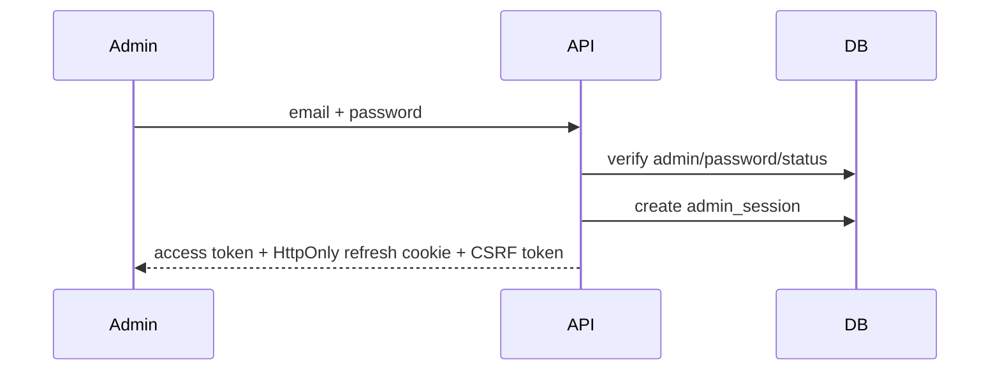
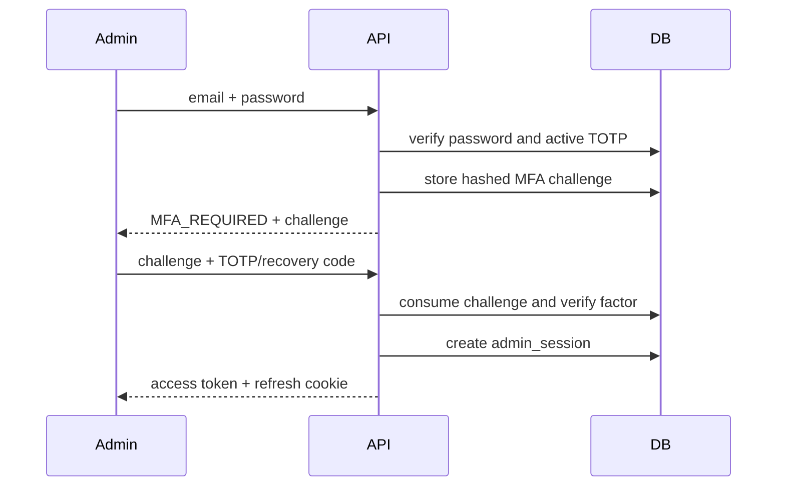
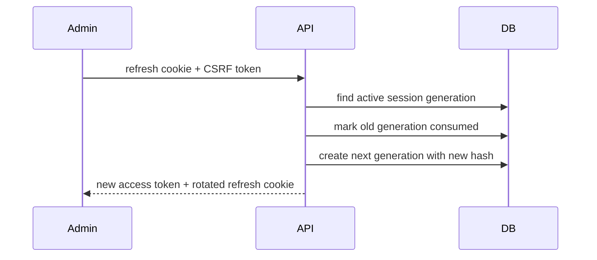
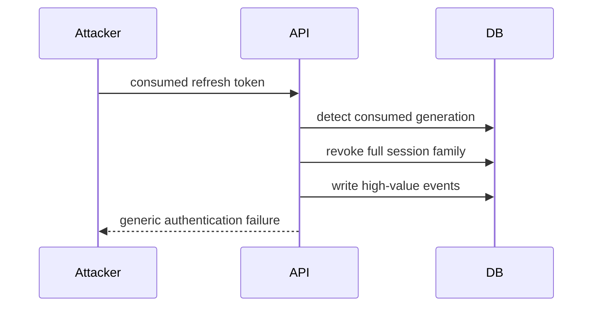
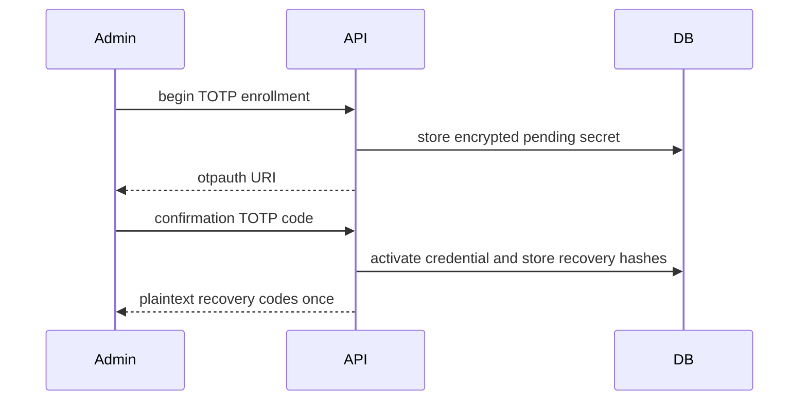
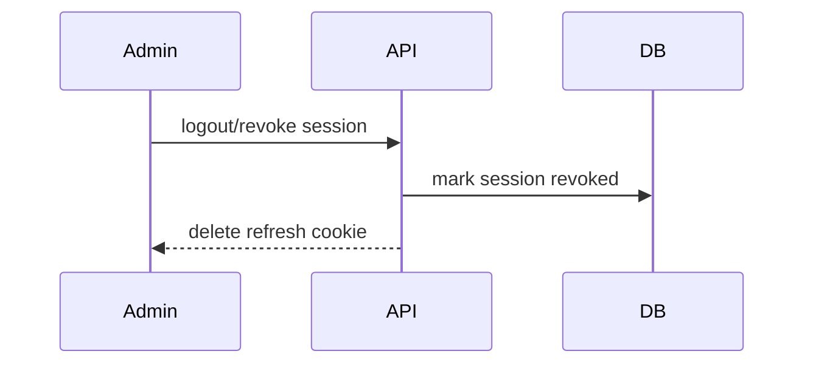
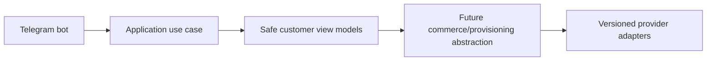

# Authentication

Customer auth will support Telegram Mini App init data verification, Telegram website login, optional email/passwordless identity, session history, and revocation. Admin auth will use email/password with Argon2id, optional/required TOTP, backup codes, refresh rotation, trusted devices, IP allowlists, and brute-force protection.

## Milestone 1A foundation

Milestone 1A implements only the data and cryptographic foundations for later authentication. User statuses are `PENDING`, `ACTIVE`, `SUSPENDED`, `BLOCKED`, and `DEACTIVATED`; admin statuses are `INVITED`, `ACTIVE`, `LOCKED`, and `DISABLED`. Legal transitions are explicit and reject undocumented moves. Password hashing uses Argon2id with configurable time, memory, and parallelism parameters. Refresh-token persistence stores only opaque token hashes and session lineage metadata; no login or refresh endpoint is implemented.

## Milestone 1B-A administrator authentication

Administrators are bootstrapped explicitly with `python -m platform_api.cli bootstrap-admin --email <address>` and a no-echo password prompt, or `--password-stdin` for CI tests. The command seeds RBAC, assigns `super_admin`, rejects duplicate active Super Admin bootstrap, and does not print credentials or MFA material.

Admin login uses normalized email lookup, Argon2id verification, generic external errors, failed-login counters, lockout, and keyed rate-limit identifiers. Successful password authentication creates a session immediately only when MFA is not enabled. When TOTP is enabled, the password step returns an opaque short-lived MFA challenge; a session is created only after TOTP or a recovery code succeeds.

Refresh rotation uses opaque refresh credentials in an HttpOnly cookie and stores only hashes. Reusing a consumed refresh credential revokes the session family and records audit/security events.

## Milestone 1B-B completed admin endpoint inventory

The administrator auth API now includes typed endpoints for login, MFA challenge verification, refresh, CSRF state, current profile, session listing, logout, selected-session revocation, revoke-all-other sessions, revoke-all sessions, password change, TOTP enrollment/confirmation, recovery-code regeneration, and MFA disablement.

Browser clients keep access tokens in memory only, send them with `Authorization`, and rely on the refresh credential only through the HttpOnly refresh cookie. Cookie-authenticated state-changing endpoints require `X-CSRF-Token`; the token is bound to the server-side admin session and rotates with refresh generations.

## Milestone 1C-A customer Telegram authentication
Customer Telegram Mini App authentication accepts only the raw init-data query string and verifies it server-side with the configured bot token. The verifier rejects malformed percent encoding, duplicate keys, missing hash/auth_date/user, malformed JSON, invalid Telegram IDs, invalid signatures, expired data, future timestamps, and oversized payloads. Usernames are profile data only and are never identity keys.

First verified Telegram login creates an internal customer `User`, `CustomerProfile`, and `TelegramAccount`, then atomically activates the PENDING customer. ACTIVE customers may authenticate; SUSPENDED, BLOCKED, and DEACTIVATED customers receive generic authentication failures with safe internal event reason codes.

Customer access tokens use customer-only issuer and audience values. Refresh credentials are opaque HttpOnly cookies stored only as hashes in `customer_sessions`. Refresh rotation consumes the old generation, creates the next generation, rotates CSRF state, and revokes the family when a consumed token is reused.
## Milestone 1C-B1 customer frontend authentication
The customer frontend bootstraps only from raw Telegram Mini App `initData`, posts it once to `/api/v1/customer/auth/telegram-mini-app`, stores returned access credentials in memory only, loads `/me` and `/sessions`, and relies on the backend HttpOnly refresh cookie. Refresh requests include `credentials: "include"` and `X-CSRF-Token`; parallel refresh attempts are collapsed into one in-flight promise and authorized requests retry at most once. Browser users receive a fallback shell, not a fake login.

## Milestone 1C-B2 Telegram bot foundation
The Telegram bot foundation supports explicit disabled, polling and secure webhook modes. Disabled mode is the default for CI and Docker verification and performs no Telegram network calls. Polling is for local development only. Webhook mode requires an HTTPS base URL, an environment-only secret token validated with constant-time comparison, request-size limits, allowed update configuration and update-id idempotency.

The `/start` flow normalizes trusted Bot API identity fields and calls a typed `RegisterOrUpdateTelegramBotUser` application use case. It does not create a browser session; Mini App authentication continues to verify raw Telegram initData through the existing backend flow. Usernames are never identity keys, and internal user UUIDs remain independent from Telegram user IDs.

The customer menu is an extensible registry with Persian defaults and English fallback preparation. Current working destinations are Mini App home, profile, sessions/security, help, language and privacy/about. Future commerce modules must register commands and menu items through feature modules and must not place product, pricing, payment or provisioning rules inside bot handlers.

Mini App URLs are generated by a centralized allowlisted builder. Tokens, initData, Telegram IDs, usernames, emails and internal UUIDs are never placed in URLs. Callback data is compact, typed and versioned. Logs and metrics use low-cardinality outcome fields and forbid raw updates, message text, identity fields and secrets.

