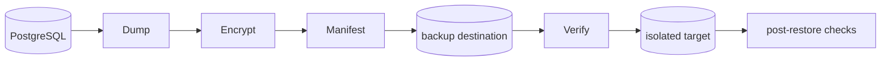

# Backup And Recovery

Backups cover PostgreSQL logical/physical strategy, object storage, encrypted archives, retention, restore drills, verification jobs, recovery time/objective documentation, and backup failure alerts.

## Milestone 7-A1 backup, restore and DR foundations

Backups include encrypted database dumps, object/media manifests, release metadata and credential ciphertext. Redis is non-authoritative. `scripts/operations/backup.py` and `scripts/operations/restore.py` use a versioned AES-256-GCM envelope, verify the encrypted checksum before restore and authenticate the complete envelope before writing plaintext. Production keys must come from a root-readable secret file or an approved secret manager, remain separate from backup storage and follow a documented rotation/retention policy.

