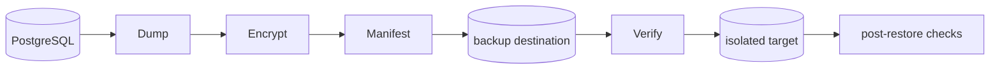

# Backup And Recovery

Backups cover PostgreSQL logical/physical strategy, object storage, encrypted archives, retention, restore drills, verification jobs, recovery time/objective documentation, and backup failure alerts.

## Milestone 7-A1 backup, restore and DR foundations

Backups include encrypted database dumps, object/media manifests, release metadata and credential ciphertext. Redis is non-authoritative. `scripts/operations/backup.py` and `scripts/operations/restore.py` provide deterministic CI-safe encryption/checksum behavior; production must replace the XOR test boundary with an approved KMS/envelope encryption backend before release review.

