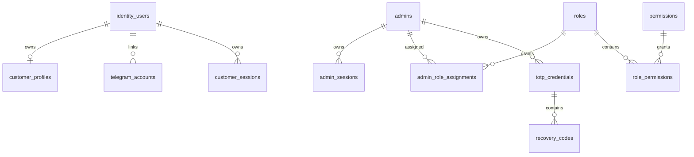

# Database

PostgreSQL is the source of truth. UUIDs are used for public identifiers; UTC timestamps are mandatory. Integrity uses unique constraints, foreign keys, check constraints, idempotency-key uniqueness, ledger balancing constraints, and indexes on tenant, status, timestamps, provider references, and reconciliation fields. Retention policies are configurable by data class.

## Milestone 1A identity schema

Milestone 1A adds PostgreSQL-compatible identity tables for `identity_users`, `customer_profiles`, `telegram_accounts`, `admins`, customer/admin sessions, RBAC, login attempts, audit logs, security events, TOTP credential placeholders, and recovery-code hashes. UUID primary keys are used for internal identities; Telegram user identifiers use `BigInteger` and remain independent from internal user IDs. Administrator email is stored only as a normalized unique value. Session, recovery, password, and future TOTP data store hashes or authenticated ciphertext only.

Migration procedure: run `alembic -c apps/api/alembic.ini upgrade head`, verify `current`, then test `downgrade 0001_initial_foundation` and re-upgrade on a disposable database. The migration creates schema only and does not create a default administrator.

## Milestone 1B-A schema additions

Migration `0003_milestone_1b_a_admin_auth` adds consumed refresh-token generation fields, CSRF hash storage, TOTP confirmation/replay fields, pending enrollment expiry, and `admin_mfa_challenges` for hashed short-lived MFA challenges. It creates no default administrator and is downgradeable for disposable databases.
