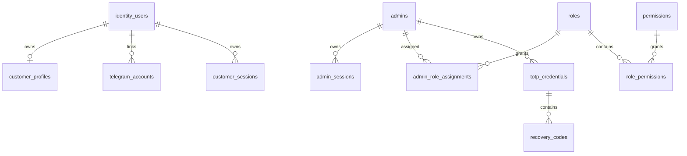

# Database

PostgreSQL is the source of truth. UUIDs are used for public identifiers; UTC timestamps are mandatory. Integrity uses unique constraints, foreign keys, check constraints, idempotency-key uniqueness, ledger balancing constraints, and indexes on tenant, status, timestamps, provider references, and reconciliation fields. Retention policies are configurable by data class.

## Milestone 1A identity schema

Milestone 1A adds PostgreSQL-compatible identity tables for `identity_users`, `customer_profiles`, `telegram_accounts`, `admins`, customer/admin sessions, RBAC, login attempts, audit logs, security events, TOTP credential placeholders, and recovery-code hashes. UUID primary keys are used for internal identities; Telegram user identifiers use `BigInteger` and remain independent from internal user IDs. Administrator email is stored only as a normalized unique value. Session, recovery, password, and future TOTP data store hashes or authenticated ciphertext only.

Migration procedure: run `alembic -c apps/api/alembic.ini upgrade head`, verify `current`, then test `downgrade 0001_initial_foundation` and re-upgrade on a disposable database. The migration creates schema only and does not create a default administrator.

## Milestone 1B-A schema additions

Migration `0003_milestone_1b_a_admin_auth` adds consumed refresh-token generation fields, CSRF hash storage, TOTP confirmation/replay fields, pending enrollment expiry, and `admin_mfa_challenges` for hashed short-lived MFA challenges. It creates no default administrator and is downgradeable for disposable databases.

## Milestone 1C-A customer authentication note
Customer Telegram Mini App authentication now verifies raw init data, links Telegram identities to internal customers, issues isolated customer access credentials, rotates opaque refresh-cookie sessions, enforces CSRF on cookie-authenticated state changes, rate limits sensitive operations, and records sanitized audit/security events. Commerce and customer UI remain out of scope.

## Milestone 1D-A identity administration
Milestone 1D-A introduces backend-only management APIs protected by database-resolved permissions. Effective permissions are loaded from active role assignments for each protected request, disabled/locked administrators are denied immediately, and final active Super Admin safeguards prevent disabling or stripping the last privileged administrator path. Administrator invitations store only token hashes and return plaintext tokens once. Customer management uses documented status transitions and revokes sessions on sensitive restrictions. Audit logs are query-only and append-oriented; security events add acknowledgment/resolution workflow state. Management UI and all commerce/provider functionality remain out of scope.

## Milestone 2-A catalog schema
Revision `0006_milestone_2a_catalog` creates `product_categories`, `products`, `product_versions`, `price_lists`, `price_list_versions`, `pricing_rules`, `pricing_tiers`, `customer_price_quotes`, `customer_price_quote_lines` and `quote_idempotency_records`. Money is integer minor units, traffic and tiers use BigInteger, and no sample products or prices are seeded.

### Milestone 2-A migration compatibility fix
The root cause of the duplicate `product_categories` table was revision `0002_milestone_1a_identity` using `IdentityBase.metadata.create_all()` while Alembic `env.py` imported current catalog ORM models into the same mutable metadata before historical upgrades ran. Normal migration execution now keeps future ORM tables out of historical revisions; catalog model imports are reserved for autogenerate metadata comparison. Revision `0006_milestone_2a_catalog` explicitly detects none/all/partial catalog table sets, adopts the known complete metadata-leak schema only after validation, and rejects unknown partial schemas.

## Milestone 3-A1 wallet and ledger backend
Wallet accounting is backend-only. API routes authenticate and authorize, then call typed wallet operations that post balanced integer-rial ledger entries and update projections transactionally. Customer wallet reads require customer sessions and expose only customer-facing references; administrator wallet and ledger routes require `wallets.*` or `ledger.*` permissions. Audit/security metadata is sanitized and must not contain raw tokens, idempotency keys, payment details, provider credentials, Telegram initData, or full request bodies. Reconciliation can detect projection mismatches and repair projections without mutating immutable journals or postings. Reservations protect available balance for future checkout but create no order, payment, provider call, or provisioning side effect.

## Milestone 3-A2B administrator financial console note
Administrator financial routes under `/management/finance`, `/management/wallets`, and `/management/ledger` use the existing admin authentication architecture with memory-only access tokens, HttpOnly refresh cookies, CSRF on mutations, and backend permission enforcement. Rial remains canonical, derived toman is presentation-only, journal/posting data is read-only, idempotency keys are memory-only, and no wallet or ledger API response is persisted in browser storage. The console intentionally excludes checkout, orders, invoices, payments, provider operations, provisioning, subscriptions, and financial analytics dashboards.

## Milestone 3-B1 order and checkout backend
Order checkout is backend-only and wallet-funded. Customer tokens can create/confirm/cancel their own checkout sessions and read their own orders/invoices. Administrator APIs require `orders.read`, `orders.cancel`, `invoices.read` or `checkout.read`. Commercial snapshots and invoice money are immutable; corrections use cancellation and compensating wallet ledger entries. `order.ready_for_fulfillment.v1` outbox events are normalized and contain no provider, payment credential, token, server, inbound or subscription data. Future external payments and provisioning remain documented boundaries, not implemented behavior.

## Milestone 3-B2B administrator order administration interface
Admin-web now includes `/management/commerce`, order discovery/detail/snapshot/timeline/reconciliation, immutable invoice inspection, checkout-session inspection, wallet-payment and reservation inspection, reviewed administrator cancellation, refund-state presentation and sanitized fulfillment-outbox inspection. The interface consumes real admin commerce APIs, uses permission-aware navigation, keeps order/financial/fulfillment states separate, treats invoices and order snapshots as immutable, and stores no commerce responses, cancellation reasons or idempotency values in browser storage. Backend compatibility additions remain read-only or reviewed-command endpoints and do not add external payments, provider infrastructure, provisioning, subscriptions, QR/configuration delivery or analytics.

## Payment schema
Milestone 4-A1 adds focused payment tables rather than one oversized table: `payment_methods`, localizations, policies, intents, attempts, verifications, settlements, webhook inbox, refunds, refund attempts, idempotency records and reconciliation runs. Money uses integer rial, currency is explicit, provider references are unique where economic effects depend on them and no credentials/card/bank data are stored.
