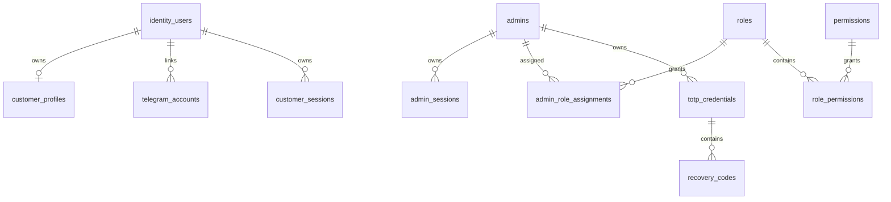

# Database

PostgreSQL is the source of truth. UUIDs are used for public identifiers; UTC timestamps are mandatory. Integrity uses unique constraints, foreign keys, check constraints, idempotency-key uniqueness, ledger balancing constraints, and indexes on tenant, status, timestamps, provider references, and reconciliation fields. Retention policies are configurable by data class.

## Milestone 1A identity schema

Milestone 1A adds PostgreSQL-compatible identity tables for `identity_users`, `customer_profiles`, `telegram_accounts`, `admins`, customer/admin sessions, RBAC, login attempts, audit logs, security events, TOTP credential placeholders, and recovery-code hashes. UUID primary keys are used for internal identities; Telegram user identifiers use `BigInteger` and remain independent from internal user IDs. Administrator email is stored only as a normalized unique value. Session, recovery, password, and future TOTP data store hashes or authenticated ciphertext only.

Migration procedure: run `alembic -c apps/api/alembic.ini upgrade head`, verify `current`, then test `downgrade 0001_initial_foundation` and re-upgrade on a disposable database. The migration creates schema only and does not create a default administrator.

## Milestone 1B-A schema additions

Migration `0003_milestone_1b_a_admin_auth` adds consumed refresh-token generation fields, CSRF hash storage, TOTP confirmation/replay fields, pending enrollment expiry, and `admin_mfa_challenges` for hashed short-lived MFA challenges. It creates no default administrator and is downgradeable for disposable databases.

## Milestone 1C-A customer authentication note
Customer Telegram Mini App authentication now verifies raw init data, links Telegram identities to internal customers, issues isolated customer access credentials, rotates opaque refresh-cookie sessions, enforces CSRF on cookie-authenticated state changes, rate limits sensitive operations, and records sanitized audit/security events. Commerce and customer UI remain out of scope.

## Milestone 1D-A identity administration
Milestone 1D-A introduces backend-only management APIs protected by database-resolved permissions. Effective permissions are loaded from active role assignments for each protected request, disabled/locked administrators are denied immediately, and final active Super Admin safeguards prevent disabling or stripping the last privileged administrator path. Administrator invitations store only token hashes and return plaintext tokens once. Customer management uses documented status transitions and revokes sessions on sensitive restrictions. Audit logs are query-only and append-oriented; security events add acknowledgment/resolution workflow state. Management UI and all commerce/provider functionality remain out of scope.

## Milestone 2-A catalog schema
Revision `0006_milestone_2a_catalog` creates `product_categories`, `products`, `product_versions`, `price_lists`, `price_list_versions`, `pricing_rules`, `pricing_tiers`, `customer_price_quotes`, `customer_price_quote_lines` and `quote_idempotency_records`. Money is integer minor units, traffic and tiers use BigInteger, and no sample products or prices are seeded.
