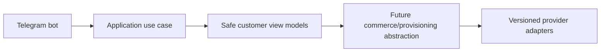

# Observability

Observability includes structured logs, correlation/request/trace IDs, metrics, error tracking, audit logs, health/readiness/dependency health, worker metrics, queue depth, payment/provisioning/panel/notification metrics, and business KPIs without secrets.

## Milestone 1B-A authentication events

Administrator bootstrap, login success/failure/lockout/rate-limit, MFA enrollment/challenge/success/failure, recovery-code use/regeneration, session create/refresh/revoke, refresh reuse, and password change events are audit/security event candidates. Metadata must remain sanitized and free of passwords, token values, token hashes, TOTP values, recovery codes, and CSRF secrets.

## Milestone 1B-B auth signals

Structured audit/security events now include session revocation, password change, recovery-code regeneration, MFA disablement, refresh reuse, and CSRF/rate-limit rejection candidates. Metric labels must use safe event codes only and must not include email addresses, raw IPs, user agents, tokens, codes, or secrets.

## Milestone 1C-A customer authentication note
Customer Telegram Mini App authentication now verifies raw init data, links Telegram identities to internal customers, issues isolated customer access credentials, rotates opaque refresh-cookie sessions, enforces CSRF on cookie-authenticated state changes, rate limits sensitive operations, and records sanitized audit/security events. Commerce and customer UI remain out of scope.
## Milestone 1C-B1 frontend diagnostics
Customer frontend diagnostics are limited to safe state names, safe error codes, correlation IDs, and timings in development/test. Raw init data, access tokens, refresh tokens, CSRF tokens, Telegram payloads, Telegram IDs, names, and full API bodies are not logged.

## Milestone 1C-B2 Telegram bot foundation
The Telegram bot foundation supports explicit disabled, polling and secure webhook modes. Disabled mode is the default for CI and Docker verification and performs no Telegram network calls. Polling is for local development only. Webhook mode requires an HTTPS base URL, an environment-only secret token validated with constant-time comparison, request-size limits, allowed update configuration and update-id idempotency.

The `/start` flow normalizes trusted Bot API identity fields and calls a typed `RegisterOrUpdateTelegramBotUser` application use case. It does not create a browser session; Mini App authentication continues to verify raw Telegram initData through the existing backend flow. Usernames are never identity keys, and internal user UUIDs remain independent from Telegram user IDs.

The customer menu is an extensible registry with Persian defaults and English fallback preparation. Current working destinations are Mini App home, profile, sessions/security, help, language and privacy/about. Future commerce modules must register commands and menu items through feature modules and must not place product, pricing, payment or provisioning rules inside bot handlers.

Mini App URLs are generated by a centralized allowlisted builder. Tokens, initData, Telegram IDs, usernames, emails and internal UUIDs are never placed in URLs. Callback data is compact, typed and versioned. Logs and metrics use low-cardinality outcome fields and forbid raw updates, message text, identity fields and secrets.

## Milestone 1D-A identity administration
Milestone 1D-A introduces backend-only management APIs protected by database-resolved permissions. Effective permissions are loaded from active role assignments for each protected request, disabled/locked administrators are denied immediately, and final active Super Admin safeguards prevent disabling or stripping the last privileged administrator path. Administrator invitations store only token hashes and return plaintext tokens once. Customer management uses documented status transitions and revokes sessions on sensitive restrictions. Audit logs are query-only and append-oriented; security events add acknowledgment/resolution workflow state. Management UI and all commerce/provider functionality remain out of scope.
