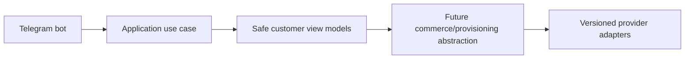

# Observability

Observability includes structured logs, correlation/request/trace IDs, metrics, error tracking, audit logs, health/readiness/dependency health, worker metrics, queue depth, payment/provisioning/panel/notification metrics, and business KPIs without secrets.

## Milestone 1B-A authentication events

Administrator bootstrap, login success/failure/lockout/rate-limit, MFA enrollment/challenge/success/failure, recovery-code use/regeneration, session create/refresh/revoke, refresh reuse, and password change events are audit/security event candidates. Metadata must remain sanitized and free of passwords, token values, token hashes, TOTP values, recovery codes, and CSRF secrets.

## Milestone 1B-B auth signals

Structured audit/security events now include session revocation, password change, recovery-code regeneration, MFA disablement, refresh reuse, and CSRF/rate-limit rejection candidates. Metric labels must use safe event codes only and must not include email addresses, raw IPs, user agents, tokens, codes, or secrets.

## Milestone 1C-A customer authentication note
Customer Telegram Mini App authentication now verifies raw init data, links Telegram identities to internal customers, issues isolated customer access credentials, rotates opaque refresh-cookie sessions, enforces CSRF on cookie-authenticated state changes, rate limits sensitive operations, and records sanitized audit/security events. Commerce and customer UI remain out of scope.
## Milestone 1C-B1 frontend diagnostics
Customer frontend diagnostics are limited to safe state names, safe error codes, correlation IDs, and timings in development/test. Raw init data, access tokens, refresh tokens, CSRF tokens, Telegram payloads, Telegram IDs, names, and full API bodies are not logged.

## Milestone 1C-B2 Telegram bot foundation
The Telegram bot foundation supports explicit disabled, polling and secure webhook modes. Disabled mode is the default for CI and Docker verification and performs no Telegram network calls. Polling is for local development only. Webhook mode requires an HTTPS base URL, an environment-only secret token validated with constant-time comparison, request-size limits, allowed update configuration and update-id idempotency.

The `/start` flow normalizes trusted Bot API identity fields and calls a typed `RegisterOrUpdateTelegramBotUser` application use case. It does not create a browser session; Mini App authentication continues to verify raw Telegram initData through the existing backend flow. Usernames are never identity keys, and internal user UUIDs remain independent from Telegram user IDs.

The customer menu is an extensible registry with Persian defaults and English fallback preparation. Current working destinations are Mini App home, profile, sessions/security, help, language and privacy/about. Future commerce modules must register commands and menu items through feature modules and must not place product, pricing, payment or provisioning rules inside bot handlers.

Mini App URLs are generated by a centralized allowlisted builder. Tokens, initData, Telegram IDs, usernames, emails and internal UUIDs are never placed in URLs. Callback data is compact, typed and versioned. Logs and metrics use low-cardinality outcome fields and forbid raw updates, message text, identity fields and secrets.

## Milestone 1D-A identity administration
Milestone 1D-A introduces backend-only management APIs protected by database-resolved permissions. Effective permissions are loaded from active role assignments for each protected request, disabled/locked administrators are denied immediately, and final active Super Admin safeguards prevent disabling or stripping the last privileged administrator path. Administrator invitations store only token hashes and return plaintext tokens once. Customer management uses documented status transitions and revokes sessions on sensitive restrictions. Audit logs are query-only and append-oriented; security events add acknowledgment/resolution workflow state. Management UI and all commerce/provider functionality remain out of scope.

## Milestone 1D-B identity administration frontend
The administrator frontend adds permission-aware identity management pages for administrators, invitations, roles, permissions, customers, sessions, audit logs, and security events. The UI consumes the existing management APIs, reuses memory-only access tokens, HttpOnly refresh cookies, CSRF headers, and single-flight refresh, and never becomes the authoritative authorization layer. Direct unauthorized routes must show controlled forbidden states while backend permission checks remain decisive.

Invitation tokens are displayed exactly once from ephemeral component state, are never placed in URLs, localStorage, sessionStorage, logs, or analytics, and are cleared after acknowledgment. Audit metadata rendering is defensive and suppresses secret-like keys. Session pages show only normalized safe metadata returned by the backend. The security center supports acknowledgment/resolution language without implying that acknowledgment removes the underlying event.

## Milestone 2-A observability
Catalog audit events record safe machine identifiers, integer amounts and currency for category/product/version/price-list/rule changes and quote issuance. Logs and audit metadata must not include raw request bodies or provider details.

## Milestone 2-B1 catalog administration note

Milestone 2-B1 adds an administrator-only catalog console in `apps/admin-web` that consumes the real Milestone 2-A catalog and pricing APIs. The backend remains authoritative for authorization, lifecycle transitions, publication validation, immutable published versions, price-list overlap, pricing validity, and concurrency conflicts. The frontend keeps access tokens in memory, sends CSRF headers for mutations, avoids storing draft API responses in browser storage, displays machine codes LTR, treats money as integer rial with explicit toman display, uses fixed-day duration labels, and keeps fulfillment requirements provider-neutral. Customer storefront, wallet/order/payment/provider/provisioning work remains out of scope.

## Milestone 2-B2 storefront observability
Storefront events are low-cardinality: page loaded, product detail loaded, preview requested/succeeded/rejected, quote created/expired/recalculated, constraint rejected and API unavailable. Allowed fields are route, product type, operation type, safe outcome, correlation ID, duration and locale; tokens, initData, customer identifiers, raw selections, price details and provider data are forbidden.

## Milestone 3-A1 wallet and ledger backend
Wallet accounting is backend-only. API routes authenticate and authorize, then call typed wallet operations that post balanced integer-rial ledger entries and update projections transactionally. Customer wallet reads require customer sessions and expose only customer-facing references; administrator wallet and ledger routes require `wallets.*` or `ledger.*` permissions. Audit/security metadata is sanitized and must not contain raw tokens, idempotency keys, payment details, provider credentials, Telegram initData, or full request bodies. Reconciliation can detect projection mismatches and repair projections without mutating immutable journals or postings. Reservations protect available balance for future checkout but create no order, payment, provider call, or provisioning side effect.

## Milestone 3-A2A customer wallet interface
Customer-web now exposes the read-only customer wallet route family (`/wallet`, `/wallet/transactions`, transaction detail, `/wallet/credits`, `/wallet/reservations`, `/wallet/policy`) backed by the Milestone 3-A1 customer wallet APIs. Balances remain backend-authoritative integer rial values; the browser only validates safe response shape and formats explicitly labelled rial/toman displays. Wallet, auth, CSRF and Telegram initData values remain memory/cookie scoped according to the existing customer authentication model and are not stored in browser storage or URLs. The UI shows frozen/closed wallet states, safe account-status errors, bucket labels, credit expiration, reservations and future top-up policy, while payment, checkout, order, invoice, provider, provisioning and admin financial-console work remain deferred.

## Milestone 3-A2B administrator financial console note
Administrator financial routes under `/management/finance`, `/management/wallets`, and `/management/ledger` use the existing admin authentication architecture with memory-only access tokens, HttpOnly refresh cookies, CSRF on mutations, and backend permission enforcement. Rial remains canonical, derived toman is presentation-only, journal/posting data is read-only, idempotency keys are memory-only, and no wallet or ledger API response is persisted in browser storage. The console intentionally excludes checkout, orders, invoices, payments, provider operations, provisioning, subscriptions, and financial analytics dashboards.

## Milestone 3-B1 order and checkout backend
Order checkout is backend-only and wallet-funded. Customer tokens can create/confirm/cancel their own checkout sessions and read their own orders/invoices. Administrator APIs require `orders.read`, `orders.cancel`, `invoices.read` or `checkout.read`. Commercial snapshots and invoice money are immutable; corrections use cancellation and compensating wallet ledger entries. `order.ready_for_fulfillment.v1` outbox events are normalized and contain no provider, payment credential, token, server, inbound or subscription data. Future external payments and provisioning remain documented boundaries, not implemented behavior.

## Milestone 3-B2A customer checkout interface
Customer-web now exposes wallet-funded commerce routes for quote checkout, order history/detail/timeline and immutable invoice history/detail. Checkout references only server-issued quote references, displays backend quote/order/invoice snapshots, uses `WALLET` as the only working method, keeps idempotency and commerce responses memory-only, and never sends authoritative price fields or wallet balances. Successful confirmation displays paid invoice/order state and `READY_FOR_FULFILLMENT` as queued for future service creation, not delivered service. Eligible cancellation is confirmed through backend checkout cancellation and refund/reservation-release states are presented as compensating history. Telegram Mini App behavior reuses the existing safe shell; raw initData, auth tokens, CSRF values, references and idempotency values are not persisted in browser storage or URLs.

## Milestone 3-B2B administrator order administration interface
Admin-web now includes `/management/commerce`, order discovery/detail/snapshot/timeline/reconciliation, immutable invoice inspection, checkout-session inspection, wallet-payment and reservation inspection, reviewed administrator cancellation, refund-state presentation and sanitized fulfillment-outbox inspection. The interface consumes real admin commerce APIs, uses permission-aware navigation, keeps order/financial/fulfillment states separate, treats invoices and order snapshots as immutable, and stores no commerce responses, cancellation reasons or idempotency values in browser storage. Backend compatibility additions remain read-only or reviewed-command endpoints and do not add external payments, provider infrastructure, provisioning, subscriptions, QR/configuration delivery or analytics.

## Payment observability
Payment metrics and events should use safe references, status codes and mismatch codes only. They must not include credentials, idempotency keys, webhook signatures, raw webhook bodies, customer tokens, card data or full provider responses.

## Milestone 4-A2A payment observability
Allowed frontend diagnostics are low-cardinality route, purpose, method kind, status category and safe outcome codes. Payment references, provider references, order/invoice references, amounts, redirect URLs, idempotency values, tokens and initData must not be logged.

## Milestone 4-A2B1 note
Administrator payment operations are represented in admin-web as a safe operations console for payment methods, intents, attempts, verifications, settlements and webhook inbox records. The console preserves payment immutability, credential boundaries, backend-authoritative authorization, no browser persistence for payment data, sanitized webhook rendering, and no refund/reconciliation-repair or real-gateway scope.

## Configuration observability

Publishing, rollback, validation, preview, media lifecycle and cache propagation emit audit/security events with sanitized metadata and without tokens, preview references, raw upload bytes or full request bodies.
