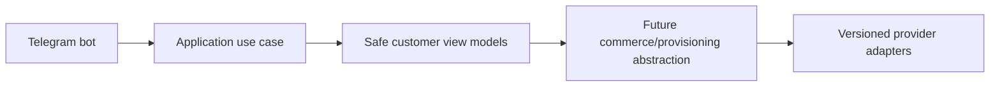

# Open Decisions

Open decisions: legal markets and currencies; exact PasarGuard OpenAPI schema; exact Sanaei 3x-ui installed version/API; payment providers and credentials; SMS/email providers; production hosting region; final charting package; whether admin TOTP is mandatory at launch; reseller credit policy; data retention durations.

Milestone 0 infrastructure decision: commit the generated `package-lock.json` after the first successful Codespaces bootstrap; remove the temporary no-lockfile CI fallback in a follow-up Milestone 0 cleanup once the lockfile is present.

Milestone 1A open decisions: final production identity encryption key storage/KMS, exact admin lockout thresholds, whether admin TOTP is mandatory at launch, audit/security event retention periods, IP/user-agent metadata minimization rules, and the Milestone 1B secure administrator bootstrap UX.

Milestone 1B-A open decisions: final production Redis fail-closed SLO, exact admin TOTP mandatory rollout date, production signing-key storage/KMS, trusted-device policy, and formal browser CSRF header naming for the future admin UI.

Milestone 1B-B open decisions: final KMS integration for admin signing/encryption keys, formal production Redis SLO and alert routing, whether TOTP becomes mandatory for every admin, and whether trusted-device labels should be user-editable beyond the current safe display model.

## Milestone 1C-A customer authentication note
Customer Telegram Mini App authentication now verifies raw init data, links Telegram identities to internal customers, issues isolated customer access credentials, rotates opaque refresh-cookie sessions, enforces CSRF on cookie-authenticated state changes, rate limits sensitive operations, and records sanitized audit/security events. Commerce and customer UI remain out of scope.
## Milestone 1C-B1 open decisions
Choose the production public Telegram bot username, final Mini App visual QA matrix across Telegram clients, and the exact CI-owned signed-init-data fixture for browser E2E. Service-worker caching remains intentionally skipped to avoid authenticated response caching risk.

## Milestone 1C-B2 Telegram bot foundation
The Telegram bot foundation supports explicit disabled, polling and secure webhook modes. Disabled mode is the default for CI and Docker verification and performs no Telegram network calls. Polling is for local development only. Webhook mode requires an HTTPS base URL, an environment-only secret token validated with constant-time comparison, request-size limits, allowed update configuration and update-id idempotency.

The `/start` flow normalizes trusted Bot API identity fields and calls a typed `RegisterOrUpdateTelegramBotUser` application use case. It does not create a browser session; Mini App authentication continues to verify raw Telegram initData through the existing backend flow. Usernames are never identity keys, and internal user UUIDs remain independent from Telegram user IDs.

The customer menu is an extensible registry with Persian defaults and English fallback preparation. Current working destinations are Mini App home, profile, sessions/security, help, language and privacy/about. Future commerce modules must register commands and menu items through feature modules and must not place product, pricing, payment or provisioning rules inside bot handlers.

Mini App URLs are generated by a centralized allowlisted builder. Tokens, initData, Telegram IDs, usernames, emails and internal UUIDs are never placed in URLs. Callback data is compact, typed and versioned. Logs and metrics use low-cardinality outcome fields and forbid raw updates, message text, identity fields and secrets.

## Milestone 1D-A identity administration
Milestone 1D-A introduces backend-only management APIs protected by database-resolved permissions. Effective permissions are loaded from active role assignments for each protected request, disabled/locked administrators are denied immediately, and final active Super Admin safeguards prevent disabling or stripping the last privileged administrator path. Administrator invitations store only token hashes and return plaintext tokens once. Customer management uses documented status transitions and revokes sessions on sensitive restrictions. Audit logs are query-only and append-oriented; security events add acknowledgment/resolution workflow state. Management UI and all commerce/provider functionality remain out of scope.

## Milestone 1D-B identity administration frontend
The administrator frontend adds permission-aware identity management pages for administrators, invitations, roles, permissions, customers, sessions, audit logs, and security events. The UI consumes the existing management APIs, reuses memory-only access tokens, HttpOnly refresh cookies, CSRF headers, and single-flight refresh, and never becomes the authoritative authorization layer. Direct unauthorized routes must show controlled forbidden states while backend permission checks remain decisive.

Invitation tokens are displayed exactly once from ephemeral component state, are never placed in URLs, localStorage, sessionStorage, logs, or analytics, and are cleared after acknowledgment. Audit metadata rendering is defensive and suppresses secret-like keys. Session pages show only normalized safe metadata returned by the backend. The security center supports acknowledgment/resolution language without implying that acknowledgment removes the underlying event.

## Milestone 2-A open decisions
Calendar-month pricing, reseller price lists, infrastructure pool allocation, quote-to-order conversion, public anonymous quote policy and full catalog administration UI remain deferred to later milestones.

## Milestone 2-B1 catalog administration note

Milestone 2-B1 adds an administrator-only catalog console in `apps/admin-web` that consumes the real Milestone 2-A catalog and pricing APIs. The backend remains authoritative for authorization, lifecycle transitions, publication validation, immutable published versions, price-list overlap, pricing validity, and concurrency conflicts. The frontend keeps access tokens in memory, sends CSRF headers for mutations, avoids storing draft API responses in browser storage, displays machine codes LTR, treats money as integer rial with explicit toman display, uses fixed-day duration labels, and keeps fulfillment requirements provider-neutral. Customer storefront, wallet/order/payment/provider/provisioning work remains out of scope.

## Milestone 2-B2 open decisions
- Exact future checkout handoff is intentionally unresolved.
- Richer backend catalog filtering and cursor pagination can replace current safe client query parameters when API support expands.
- Public browser catalog browsing remains governed by customer authentication policy and may be revisited separately.
