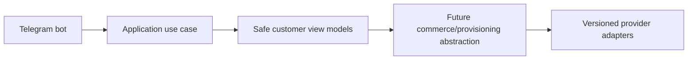

# Security

Security baseline includes Argon2id for future admin passwords, secure cookies, CSRF where applicable, strict CORS/CSP, rate limiting, replay prevention, webhook verification, object authorization, encrypted panel credentials, secret redaction, dependency scanning, secret scanning, backup encryption, and restore testing.

## Frontend dependency audit policy

Milestone 0 CI runs `npm audit --audit-level=high` after `npm ci`/install setup. Critical and high npm advisories fail CI. Moderate advisories are reviewed and documented; they may remain non-blocking only when the available npm fix is incompatible with the supported dependency line or would require a breaking downgrade/major migration that does not reduce risk.

## July 2026 frontend dependency review

The previous frontend baseline used `next@15.1.3`, `react@19.0.0`, `react-dom@19.0.0`, `@types/react@19.0.2`, `@types/react-dom@19.0.2`, and `@types/node@22.10.2` in each web app. That Next.js release was affected by multiple Next.js advisories, including critical React Server Components remote-code-execution exposure in the Next.js App Router line and additional high-severity middleware/proxy and denial-of-service advisories reported by `npm audit`.

The remediated Milestone 0 baseline pins each web app to `next@15.5.20`, `react@19.2.7`, `react-dom@19.2.7`, `@types/react@19.0.2`, `@types/react-dom@19.0.2`, and `@types/node@22.20.1`. This keeps the project on the patched Next.js 15 line instead of taking an unnecessary major-version migration. The React runtime packages were upgraded to patched 19.2.x releases; React type packages remain on the compatible 19.0.x line because Next.js 15.5 generated validation types reference the global `React.ComponentType` namespace shape. Each web app includes a small `react-global.d.ts` compatibility shim for that generated validator while retaining strict TypeScript checks.

Final `npm audit` status after the upgrade: no critical or high vulnerabilities. Two moderate findings remain because `next@15.5.20` pins `postcss@8.4.31`, which is affected by GHSA-qx2v-qp2m-jg93. npm reports the available automated fix as a breaking downgrade to `next@9.3.3`; a root override to `postcss@8.5.10` clears the advisory but makes npm report Next's exact dependency as invalid. Milestone 0 does not use user-supplied CSS stringification or expose products, users, authentication, payments, panels, or other business features. The finding remains documented and non-blocking until Next publishes a compatible patched dependency graph or the project intentionally migrates to a supported release that removes the exact vulnerable PostCSS pin.

## Milestone 1A identity security primitives

Identity secrets use reviewed primitives: Argon2id for administrator passwords, cryptographically random opaque tokens with SHA-256 hashes for persistence, and Fernet authenticated encryption for future TOTP secrets. Encrypted secret records carry a key version so rotation can decrypt old versions while writing new versions. Audit and security metadata rejects secret-looking keys such as passwords, tokens, hashes, credentials, TOTP, recovery codes, and raw Telegram init data.

## Milestone 1B-A administrator controls

Administrator passwords are policy checked before Argon2id hashing. Signed access tokens are short lived; refresh credentials are opaque, cookie-scoped, HttpOnly, and persisted only as hashes. CSRF state is derived per session. TOTP secrets use the existing key-versioned encrypted-secret abstraction, and recovery codes are one-time hashed values. Authentication audit/security metadata is sanitized and rejects secret-looking fields.

Redis-backed distributed rate limiting is the production target; the Milestone 1B-A abstraction includes deterministic in-process tests and documents fail-closed expectations for production Redis outages.

## Milestone 1B-B hardening

The API now uses a reusable SQLAlchemy engine/session factory, structured generic errors, session-bound CSRF checks for refresh-cookie operations, production Redis rate-limiter abstraction with fail-closed behavior, and consistent refresh-cookie creation/deletion attributes. Password change, recovery-code regeneration, and MFA disablement require strong confirmation and avoid logging secrets.

## Milestone 1C-A customer controls
Telegram init data is verified with HMAC-SHA256 according to the Mini Apps data-check-string design and constant-time signature comparison. Customer sessions use distinct issuer/audience/cookie/CSRF configuration from administrator sessions. Customer refresh cookies are HttpOnly, path-scoped to `/api/v1/customer/auth`, Secure in production, and never returned in URLs or browser storage. Rate-limit keys are HMAC-hardened and Redis outages fail closed in production-like environments.
## Milestone 1C-B1 frontend token policy
Customer access tokens, CSRF values, and session identifiers are held in JavaScript memory only and are cleared on logout, revoke-all, and refresh failure. The frontend never uses `initDataUnsafe`, never persists raw init data or tokens to Web Storage/IndexedDB/cookies, never places secrets in URLs, and exposes only public placeholders such as API base URL and bot username.

## Milestone 1C-B2 Telegram bot foundation
The Telegram bot foundation supports explicit disabled, polling and secure webhook modes. Disabled mode is the default for CI and Docker verification and performs no Telegram network calls. Polling is for local development only. Webhook mode requires an HTTPS base URL, an environment-only secret token validated with constant-time comparison, request-size limits, allowed update configuration and update-id idempotency.

The `/start` flow normalizes trusted Bot API identity fields and calls a typed `RegisterOrUpdateTelegramBotUser` application use case. It does not create a browser session; Mini App authentication continues to verify raw Telegram initData through the existing backend flow. Usernames are never identity keys, and internal user UUIDs remain independent from Telegram user IDs.

The customer menu is an extensible registry with Persian defaults and English fallback preparation. Current working destinations are Mini App home, profile, sessions/security, help, language and privacy/about. Future commerce modules must register commands and menu items through feature modules and must not place product, pricing, payment or provisioning rules inside bot handlers.

Mini App URLs are generated by a centralized allowlisted builder. Tokens, initData, Telegram IDs, usernames, emails and internal UUIDs are never placed in URLs. Callback data is compact, typed and versioned. Logs and metrics use low-cardinality outcome fields and forbid raw updates, message text, identity fields and secrets.

## Milestone 1D-A identity administration
Milestone 1D-A introduces backend-only management APIs protected by database-resolved permissions. Effective permissions are loaded from active role assignments for each protected request, disabled/locked administrators are denied immediately, and final active Super Admin safeguards prevent disabling or stripping the last privileged administrator path. Administrator invitations store only token hashes and return plaintext tokens once. Customer management uses documented status transitions and revokes sessions on sensitive restrictions. Audit logs are query-only and append-oriented; security events add acknowledgment/resolution workflow state. Management UI and all commerce/provider functionality remain out of scope.

## Milestone 1D-B identity administration frontend
The administrator frontend adds permission-aware identity management pages for administrators, invitations, roles, permissions, customers, sessions, audit logs, and security events. The UI consumes the existing management APIs, reuses memory-only access tokens, HttpOnly refresh cookies, CSRF headers, and single-flight refresh, and never becomes the authoritative authorization layer. Direct unauthorized routes must show controlled forbidden states while backend permission checks remain decisive.

Invitation tokens are displayed exactly once from ephemeral component state, are never placed in URLs, localStorage, sessionStorage, logs, or analytics, and are cleared after acknowledgment. Audit metadata rendering is defensive and suppresses secret-like keys. Session pages show only normalized safe metadata returned by the backend. The security center supports acknowledgment/resolution language without implying that acknowledgment removes the underlying event.

## Milestone 2-A catalog security
Quotes ignore client-supplied prices and persist server-side immutable snapshots. Idempotency keys are customer-scoped and hashed. Catalog responses omit admin notes, provider internals, server IPs, inbound identifiers, panel URLs and credentials.

## Milestone 2-B1 catalog administration note

Milestone 2-B1 adds an administrator-only catalog console in `apps/admin-web` that consumes the real Milestone 2-A catalog and pricing APIs. The backend remains authoritative for authorization, lifecycle transitions, publication validation, immutable published versions, price-list overlap, pricing validity, and concurrency conflicts. The frontend keeps access tokens in memory, sends CSRF headers for mutations, avoids storing draft API responses in browser storage, displays machine codes LTR, treats money as integer rial with explicit toman display, uses fixed-day duration labels, and keeps fulfillment requirements provider-neutral. Customer storefront, wallet/order/payment/provider/provisioning work remains out of scope.

## Milestone 2-B2 storefront controls
The customer storefront keeps access credentials and Telegram initData memory-only, serializes only safe catalog identifiers in URLs, calls authenticated preview/quote APIs without client prices, and renders controlled errors instead of backend internals. Quote references are treated as opaque identifiers and backend ownership checks remain authoritative. Preview is non-persisted and cannot create orders, wallet reservations, payments, services, allocations or provider requests.

## Milestone 3-A1 wallet and ledger backend
Wallet accounting is backend-only. API routes authenticate and authorize, then call typed wallet operations that post balanced integer-rial ledger entries and update projections transactionally. Customer wallet reads require customer sessions and expose only customer-facing references; administrator wallet and ledger routes require `wallets.*` or `ledger.*` permissions. Audit/security metadata is sanitized and must not contain raw tokens, idempotency keys, payment details, provider credentials, Telegram initData, or full request bodies. Reconciliation can detect projection mismatches and repair projections without mutating immutable journals or postings. Reservations protect available balance for future checkout but create no order, payment, provider call, or provisioning side effect.

## Milestone 3-A2A customer wallet interface
Customer-web now exposes the read-only customer wallet route family (`/wallet`, `/wallet/transactions`, transaction detail, `/wallet/credits`, `/wallet/reservations`, `/wallet/policy`) backed by the Milestone 3-A1 customer wallet APIs. Balances remain backend-authoritative integer rial values; the browser only validates safe response shape and formats explicitly labelled rial/toman displays. Wallet, auth, CSRF and Telegram initData values remain memory/cookie scoped according to the existing customer authentication model and are not stored in browser storage or URLs. The UI shows frozen/closed wallet states, safe account-status errors, bucket labels, credit expiration, reservations and future top-up policy, while payment, checkout, order, invoice, provider, provisioning and admin financial-console work remain deferred.
