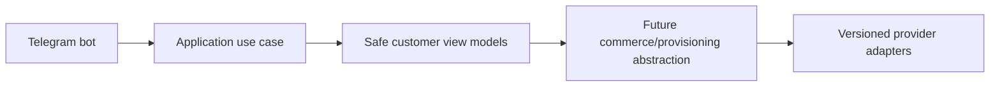

# Testing

Testing strategy covers unit, integration, contract, adapter, pricing, wallet concurrency, ledger invariants, order state machines, provisioning idempotency, reconciliation, RBAC, object auth, Telegram handlers, notification dedupe, migrations, browser E2E, accessibility, load, backup/restore, failover, and security regression tests.

## Milestone 0 verification

Milestone 0 uses GitHub Actions as the authoritative verification environment. The main workflow `.github/workflows/verify.yml` runs backend, frontend, Docker Compose, and security jobs on Ubuntu with Python 3.12, Node.js 22, PostgreSQL 16, Redis 7, and Docker Compose v2.

Repository scripts mirror CI categories and are intended for Codespaces and CI reuse. Backend verification derives the CI application database URL from the disposable PostgreSQL service credentials and verifies those credentials with a sanitized preflight before Alembic runs. Frontend verification reports tool versions, gates npm dependency security with `npm audit --audit-level=high`, and runs each real Next.js production build under a clear workspace label:

- `scripts/verify-backend.sh`
- `scripts/verify-frontend.sh`
- `scripts/verify-docker.sh`
- `scripts/security-scan.sh`
- `scripts/verify-all.sh`

The current no-lockfile npm installation path is temporary. Missing `package-lock.json` is a security-scan warning, not a failure, during this phase. When frontend CI falls back to `npm install`, it uploads the generated `package-lock.json` as the `generated-package-lock` artifact and does not commit or push it. Once `package-lock.json` is generated in Codespaces and committed, CI and Codespaces should use `npm ci` for reproducible frontend installs.

Security regression coverage is provided by `scripts/test-security-scan.sh`. It checks that the safe repository state passes, a temporary fake secret fixture fails, scanner pattern definitions do not self-match, and secret values are not printed.

## Frontend dependency security remediation

The July 2026 Milestone 0 dependency remediation upgraded the web apps from `next@15.1.3`, `react@19.0.0`, and `react-dom@19.0.0` to patched `next@15.5.20`, `react@19.2.7`, and `react-dom@19.2.7`, with Node type packages updated to the Node 22 line and React type packages kept on the compatible 19.0.x line required by Next.js 15.5 generated validator types. Validation commands executed for the remediation include `npm ci`, `npm audit`, workspace lint/typecheck/test, the three real Next.js production builds, backend Ruff/Pyright/pytest checks, the repository security scan, the security scanner regression test, and `git diff --check`. Remaining moderate npm audit risk is documented in `docs/SECURITY.md`.

## Milestone 1A tests

Milestone 1A adds deterministic unit tests for identity state machines, normalization, permission-code validation, audit metadata rejection, Argon2id, opaque tokens, and encrypted secrets. Integration-style tests exercise SQLite-backed SQLAlchemy metadata for repository behavior, uniqueness constraints, RBAC seed idempotency, append-only audit insertion, and refresh-token hash persistence. PostgreSQL Alembic upgrade/downgrade/re-upgrade remains required for final CI or a disposable local database.

## Milestone 1B-A tests

Added deterministic tests for password policy, bootstrap, generic login failures, lockout events, access-token validation, hardened rate-limit keys, refresh rotation/reuse family revocation, TOTP enrollment, MFA challenge login, recovery-code hashing, and one-time recovery-code rejection.

## Milestone 1B-B tests

Backend tests cover CSRF validation, safe profile/session data, password change with other-session revocation, cross-admin session ownership denial, recovery-code regeneration, and MFA disablement. Admin frontend tests assert memory-only access-token storage, credentials-enabled refresh calls, Authorization headers, and refresh single-flight control.

## Milestone 1C-A customer authentication note
Customer Telegram Mini App authentication now verifies raw init data, links Telegram identities to internal customers, issues isolated customer access credentials, rotates opaque refresh-cookie sessions, enforces CSRF on cookie-authenticated state changes, rate limits sensitive operations, and records sanitized audit/security events. Commerce and customer UI remain out of scope.
## Milestone 1C-B1 tests
Customer frontend checks cover Telegram adapter safety, absence of `initDataUnsafe`, memory-only credential storage, CSRF/credentials-enabled requests, single-flight refresh, one-time retry, bootstrap deduplication, browser fallback text, RTL/LTR rendering hooks, safe-area styling, and absence of commerce vocabulary. Full browser E2E should run in CI with the explicit fake Telegram adapter and signed backend fixture.

## Milestone 1C-B2 Telegram bot foundation
The Telegram bot foundation supports explicit disabled, polling and secure webhook modes. Disabled mode is the default for CI and Docker verification and performs no Telegram network calls. Polling is for local development only. Webhook mode requires an HTTPS base URL, an environment-only secret token validated with constant-time comparison, request-size limits, allowed update configuration and update-id idempotency.

The `/start` flow normalizes trusted Bot API identity fields and calls a typed `RegisterOrUpdateTelegramBotUser` application use case. It does not create a browser session; Mini App authentication continues to verify raw Telegram initData through the existing backend flow. Usernames are never identity keys, and internal user UUIDs remain independent from Telegram user IDs.

The customer menu is an extensible registry with Persian defaults and English fallback preparation. Current working destinations are Mini App home, profile, sessions/security, help, language and privacy/about. Future commerce modules must register commands and menu items through feature modules and must not place product, pricing, payment or provisioning rules inside bot handlers.

Mini App URLs are generated by a centralized allowlisted builder. Tokens, initData, Telegram IDs, usernames, emails and internal UUIDs are never placed in URLs. Callback data is compact, typed and versioned. Logs and metrics use low-cardinality outcome fields and forbid raw updates, message text, identity fields and secrets.

## Milestone 1D-A identity administration
Milestone 1D-A introduces backend-only management APIs protected by database-resolved permissions. Effective permissions are loaded from active role assignments for each protected request, disabled/locked administrators are denied immediately, and final active Super Admin safeguards prevent disabling or stripping the last privileged administrator path. Administrator invitations store only token hashes and return plaintext tokens once. Customer management uses documented status transitions and revokes sessions on sensitive restrictions. Audit logs are query-only and append-oriented; security events add acknowledgment/resolution workflow state. Management UI and all commerce/provider functionality remain out of scope.

## Milestone 1D-B identity administration frontend
The administrator frontend adds permission-aware identity management pages for administrators, invitations, roles, permissions, customers, sessions, audit logs, and security events. The UI consumes the existing management APIs, reuses memory-only access tokens, HttpOnly refresh cookies, CSRF headers, and single-flight refresh, and never becomes the authoritative authorization layer. Direct unauthorized routes must show controlled forbidden states while backend permission checks remain decisive.

Invitation tokens are displayed exactly once from ephemeral component state, are never placed in URLs, localStorage, sessionStorage, logs, or analytics, and are cleared after acknowledgment. Audit metadata rendering is defensive and suppresses secret-like keys. Session pages show only normalized safe metadata returned by the backend. The security center supports acknowledgment/resolution language without implying that acknowledgment removes the underlying event.

## Milestone 2-A catalog tests
Catalog tests cover money arithmetic, traffic/duration/device validation, lifecycle transitions, fixed/custom plan pricing, rule order, operation-specific add-on/renewal pricing, tier validation and provider-boundary scanner assertions.

## Milestone 2-B1 catalog administration note

Milestone 2-B1 adds an administrator-only catalog console in `apps/admin-web` that consumes the real Milestone 2-A catalog and pricing APIs. The backend remains authoritative for authorization, lifecycle transitions, publication validation, immutable published versions, price-list overlap, pricing validity, and concurrency conflicts. The frontend keeps access tokens in memory, sends CSRF headers for mutations, avoids storing draft API responses in browser storage, displays machine codes LTR, treats money as integer rial with explicit toman display, uses fixed-day duration labels, and keeps fulfillment requirements provider-neutral. Customer storefront, wallet/order/payment/provider/provisioning work remains out of scope.

## Milestone 2-B2 storefront tests
Customer storefront tests cover typed formatting/validation, query normalization, comparison limits, preview cancellation/latest-wins behavior, quote idempotency conflict mapping, expiration display, Telegram Back/Main button hooks, RTL/LTR rendering conventions, and storage safety. Repository E2E should seed catalog fixtures and verify no wallet, order, payment or provider side effects.

## Milestone 3-A1 wallet and ledger backend
Wallet accounting is backend-only. API routes authenticate and authorize, then call typed wallet operations that post balanced integer-rial ledger entries and update projections transactionally. Customer wallet reads require customer sessions and expose only customer-facing references; administrator wallet and ledger routes require `wallets.*` or `ledger.*` permissions. Audit/security metadata is sanitized and must not contain raw tokens, idempotency keys, payment details, provider credentials, Telegram initData, or full request bodies. Reconciliation can detect projection mismatches and repair projections without mutating immutable journals or postings. Reservations protect available balance for future checkout but create no order, payment, provider call, or provisioning side effect.

## Milestone 3-A2A customer wallet interface
Customer-web now exposes the read-only customer wallet route family (`/wallet`, `/wallet/transactions`, transaction detail, `/wallet/credits`, `/wallet/reservations`, `/wallet/policy`) backed by the Milestone 3-A1 customer wallet APIs. Balances remain backend-authoritative integer rial values; the browser only validates safe response shape and formats explicitly labelled rial/toman displays. Wallet, auth, CSRF and Telegram initData values remain memory/cookie scoped according to the existing customer authentication model and are not stored in browser storage or URLs. The UI shows frozen/closed wallet states, safe account-status errors, bucket labels, credit expiration, reservations and future top-up policy, while payment, checkout, order, invoice, provider, provisioning and admin financial-console work remain deferred.

## Milestone 3-A2B administrator financial console note
Administrator financial routes under `/management/finance`, `/management/wallets`, and `/management/ledger` use the existing admin authentication architecture with memory-only access tokens, HttpOnly refresh cookies, CSRF on mutations, and backend permission enforcement. Rial remains canonical, derived toman is presentation-only, journal/posting data is read-only, idempotency keys are memory-only, and no wallet or ledger API response is persisted in browser storage. The console intentionally excludes checkout, orders, invoices, payments, provider operations, provisioning, subscriptions, and financial analytics dashboards.

## Milestone 3-B1 order and checkout backend
Order checkout is backend-only and wallet-funded. Customer tokens can create/confirm/cancel their own checkout sessions and read their own orders/invoices. Administrator APIs require `orders.read`, `orders.cancel`, `invoices.read` or `checkout.read`. Commercial snapshots and invoice money are immutable; corrections use cancellation and compensating wallet ledger entries. `order.ready_for_fulfillment.v1` outbox events are normalized and contain no provider, payment credential, token, server, inbound or subscription data. Future external payments and provisioning remain documented boundaries, not implemented behavior.

## Milestone 3-B2A customer checkout interface
Customer-web now exposes wallet-funded commerce routes for quote checkout, order history/detail/timeline and immutable invoice history/detail. Checkout references only server-issued quote references, displays backend quote/order/invoice snapshots, uses `WALLET` as the only working method, keeps idempotency and commerce responses memory-only, and never sends authoritative price fields or wallet balances. Successful confirmation displays paid invoice/order state and `READY_FOR_FULFILLMENT` as queued for future service creation, not delivered service. Eligible cancellation is confirmed through backend checkout cancellation and refund/reservation-release states are presented as compensating history. Telegram Mini App behavior reuses the existing safe shell; raw initData, auth tokens, CSRF values, references and idempotency values are not persisted in browser storage or URLs.

## Milestone 3-B2B administrator order administration interface
Admin-web now includes `/management/commerce`, order discovery/detail/snapshot/timeline/reconciliation, immutable invoice inspection, checkout-session inspection, wallet-payment and reservation inspection, reviewed administrator cancellation, refund-state presentation and sanitized fulfillment-outbox inspection. The interface consumes real admin commerce APIs, uses permission-aware navigation, keeps order/financial/fulfillment states separate, treats invoices and order snapshots as immutable, and stores no commerce responses, cancellation reasons or idempotency values in browser storage. Backend compatibility additions remain read-only or reviewed-command endpoints and do not add external payments, provider infrastructure, provisioning, subscriptions, QR/configuration delivery or analytics.

## Payment testing
Payment tests use the deterministic fake adapter contract. Required coverage includes adapter-version registration, production fake-adapter rejection, state machines, exact amount/currency verification, webhook signature/replay behavior, idempotent settlement, compensating refunds and dry-run reconciliation mismatch detection.

## Milestone 4-A2A payment tests
Frontend payment tests cover integer-rial parsing, toman derivation, safe redirect validation, unsafe redirect rejection and idempotency key stability without storing auth/payment data in browser persistence. End-to-end fake adapter settlement remains deterministic test fixture scope only.

## Milestone 4-A2B1 payment operations testing
Admin-web includes deterministic behavioral coverage for payment navigation, route inventory, permission strings, runtime validation, safe metadata redaction, immutable inspection pages, webhook retry safeguards, RTL/LTR rendering and absence of forbidden controls. E2E setup must use explicit fake adapter test configuration and must not call real payment or VPN providers.

## Configuration tests

Configuration tests cover lifecycle, validation, publishing, rollback, feature rollout, template escaping, safe navigation, Telegram action registries, media validation, runtime APIs, ETags, permissions and migration head constraints.

## Support testing
Milestone 5-E tests cover participant isolation, internal-note privacy, assignment conflicts, legal status transitions, message ordering and deduplication, attachment quarantine/rejection, canned response placeholder allowlists, CSAT cycles and same-requester merge rules. E2E support flows must not call real VPN or payment providers.

## Milestone 5-F tests
Deterministic domain, API and Telegram bot tests cover publication immutability, preview expiry, unsafe block/media rejection, Persian normalization, guide recommendations, status UNKNOWN defaults and no fabricated VPN health.

## Milestone 6-A2A provider write safety gate

Provider mutations remain disabled. The write-contract layer supports only sanitized preflight and dry-run planning for 3X-UI v3.5.0, Alireza X-UI v1.11.3 and PasarGuard panel v4.0.2. PasarGuard v5.1.0/OpenAPI/API-key assumptions from Milestone 6-A1 are invalidated and require re-certification against the corrected contract digest. No real panel write, provisioning, subscription delivery or configuration generation is enabled by default.
