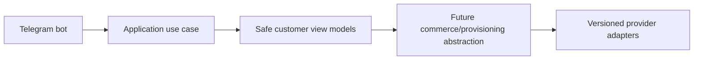

# Testing

Testing strategy covers unit, integration, contract, adapter, pricing, wallet concurrency, ledger invariants, order state machines, provisioning idempotency, reconciliation, RBAC, object auth, Telegram handlers, notification dedupe, migrations, browser E2E, accessibility, load, backup/restore, failover, and security regression tests.

## Milestone 0 verification

Milestone 0 uses GitHub Actions as the authoritative verification environment. The main workflow `.github/workflows/verify.yml` runs backend, frontend, Docker Compose, and security jobs on Ubuntu with Python 3.12, Node.js 22, PostgreSQL 16, Redis 7, and Docker Compose v2.

Repository scripts mirror CI categories and are intended for Codespaces and CI reuse. Backend verification derives the CI application database URL from the disposable PostgreSQL service credentials and verifies those credentials with a sanitized preflight before Alembic runs. Frontend verification reports tool versions, gates npm dependency security with `npm audit --audit-level=high`, and runs each real Next.js production build under a clear workspace label:

- `scripts/verify-backend.sh`
- `scripts/verify-frontend.sh`
- `scripts/verify-docker.sh`
- `scripts/security-scan.sh`
- `scripts/verify-all.sh`

The current no-lockfile npm installation path is temporary. Missing `package-lock.json` is a security-scan warning, not a failure, during this phase. When frontend CI falls back to `npm install`, it uploads the generated `package-lock.json` as the `generated-package-lock` artifact and does not commit or push it. Once `package-lock.json` is generated in Codespaces and committed, CI and Codespaces should use `npm ci` for reproducible frontend installs.

Security regression coverage is provided by `scripts/test-security-scan.sh`. It checks that the safe repository state passes, a temporary fake secret fixture fails, scanner pattern definitions do not self-match, and secret values are not printed.

## Frontend dependency security remediation

The July 2026 Milestone 0 dependency remediation upgraded the web apps from `next@15.1.3`, `react@19.0.0`, and `react-dom@19.0.0` to patched `next@15.5.20`, `react@19.2.7`, and `react-dom@19.2.7`, with Node type packages updated to the Node 22 line and React type packages kept on the compatible 19.0.x line required by Next.js 15.5 generated validator types. Validation commands executed for the remediation include `npm ci`, `npm audit`, workspace lint/typecheck/test, the three real Next.js production builds, backend Ruff/Pyright/pytest checks, the repository security scan, the security scanner regression test, and `git diff --check`. Remaining moderate npm audit risk is documented in `docs/SECURITY.md`.

## Milestone 1A tests

Milestone 1A adds deterministic unit tests for identity state machines, normalization, permission-code validation, audit metadata rejection, Argon2id, opaque tokens, and encrypted secrets. Integration-style tests exercise SQLite-backed SQLAlchemy metadata for repository behavior, uniqueness constraints, RBAC seed idempotency, append-only audit insertion, and refresh-token hash persistence. PostgreSQL Alembic upgrade/downgrade/re-upgrade remains required for final CI or a disposable local database.

## Milestone 1B-A tests

Added deterministic tests for password policy, bootstrap, generic login failures, lockout events, access-token validation, hardened rate-limit keys, refresh rotation/reuse family revocation, TOTP enrollment, MFA challenge login, recovery-code hashing, and one-time recovery-code rejection.

## Milestone 1B-B tests

Backend tests cover CSRF validation, safe profile/session data, password change with other-session revocation, cross-admin session ownership denial, recovery-code regeneration, and MFA disablement. Admin frontend tests assert memory-only access-token storage, credentials-enabled refresh calls, Authorization headers, and refresh single-flight control.

## Milestone 1C-A customer authentication note
Customer Telegram Mini App authentication now verifies raw init data, links Telegram identities to internal customers, issues isolated customer access credentials, rotates opaque refresh-cookie sessions, enforces CSRF on cookie-authenticated state changes, rate limits sensitive operations, and records sanitized audit/security events. Commerce and customer UI remain out of scope.
## Milestone 1C-B1 tests
Customer frontend checks cover Telegram adapter safety, absence of `initDataUnsafe`, memory-only credential storage, CSRF/credentials-enabled requests, single-flight refresh, one-time retry, bootstrap deduplication, browser fallback text, RTL/LTR rendering hooks, safe-area styling, and absence of commerce vocabulary. Full browser E2E should run in CI with the explicit fake Telegram adapter and signed backend fixture.

## Milestone 1C-B2 Telegram bot foundation
The Telegram bot foundation supports explicit disabled, polling and secure webhook modes. Disabled mode is the default for CI and Docker verification and performs no Telegram network calls. Polling is for local development only. Webhook mode requires an HTTPS base URL, an environment-only secret token validated with constant-time comparison, request-size limits, allowed update configuration and update-id idempotency.

The `/start` flow normalizes trusted Bot API identity fields and calls a typed `RegisterOrUpdateTelegramBotUser` application use case. It does not create a browser session; Mini App authentication continues to verify raw Telegram initData through the existing backend flow. Usernames are never identity keys, and internal user UUIDs remain independent from Telegram user IDs.

The customer menu is an extensible registry with Persian defaults and English fallback preparation. Current working destinations are Mini App home, profile, sessions/security, help, language and privacy/about. Future commerce modules must register commands and menu items through feature modules and must not place product, pricing, payment or provisioning rules inside bot handlers.

Mini App URLs are generated by a centralized allowlisted builder. Tokens, initData, Telegram IDs, usernames, emails and internal UUIDs are never placed in URLs. Callback data is compact, typed and versioned. Logs and metrics use low-cardinality outcome fields and forbid raw updates, message text, identity fields and secrets.

## Milestone 1D-A identity administration
Milestone 1D-A introduces backend-only management APIs protected by database-resolved permissions. Effective permissions are loaded from active role assignments for each protected request, disabled/locked administrators are denied immediately, and final active Super Admin safeguards prevent disabling or stripping the last privileged administrator path. Administrator invitations store only token hashes and return plaintext tokens once. Customer management uses documented status transitions and revokes sessions on sensitive restrictions. Audit logs are query-only and append-oriented; security events add acknowledgment/resolution workflow state. Management UI and all commerce/provider functionality remain out of scope.

## Milestone 1D-B identity administration frontend
The administrator frontend adds permission-aware identity management pages for administrators, invitations, roles, permissions, customers, sessions, audit logs, and security events. The UI consumes the existing management APIs, reuses memory-only access tokens, HttpOnly refresh cookies, CSRF headers, and single-flight refresh, and never becomes the authoritative authorization layer. Direct unauthorized routes must show controlled forbidden states while backend permission checks remain decisive.

Invitation tokens are displayed exactly once from ephemeral component state, are never placed in URLs, localStorage, sessionStorage, logs, or analytics, and are cleared after acknowledgment. Audit metadata rendering is defensive and suppresses secret-like keys. Session pages show only normalized safe metadata returned by the backend. The security center supports acknowledgment/resolution language without implying that acknowledgment removes the underlying event.

## Milestone 2-A catalog tests
Catalog tests cover money arithmetic, traffic/duration/device validation, lifecycle transitions, fixed/custom plan pricing, rule order, operation-specific add-on/renewal pricing, tier validation and provider-boundary scanner assertions.

## Milestone 2-B1 catalog administration note

Milestone 2-B1 adds an administrator-only catalog console in `apps/admin-web` that consumes the real Milestone 2-A catalog and pricing APIs. The backend remains authoritative for authorization, lifecycle transitions, publication validation, immutable published versions, price-list overlap, pricing validity, and concurrency conflicts. The frontend keeps access tokens in memory, sends CSRF headers for mutations, avoids storing draft API responses in browser storage, displays machine codes LTR, treats money as integer rial with explicit toman display, uses fixed-day duration labels, and keeps fulfillment requirements provider-neutral. Customer storefront, wallet/order/payment/provider/provisioning work remains out of scope.

## Milestone 2-B2 storefront tests
Customer storefront tests cover typed formatting/validation, query normalization, comparison limits, preview cancellation/latest-wins behavior, quote idempotency conflict mapping, expiration display, Telegram Back/Main button hooks, RTL/LTR rendering conventions, and storage safety. Repository E2E should seed catalog fixtures and verify no wallet, order, payment or provider side effects.
