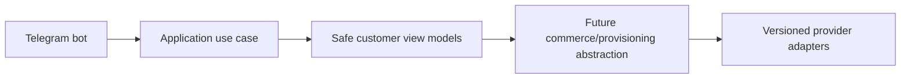

# Threat Model

Threats: credential theft, panel compromise, Telegram init data forgery, session theft, CSRF, XSS, SSRF, SQL injection, webhook forgery/replay, duplicate payments, wallet races, double provisioning, IDOR, privilege escalation, unsafe uploads, secret/log leakage, malicious panel responses, supply chain risk, backup exposure, and insider abuse. Controls map to docs/SECURITY.md.

## Milestone 1A additions

New controls reduce credential theft, session replay, privilege escalation, and audit-log leakage risks. Raw passwords, refresh tokens, recovery codes, and TOTP secrets are not stored. Unique constraints protect duplicate normalized administrator email, Telegram ID, role-permission pairs, admin-role pairs, and token hashes. Remaining risks include future login endpoint rate limits, admin bootstrap hardening, TOTP enrollment UX, and production key-management decisions.

## Milestone 1B-A administrator authentication threats

New controls address administrator credential stuffing, account enumeration, stolen refresh-token replay, MFA replay, recovery-code reuse, CSRF on cookie-authenticated endpoints, and secret leakage through logs/audit metadata. Remaining risks include selecting production Redis availability posture, final KMS-backed identity encryption key storage, and operational signing-key rotation runbooks.

## Milestone 1B-B updated controls

CSRF attacks against refresh-cookie endpoints are mitigated with session-bound tokens. Cross-administrator session revocation is denied by ownership checks. Redis limiter outage in production-like environments is treated as a sensitive authentication failure rather than unlimited access. The admin frontend avoids localStorage/sessionStorage for access tokens.

## Milestone 1C-A customer authentication note
Customer Telegram Mini App authentication now verifies raw init data, links Telegram identities to internal customers, issues isolated customer access credentials, rotates opaque refresh-cookie sessions, enforces CSRF on cookie-authenticated state changes, rate limits sensitive operations, and records sanitized audit/security events. Commerce and customer UI remain out of scope.
## Milestone 1C-B1 customer UI threats
The customer Mini App mitigates init-data leakage, token persistence, refresh storms, CSRF on cookie-authenticated state changes, browser fallback confusion, unsupported Telegram clients, and route loops. Remaining risks include production Telegram client variability and final public bot username rollout.

## Milestone 1C-B2 Telegram bot foundation
The Telegram bot foundation supports explicit disabled, polling and secure webhook modes. Disabled mode is the default for CI and Docker verification and performs no Telegram network calls. Polling is for local development only. Webhook mode requires an HTTPS base URL, an environment-only secret token validated with constant-time comparison, request-size limits, allowed update configuration and update-id idempotency.

The `/start` flow normalizes trusted Bot API identity fields and calls a typed `RegisterOrUpdateTelegramBotUser` application use case. It does not create a browser session; Mini App authentication continues to verify raw Telegram initData through the existing backend flow. Usernames are never identity keys, and internal user UUIDs remain independent from Telegram user IDs.

The customer menu is an extensible registry with Persian defaults and English fallback preparation. Current working destinations are Mini App home, profile, sessions/security, help, language and privacy/about. Future commerce modules must register commands and menu items through feature modules and must not place product, pricing, payment or provisioning rules inside bot handlers.

Mini App URLs are generated by a centralized allowlisted builder. Tokens, initData, Telegram IDs, usernames, emails and internal UUIDs are never placed in URLs. Callback data is compact, typed and versioned. Logs and metrics use low-cardinality outcome fields and forbid raw updates, message text, identity fields and secrets.

## Milestone 1D-A identity administration
Milestone 1D-A introduces backend-only management APIs protected by database-resolved permissions. Effective permissions are loaded from active role assignments for each protected request, disabled/locked administrators are denied immediately, and final active Super Admin safeguards prevent disabling or stripping the last privileged administrator path. Administrator invitations store only token hashes and return plaintext tokens once. Customer management uses documented status transitions and revokes sessions on sensitive restrictions. Audit logs are query-only and append-oriented; security events add acknowledgment/resolution workflow state. Management UI and all commerce/provider functionality remain out of scope.
