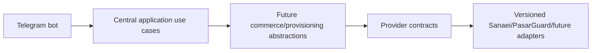

# ADR 0008: Telegram bot modular boundaries

## Status
Accepted for Milestone 1C-B2.

## Context
The Telegram bot must become a production-ready customer entry point without coupling handlers to commerce, provisioning or provider infrastructure.

## Decision
Use this dependency direction:

Handlers are thin aiogram adapters. They translate updates into typed commands, call application use cases and render localized view models. They never access SQLAlchemy models, Redis clients, panel APIs, payment gateways, raw repository queries, product/pricing logic or provisioning rules.

Webhook and polling transports share one bot/dispatcher lifecycle per process. Webhook mode validates HTTPS configuration and Telegram secret tokens with constant-time comparison. Polling is local-development only unless explicitly approved.

The menu is a registry of typed items with stable IDs, localization keys, target types, account-state policy and future feature/capability metadata. Future products, wallet, orders, support, subscriptions, referrals and reseller modules must register their own commands/menu items instead of expanding a giant handler file.

Callback data is compact, versioned and typed. Mini App destinations are produced only by an allowlisted URL builder. Bot tokens, webhook secrets, access tokens, refresh tokens, initData, Telegram IDs, usernames, emails and internal UUIDs are never placed in URLs.

## Consequences
Provider/server changes, multiple provider instances, multiple servers/nodes, multiple inbounds, capability discovery, versioned adapters, store-owned subscription links, QR delivery and single-configuration delivery will be introduced behind application view models in later milestones. Bot handlers remain provider-agnostic.

## Prohibitions
The bot must not call Sanaei, PasarGuard, 3X-UI, servers, nodes, inbounds or provider APIs directly and must not implement commerce or provisioning behavior.
