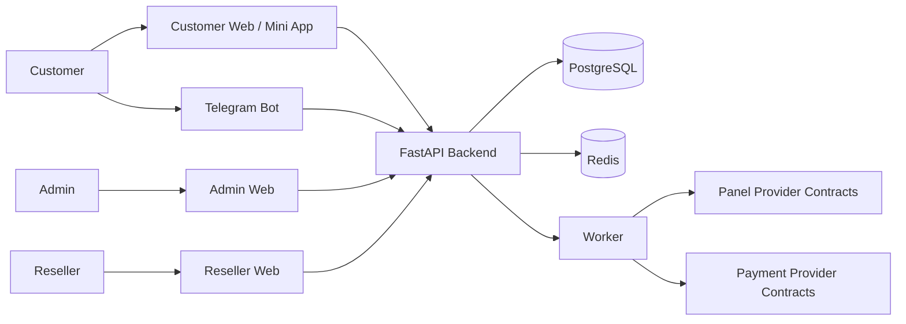

# Checkout Flow

```mermaid
flowchart LR
  Customer[Customer] --> Web[Customer Web / Mini App]
  Customer --> Bot[Telegram Bot]
  Admin[Admin] --> AdminWeb[Admin Web]
  Reseller[Reseller] --> ResellerWeb[Reseller Web]
  Web --> API[FastAPI Backend]
  Bot --> API
  AdminWeb --> API
  ResellerWeb --> API
  API --> DB[(PostgreSQL)]
  API --> Redis[(Redis)]
  API --> Worker[Worker]
  Worker --> Panels[Panel Provider Contracts]
  Worker --> Payments[Payment Provider Contracts]
```
