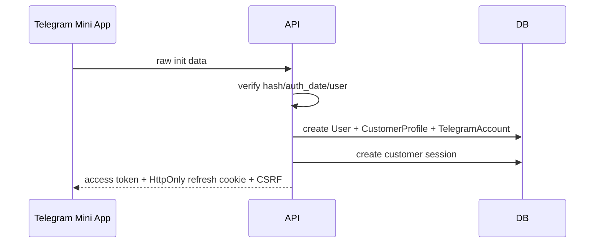
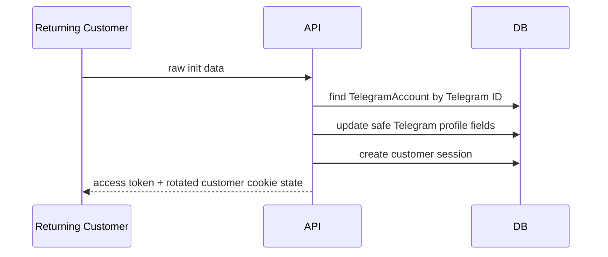
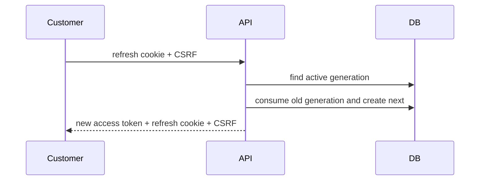
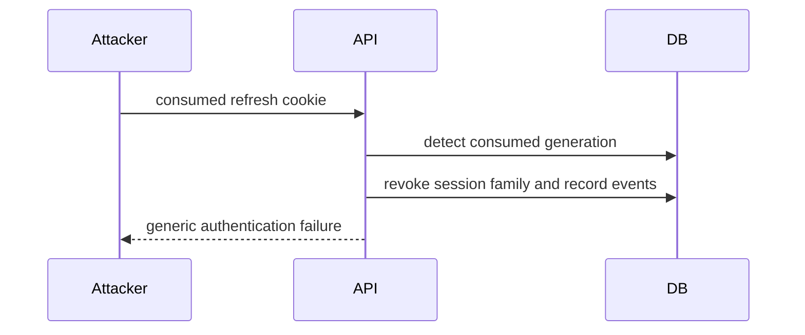
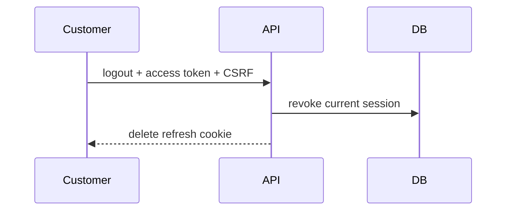

# Milestone 1C-A Plan: Telegram Customer Authentication Backend

## Scope
Milestone 1C-A implements backend-only customer authentication for Telegram Mini Apps: strict raw init-data verification, internal User/TelegramAccount linking, customer sessions, refresh rotation with reuse detection, CSRF-protected cookie refresh flows, profile/session APIs, rate limiting, audit/security events, deterministic tests, and documentation.

## Non-goals
No Telegram bot `/start`, bot menus, customer dashboard, store, products, wallet, payments, panel integrations, provisioning, subscriptions, referrals, tickets, reseller behavior, or complete frontend UI are included.

## Threat assumptions
Attackers may forge init data, replay stale Mini App launches, steal refresh cookies, attempt CSRF, reuse consumed refresh tokens, enumerate account status, abuse session-management APIs, scrape logs, or trigger Redis outages. Raw init data, bot tokens, signatures, access/refresh credentials, CSRF values, token hashes, and full Telegram payloads are never logged or returned.

## API decisions
Versioned customer routes live under `/api/v1/customer/auth/...`. Routes are thin FastAPI adapters over customer authentication services. Access credentials use customer-only issuer/audience values and cannot authorize admin routes; admin credentials cannot authorize customer routes. Refresh credentials use separate customer cookie names and paths.

## Acceptance criteria
- Raw Telegram Mini App init data is verified server-side with duplicate, malformed, expired, future, oversized, and modified data rejected.
- Customer identity linking creates or updates safe Telegram fields transactionally and activates first verified PENDING customers.
- Customer sessions rotate refresh generations, store only hashes, revoke immediately, and revoke families on reuse.
- Cookie-authenticated state changes require customer CSRF state.
- Customer profile and session APIs enforce ownership and status.
- Documentation and tests cover the implemented backend without adding commerce or UI behavior.

## Mermaid flows

