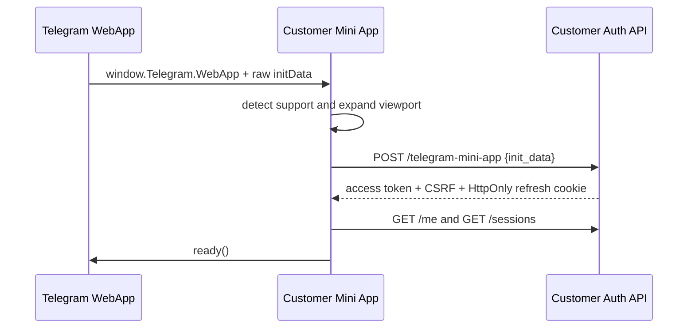
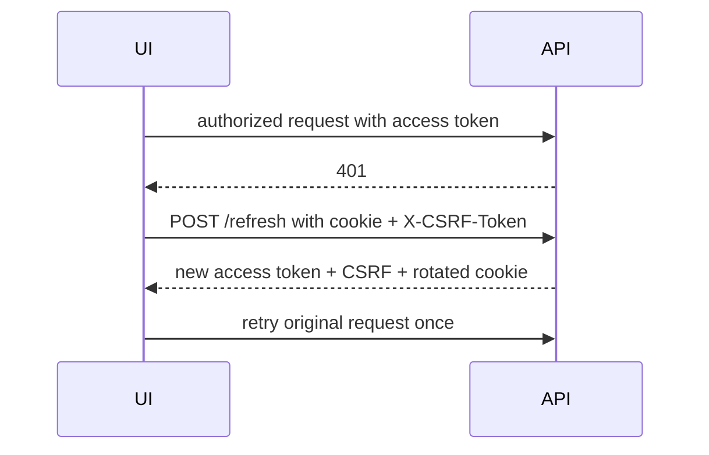
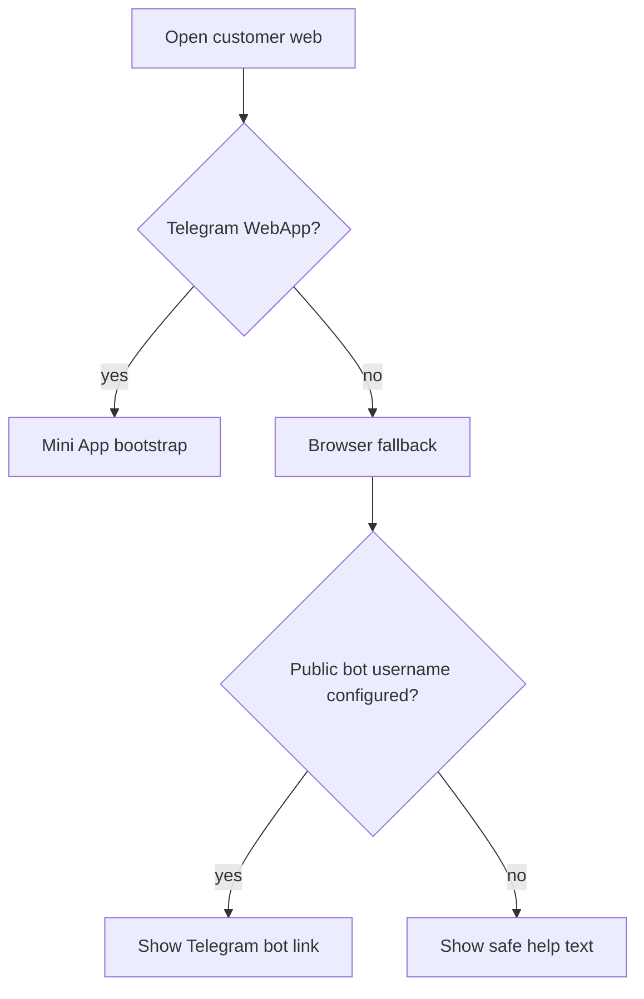
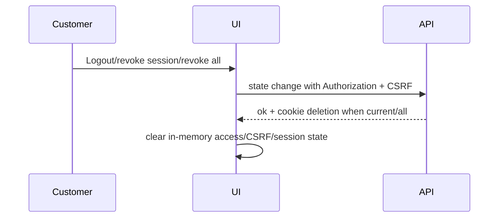

# Milestone 1C-B1 Plan: Customer Mini App and Web Authentication UI

## Scope
Milestone 1C-B1 adds the customer-facing Telegram Mini App/browser fallback shell. It integrates only with the merged `/api/v1/customer/auth` APIs for Telegram init-data login, refresh, CSRF, profile, sessions, logout, selected-session revocation, revoke-other sessions, and revoke-all sessions.

## Non-goals
No Telegram bot `/start`, bot menus, products, plans, wallet, ledger, orders, payments, provisioning, subscriptions, coupons, referrals, tickets, reseller features, or business dashboards are implemented.

## UI state machine
The frontend models authentication as `INITIALIZING`, `TELEGRAM_DETECTED`, `AUTHENTICATING`, `AUTHENTICATED`, `REFRESHING`, `UNAUTHORIZED`, `EXPIRED`, `BLOCKED`, `SUSPENDED`, `DEACTIVATED`, `RATE_LIMITED`, `TELEGRAM_UNAVAILABLE`, `UNSUPPORTED_CLIENT`, `NETWORK_ERROR`, and `SERVICE_UNAVAILABLE`. Route guards render safe states instead of redirect loops.

## Telegram and browser behavior
The typed adapter detects `window.Telegram.WebApp` only on the client, reads raw `initData`, never reads `initDataUnsafe`, calls `expand()`, calls `ready()` when a loading/final state is ready, reads theme and viewport/safe-area values, and wraps optional BackButton/MainButton events. Browser users see an RTL branded fallback and, when configured, a public bot link.

## Security boundaries
Access tokens and CSRF values are memory-only. Refresh tokens remain in the HttpOnly cookie scoped by the backend. Requests use `credentials: "include"`, Authorization headers for access tokens, CSRF headers for cookie-authenticated state changes, one retry after refresh, and single-flight refresh. Raw init data is posted only to the backend and is not logged, persisted, or placed in URLs.

## Acceptance criteria
- Safe Telegram detection and unsupported-client handling.
- Raw init-data bootstrap deduplicated for React Strict Mode.
- Profile and session pages render only API-supported fields.
- Session revocation actions use confirmations and clear memory after revoke-all/logout.
- RTL Persian UI includes LTR technical identifiers, theme integration, and safe-area padding.
- Deterministic frontend checks prove memory-only storage, no `initDataUnsafe`, CSRF headers, single-flight refresh, retry behavior, fallback state, and no commerce vocabulary.

## Mermaid flows

