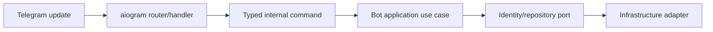
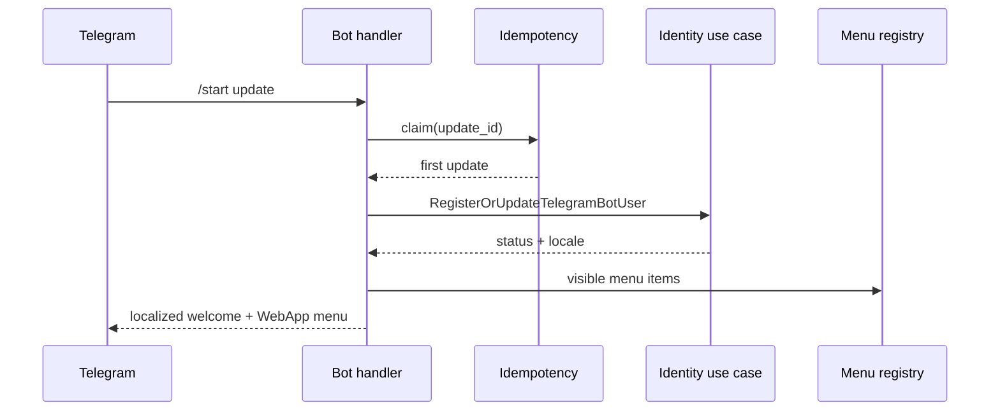
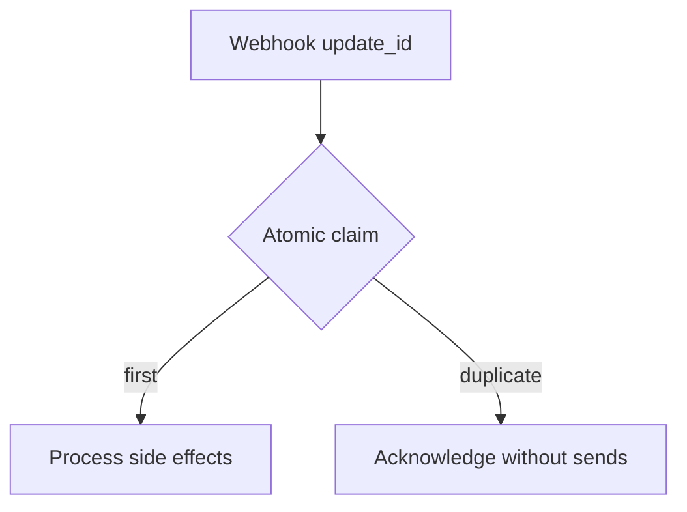
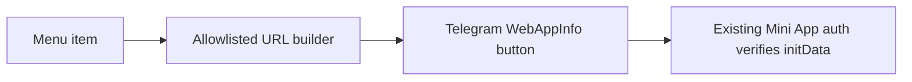
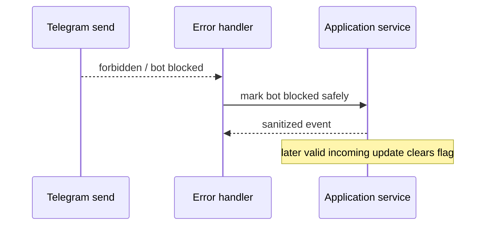

# Milestone 1C-B2 Plan — Telegram Bot Foundation

## Scope
Implement the production-oriented Telegram bot foundation only: disabled, polling and webhook modes; secure webhook secret validation; `/start` identity registration through application use cases; professional Persian customer menu; Mini App WebApp launch URLs; localization; update idempotency; bot rate limiting; observability and health/readiness surfaces.

## Non-goals
Products, pricing, wallet, ledger, orders, payments, panel adapters, provisioning, subscriptions, tickets, broadcasts, referrals, resellers, servers, nodes, inbounds, QR codes and provider API calls are explicitly out of scope.

## Architecture

Handlers translate Telegram data into typed commands and must not import SQLAlchemy models, open database sessions, query Redis directly, call provider APIs, or contain commerce/provisioning rules.

## Runtime modes
- **disabled**: default, no Telegram network calls, honest health state for CI and Docker verification.
- **polling**: explicit local development mode, configurable allowed updates and timeout, rejected in production-like environments unless policy explicitly allows it.
- **webhook**: production-oriented POST endpoint with HTTPS URL validation, constant-time `X-Telegram-Bot-Api-Secret-Token` checks, request-size limits, idempotency and fast acknowledgement.

## `/start` sequence

## Duplicate handling

## Mini App launch

No tokens, initData, Telegram IDs, usernames, emails or internal UUIDs are placed in URLs.

## Blocked bot handling

## Acceptance criteria
The bot supports all required commands, idempotent `/start`, menu extensibility, webhook secret validation, Mini App URL allowlisting, localization fallback, HMAC-hardened rate-limit keys, safe logs/metrics, Docker optional operation without real credentials and no commerce/provider functionality.

## Risks and mitigations
- Telegram network calls in tests are avoided with deterministic fakes.
- Redis outages fail closed in production design; in-memory fakes are test-only.
- Legal privacy copy is concise and marked for final legal review.
