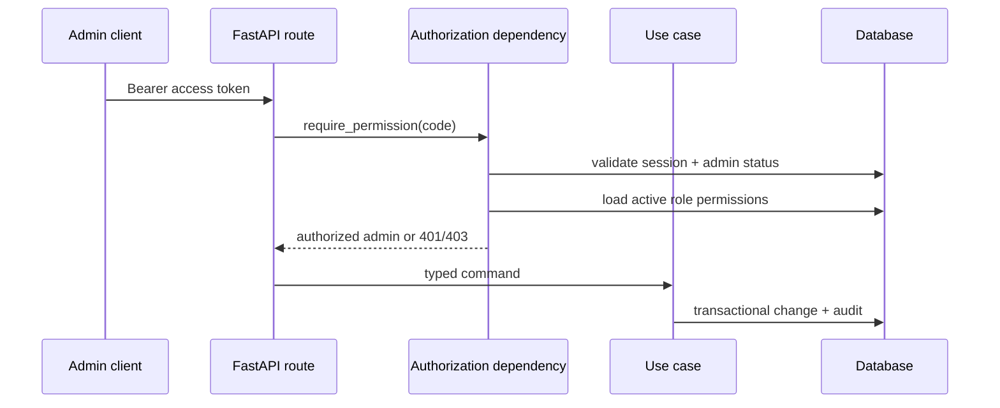

# Milestone 1D-A Plan: Identity Administration Backend

## Scope
Backend-only identity administration: permission enforcement, administrator invitation/status/roles/sessions, custom role management, read-only permission catalog, customer lookup/status/sessions, audit-log querying, security-event workflow, bounded filtering, append-only audit coverage, and migration support.

## Non-goals
No management frontend, products, plans, pricing, wallet, ledger, orders, payments, panels, servers, provisioning, subscriptions, coupons, referrals, tickets, broadcasts, resellers, or analytics.

## Authorization model
FastAPI routes depend on reusable admin authorization dependencies. The dependency validates the existing administrator access token, verifies the server-side session, enforces `ACTIVE` status, and loads effective permissions from active database roles. Client-supplied roles or token claims are not trusted. Deny by default returns 401 for missing/invalid authentication and 403 for authenticated permission failures.

Super Admin is explicit: the `super_admin` role is protected, all seeded permissions are attached during bootstrap, and final active Super Admin safeguards prevent disabling or stripping the last active Super Admin path.

## Management APIs
- `/api/v1/admin/management/admins` lists and retrieves safe admin representations.
- Invitation endpoints create, revoke/regenerate foundation records, and return plaintext tokens only once.
- Administrator status endpoints lock, unlock, and disable while revoking sessions where required.
- Role APIs create/update/deactivate custom roles and manage permission assignments.
- Permission APIs are read-only and based on the seeded catalog.
- User APIs list/filter customer identities, show safe Telegram summaries, update profile metadata, perform legal status transitions, and revoke sessions.
- Audit-log APIs are read-only; no update/delete/purge route exists.
- Security-event APIs list, acknowledge, resolve, and reopen workflow state without deleting event facts.

## Privacy policy
Responses omit password hashes, invitation hashes, token hashes, TOTP secrets, recovery-code hashes, CSRF hashes, raw Telegram init data, full user agents, and raw IP addresses. Audit and security metadata is sanitized through domain metadata rules.

## Security risks
- Stale authorization is mitigated by loading permissions from current database roles per request.
- Invitation leakage is mitigated by one-time plaintext return and hash-only persistence.
- Privilege loss or outage is mitigated by final active Super Admin protections.
- Sensitive status changes revoke sessions transactionally.

## Migrations
Revision `0005_milestone_1d_a` adds invitation fields, role workflow metadata, security-event workflow fields, indexes, foreign keys, and idempotent management permission seed rows. Downgrade removes only the milestone additions.

## Acceptance criteria
Milestone 1D-A is complete when permission enforcement, management APIs, bounded filtering, invitation activation, final Super Admin protections, audit querying, security-event workflow, tests, documentation, migration upgrade/downgrade, and required checks are green with no commerce/provider/frontend management work added.
