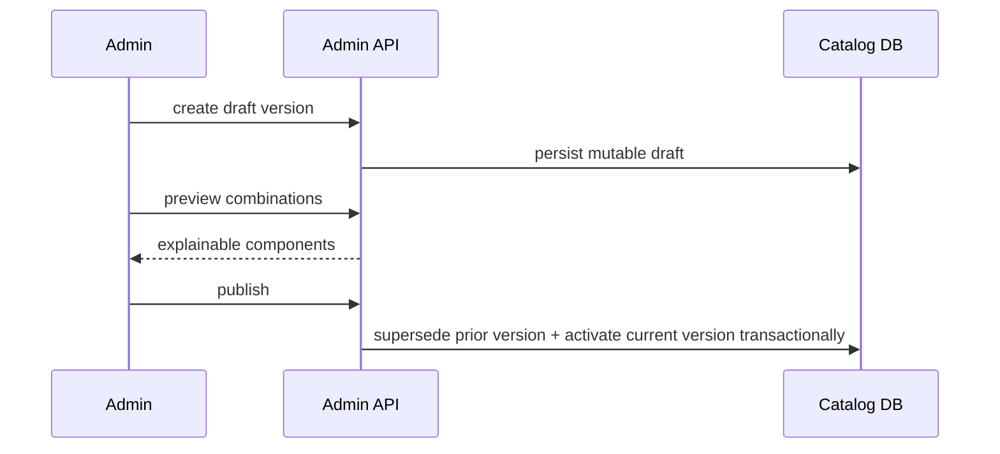
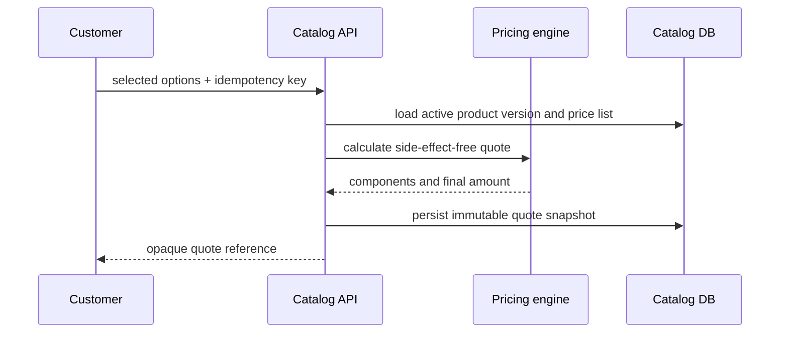
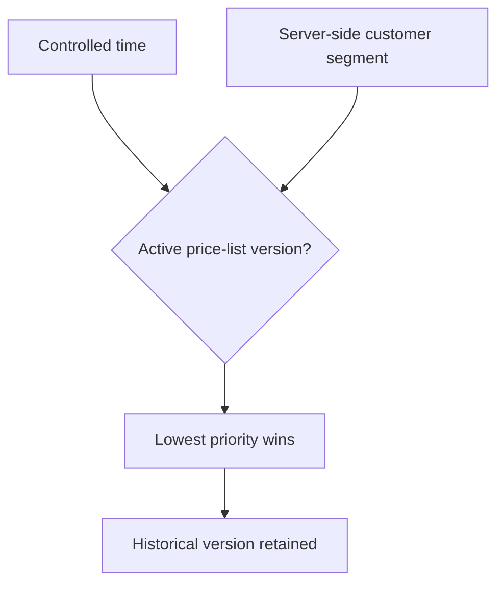
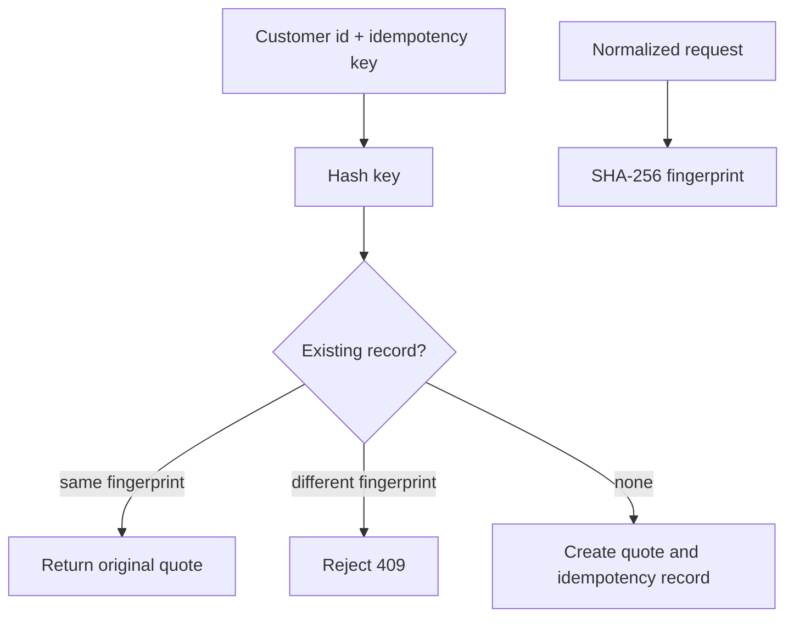
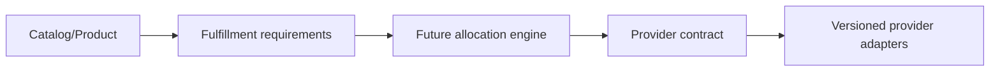

# Milestone 2-A Plan — Catalog and Pricing Backend

## Scope
Backend catalog foundation: product categories, products, immutable product versions, fixed and custom plan definitions, provider-neutral fulfillment requirements, versioned price lists/rules, deterministic customer quotes, quote expiration and customer-scoped quote idempotency.

## Non-goals
No wallet, ledger, orders, invoices, payments, gateways, coupons, referrals, reseller commissions, provider instances, panel credentials, servers, nodes, inbounds, allocation, provisioning, subscription links, QR codes or catalog frontend.

## Domain terms
- **Category** groups visible products with localized public text and separate admin notes.
- **Product** is a saleable catalog item with lifecycle state and a current published version.
- **ProductVersion** is an immutable published snapshot containing options, constraints and fulfillment requirements.
- **Fixed plan** requires selected traffic/duration/device values to match the template.
- **Custom plan** allows bounded traffic bytes, fixed-day duration and device count choices.
- **PriceListVersion** resolves server-side by active period, segment and priority.
- **PriceRule** is typed and ordered; no script or SQL expression is accepted.
- **Quote** is an immutable server-side price snapshot with opaque reference and expiration.

## Pricing rules and order
The engine evaluates rules deterministically in this order: fixed base, traffic, duration, device, location, quality, operation/segment adjustments, minimum/maximum bounds and final integer rounding. Money is stored in integer minor units; the canonical Iranian unit is rial and toman is display-only as 10 rial.

## Publication and quote flows

## Migration risks
The migration creates normalized catalog, pricing and quote tables with UUID keys, integer money, BigInteger traffic/tier values, check constraints, unique constraints and indexes. It seeds only catalog/pricing permissions and no products or prices. Rollback drops Milestone 2-A tables and permission rows on disposable environments.

## Acceptance criteria
Milestone 2-A is accepted when published product versions are immutable snapshots, fixed/custom options validate, price quotes are deterministic and idempotent, customer APIs expose only published data, admin APIs are permission-protected, provider-specific fields are absent and documentation states remaining limitations.
