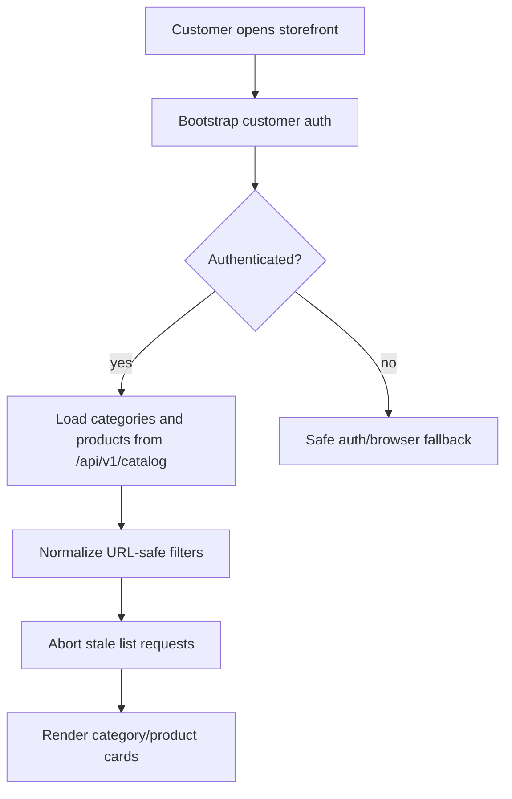
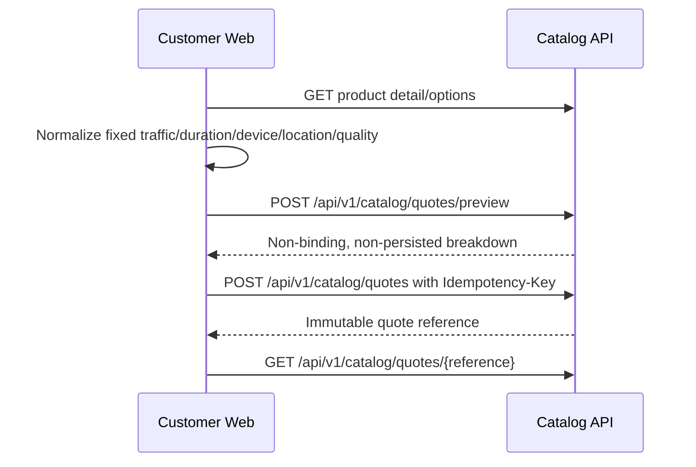
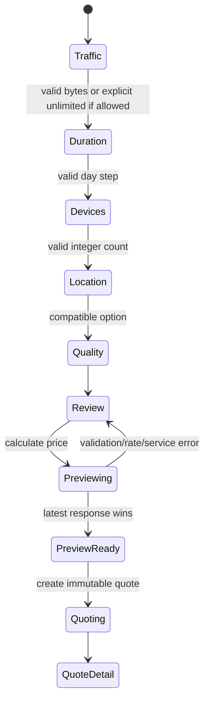
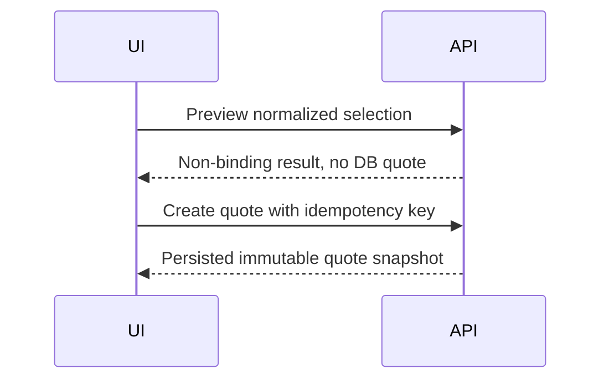
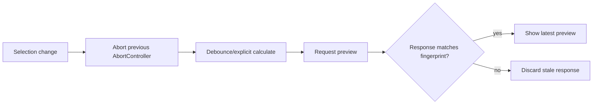
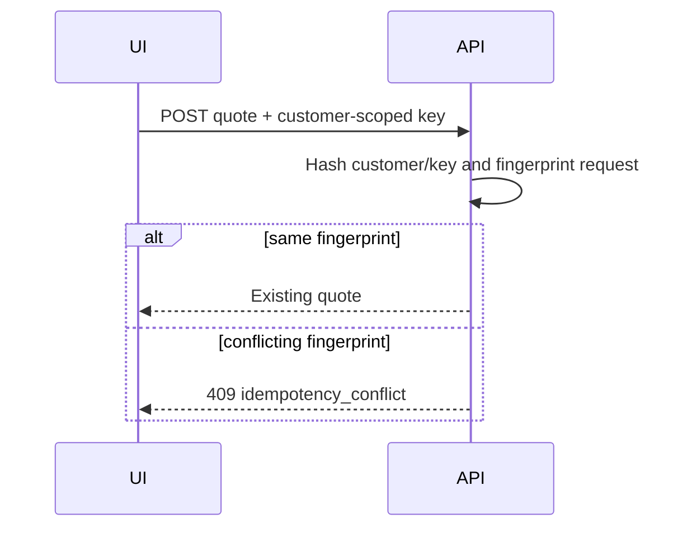
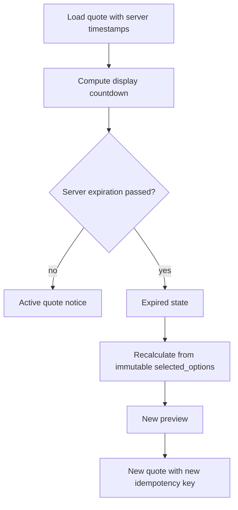
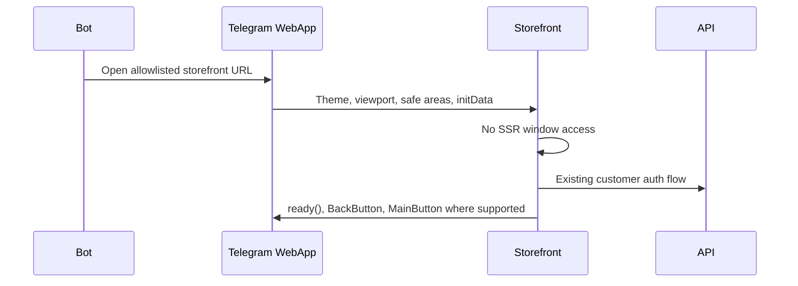

# Milestone 2-B2 Plan: Customer Catalog Storefront

Milestone 2-B2 adds the customer-web and Telegram Mini App storefront for real catalog discovery, fixed-plan selection, custom-plan building, server-authoritative non-persisted preview, immutable quote creation, quote detail, expiration handling, and bounded comparison. Checkout, wallet, orders, payments, providers, provisioning, subscription delivery, QR codes and service operations remain non-goals.

## Page inventory

- `/` storefront landing with real active categories and published products.
- `/catalog/categories` category browsing.
- `/catalog/products` searchable/filterable product listing.
- `/catalog/products/[productId]` product detail.
- `/catalog/products/[productId]/fixed` fixed-plan selection.
- `/catalog/products/[productId]/custom` custom-plan builder.
- `/catalog/compare` bounded comparison.
- `/catalog/quotes/[quoteReference]` immutable quote detail and expiration/recalculation state.
- Controlled states: unavailable product, paused/retired product, empty catalog, authentication required, suspended, blocked, network error, service unavailable, safe generic error and not found.

## Catalog discovery flow

Only backend-supported filters are exposed: category, plan type and bounded localized search. Query strings contain only safe catalog identifiers and filters.

## Fixed-plan flow

No client-supplied price is trusted and no order, wallet reservation, payment, service, allocation or provider request is created.

## Custom-plan state machine

Traffic bytes, duration days and device counts are normalized as integers. Client validation is usability-only; backend validation remains authoritative.

## Authoritative pricing policy

The browser never calculates authoritative final prices. It may format integer rial/toman values returned by the backend and validates component sums for malformed responses. Preview uses the same server pricing engine as quote creation and is marked `binding: false` and `persisted: false`.

## Preview and quote distinction

Preview responses cannot be reused as order prices. Final price locking occurs only in quote creation.

## Preview cancellation

## Quote idempotency

## Quote expiration and recalculation

Old quotes are never modified.

## Telegram Mini App integration

Raw initData stays in memory for the existing auth bootstrap only; it is not logged, persisted, rendered or placed in URLs.

## Security boundaries

- Access tokens and CSRF values remain memory-only.
- Refresh credentials remain HttpOnly cookies.
- Quote references are identifiers, not authorization.
- Product/provider internals, panel URLs, server IPs, inbound IDs, SQL, pricing implementation objects and raw backend exceptions are never rendered.
- Account statuses fail closed for protected preview and quote operations.

## Accessibility

The storefront is RTL-first with semantic headings, keyboard-accessible cards/actions, labelled filters, screen-reader step progress, live regions for preview/quote results, visible focus indicators, reduced-motion-safe countdowns and LTR technical identifiers.

## Non-goals

Checkout, wallet, ledger, financial transactions, orders, invoices, payment gateways, refunds, provider instances, server/node/inbound management, allocation, provisioning, subscriptions, QR/config delivery, coupons, referrals, tickets, broadcasts, reseller commerce and analytics are not included.

## Acceptance criteria

Customers can browse real published categories/products, configure fixed and custom plans, receive non-persisted server previews, create immutable idempotent quotes, view quote breakdown/expiration, recalculate expired selections, compare up to three products, use the flow inside Telegram Mini App, and retain memory-only auth/initData handling with tests and documentation.
