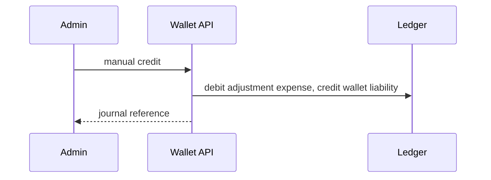
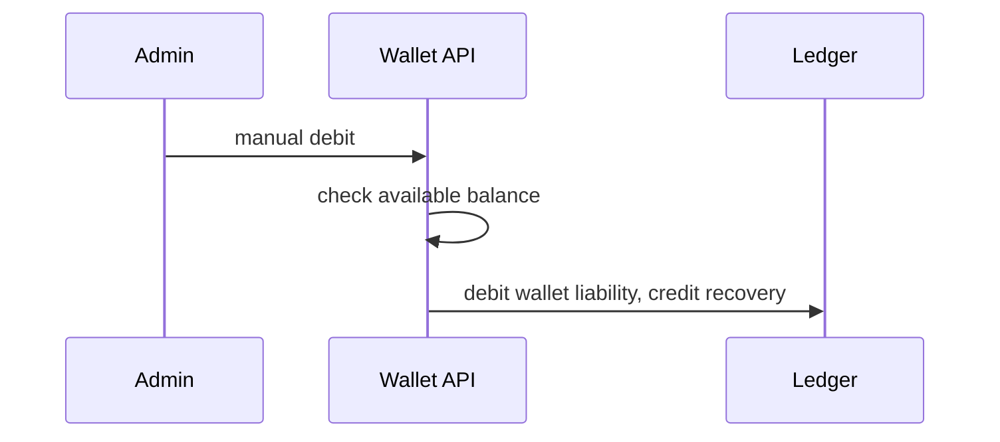
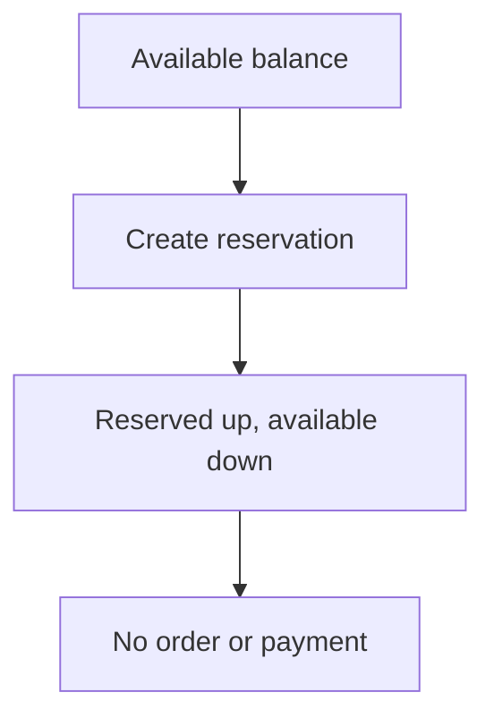
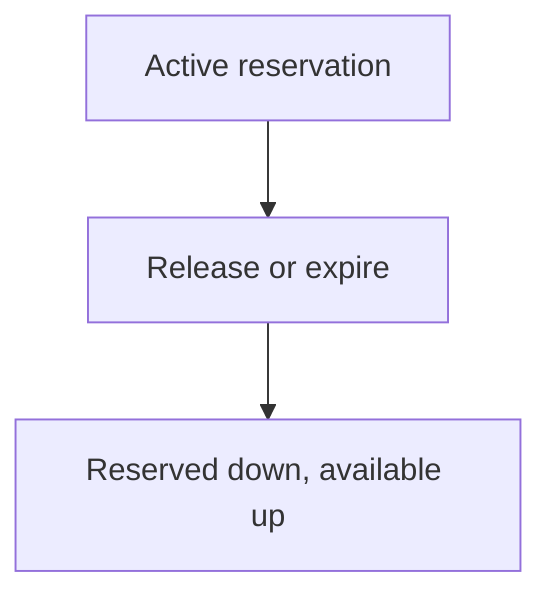
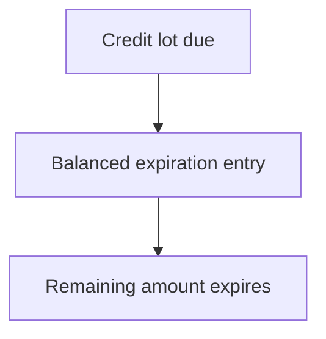
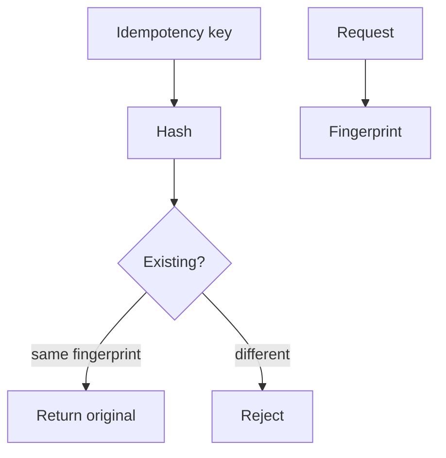
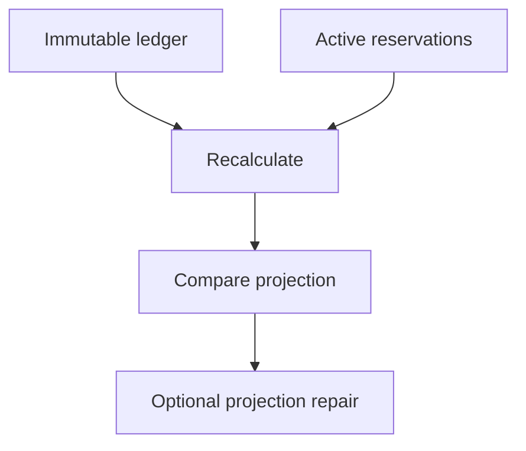

# Milestone 3-A1 Plan — Wallet and ledger backend

## Scope
Backend-only wallet foundation: one IRR wallet per customer, immutable balanced double-entry ledger, integer-rial money, balance buckets, expiring credit lots, reservations, manual admin adjustments, wallet policy, customer transaction reads, administrator ledger inspection, reconciliation, audit metadata, and migration coverage.

## Non-goals
No frontend wallet pages, checkout, orders, invoices, payment gateways, payment webhooks, external refunds, provider infrastructure, provisioning, subscriptions, referrals rewards, coupons, withdrawals, dashboards, or service delivery.

## Terminology and direction
- **Wallet**: customer-owned IRR balance container.
- **Journal entry**: immutable posted financial event.
- **Posting**: positive integer-rial debit or credit line.
- **Customer liability account**: credit increases customer-facing balance; debit decreases it.
- **Available balance**: posted balance minus active reservations.
- **Bucket**: customer-visible source category: cash, refund, promotional, referral, gift, or admin grant.

## Invariants
Money is integer rial only; no float columns are used. Every posted entry must balance. No endpoint sets a balance directly. Reversals never mutate the original. Projection mismatches are detected and repair rebuilds projections only.

## Permissions
`wallets.read`, `wallets.adjust`, `wallets.freeze`, `wallets.policy.manage`, `ledger.read`, and `ledger.reconcile` are seeded for explicit role assignment. Customer endpoints require customer tokens and enforce ownership.

## Concurrency and idempotency
Financial mutations use scoped idempotency records keyed by actor scope, operation type, hashed key, and request fingerprint. Projection rows are locked for posting/reconciliation paths. Database uniqueness prevents duplicate wallet/currency and duplicate idempotency scopes.

## Reconciliation
Reconciliation recalculates posted balance from wallet ledger postings, active reservations, and available balance, then reports mismatches. Repair updates only projections and records an audit event; immutable ledger entries are never edited.

## Privacy boundaries
Audit metadata uses safe IDs, operation codes, integer rial amounts, currency, actor IDs, target customer IDs, correlation ID, and reason codes. Raw idempotency keys, tokens, credentials, card data, provider data, Telegram initData, and full request bodies are forbidden.

## Mermaid flows

## Acceptance criteria
Implemented backend foundations satisfy balanced accounting, immutable corrections, reproducible balances, available balance reservations, bucket separation, expiring credit foundation, controlled wallet policy, permission-protected adjustments, idempotency, reconciliation, customer ownership, admin permission checks, integer rial storage, and no checkout/payment/provider functionality.
