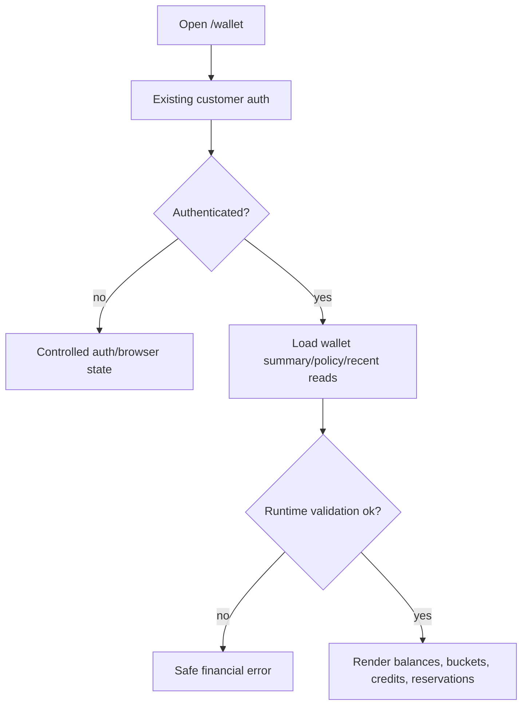
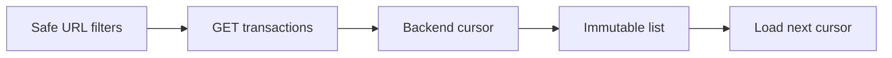
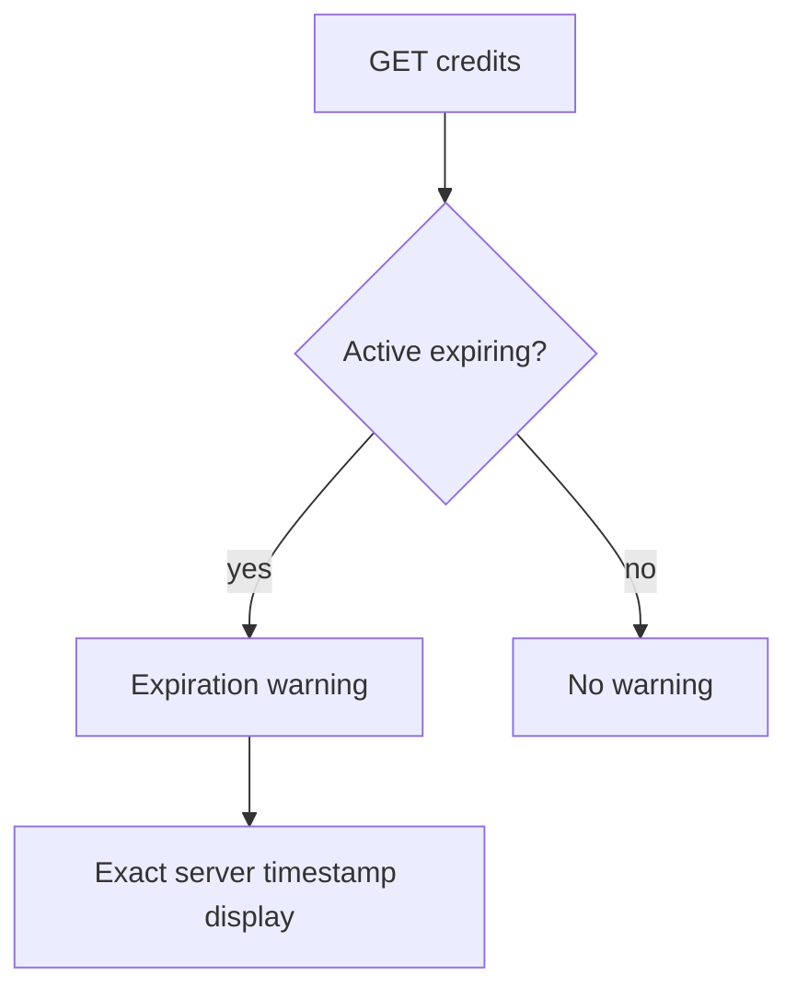
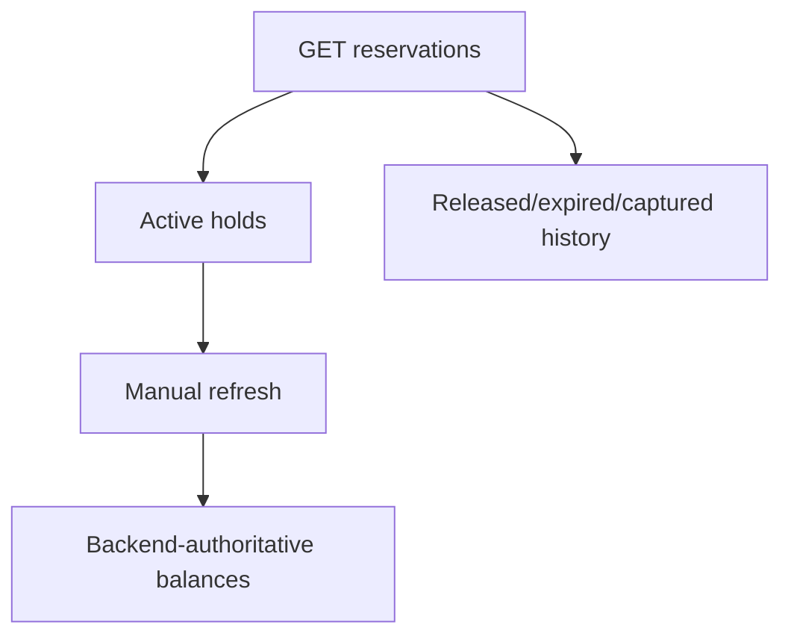
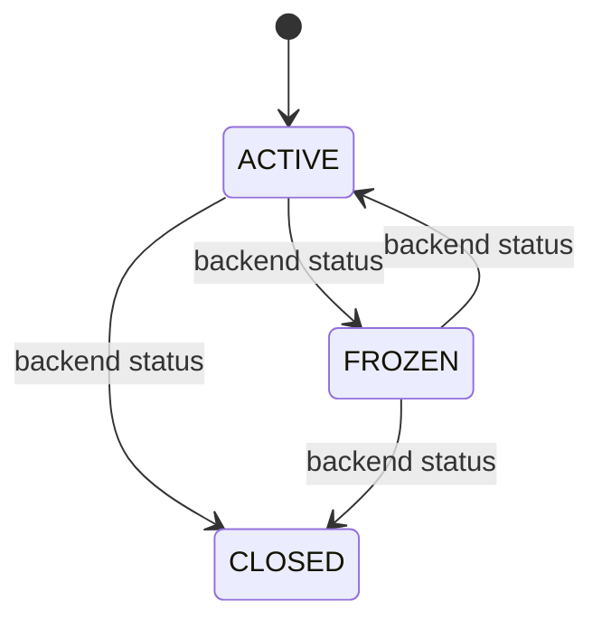
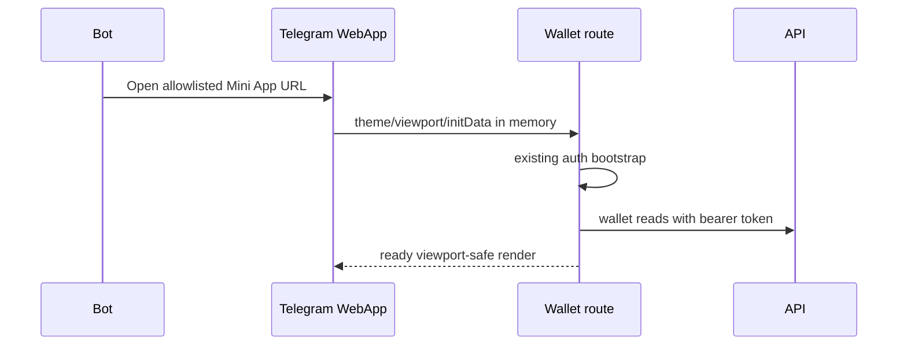

# Milestone 3-A2A Plan — Customer wallet interface

Milestone 3-A2A adds the customer-web and Telegram Mini App read interface for the already-merged Milestone 3-A1 wallet APIs. It does not add admin financial UI, checkout, orders, payments, provider operations, provisioning, subscriptions, invoices, refunds, withdrawals, transfers or analytics.

## Page inventory and API coverage

- `/wallet` loads `/api/v1/customer/wallet`, `/policy`, `/transactions`, `/credits`, and `/reservations` for an overview.
- `/wallet/transactions` loads cursor-shaped transaction history from `/transactions`.
- `/wallet/transactions/[transactionReference]` loads one safe transaction detail.
- `/wallet/credits` loads credit-lot and expiration records from `/credits`.
- `/wallet/reservations` loads active and historical reservations from `/reservations`.
- `/wallet/policy` loads top-up policy limits from `/policy` and shows them as future-only information.

## Balance terminology

Posted, reserved and available balances are distinct backend fields. The browser validates non-negative safe integer rial values and the projection relationship declared by the 3-A1 API, but it does not calculate authoritative balances or repair mismatches. Rial is always visible; toman is derived only as an explicitly labelled readability display.

## Balance buckets

Customer-visible buckets are mapped through controlled labels: `CASH`, `REFUND`, `PROMOTIONAL`, `REFERRAL`, `GIFT`, and `ADMIN_GRANT`. Unknown bucket codes receive a safe generic label. Promotional, referral and gift buckets are presented as non-cash credit, not withdrawable money. Ledger account codes and accounting debit/credit internals are not displayed.

## Credit expiration

Credit lots display bucket type, remaining rial, derived toman, issued time when present, expiration time, source operation when present and a controlled status label. The warning section appears only when the backend returns active expiring credit.

## Transactions and reservations

Transactions are immutable, read-only and customer-facing. The UI displays opaque references, type, optional customer-perspective direction, amount when provided, status and safe timestamps. Reservations are shown as temporary wallet holds, never as completed purchases or orders.

## Wallet policy and statuses

Policy values come from the backend and are shown as future top-up limits only. No top-up button, payment route, amount form, gateway, checkout, order, invoice or provider action is present. Active wallets show normal reads, frozen wallets show a restricted read-only banner, and closed wallets show closed-state guidance.

## Telegram Mini App integration

The route is part of the existing customer shell, so it reuses memory-only access tokens, HttpOnly refresh cookies, CSRF lifecycle, Telegram theme parameters, viewport safe-area padding and browser fallback. Raw Telegram initData is never stored, logged, rendered or placed in URLs.

## Security and storage policy

Wallet responses, tokens, CSRF values, profile data, correlation IDs and raw Telegram initData are not written to localStorage, sessionStorage or IndexedDB. Fetches use `cache: no-store`, request cancellation and safe error mapping. Diagnostics remain low-cardinality and must not include customer IDs, wallet IDs, transaction references, amounts or full response bodies.

## Non-goals

No admin financial console, wallet charging, payment gateway, card receipt, webhook, checkout, cart, order, invoice, refund, withdrawal, transfer, cryptocurrency, coupon, referral reward, reseller settlement, service, provisioning, subscription, QR/config delivery, provider integration or financial analytics is implemented.

## Mermaid diagrams

## Acceptance criteria

Customers can view real wallet summary, balance buckets, credit expiration, transactions, reservations and policy; frozen/closed states are represented; account restrictions use backend errors; Telegram and browser fallback remain safe; no wallet/auth data is persisted in browser storage; no ledger internals or payment/provider information is exposed.
