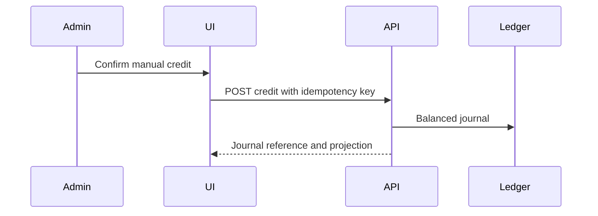
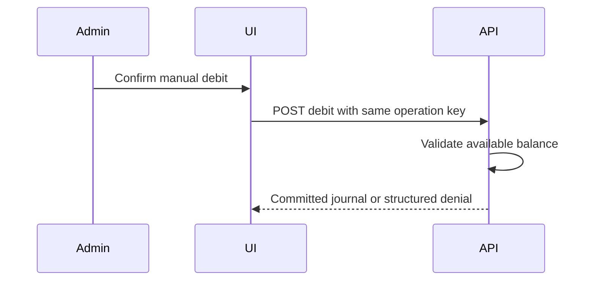
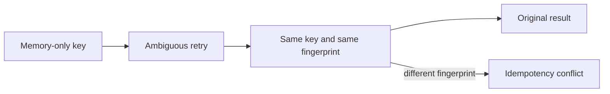
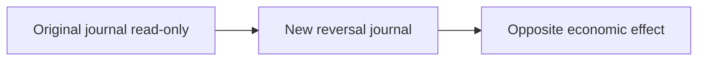
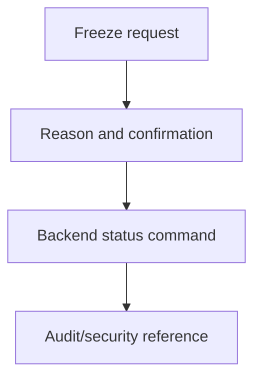
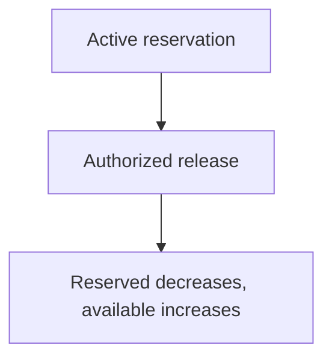
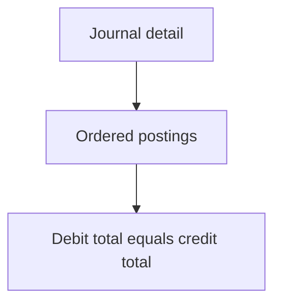
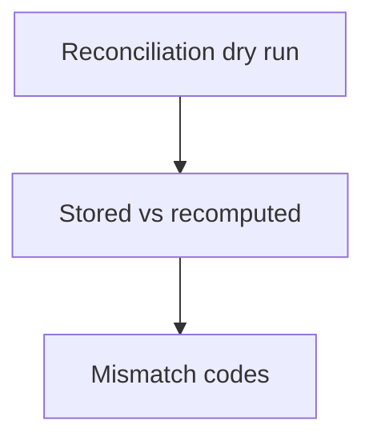
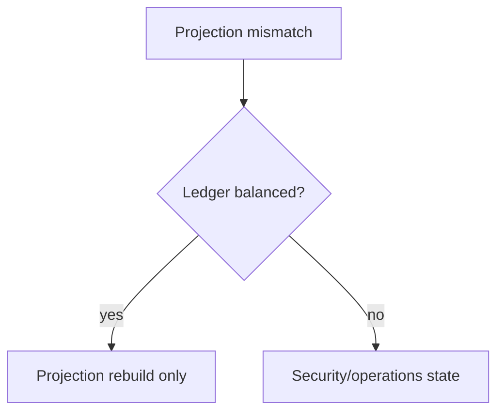
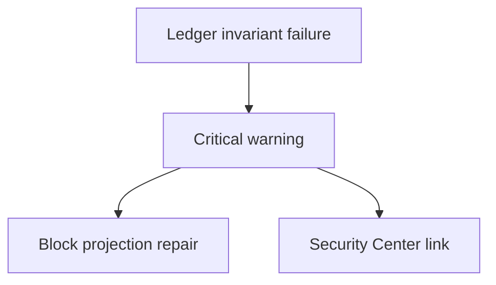

# Milestone 3-A2B Plan — Administrator financial console

Milestone 3-A2B adds the administrator-facing financial console for customer wallets and the Milestone 3-A1 double-entry ledger backend. It is scoped to `apps/admin-web` with only minimal compatibility expectations from existing `/api/v1/admin/management/wallets` and `/ledger` APIs.

## Page inventory

- `/management/finance` financial operations overview with no fake KPIs.
- `/management/wallets` cursor-shaped wallet discovery.
- `/management/wallets/[walletId]` wallet detail and safe actions.
- `/management/wallets/[walletId]/transactions` immutable wallet journal history.
- `/management/wallets/[walletId]/adjustments/credit`, `/debit`, and `/result` for separate manual adjustment workflows.
- `/management/wallets/[walletId]/freeze` and `/unfreeze` for privileged status workflows.
- `/management/ledger` and `/management/ledger/[journalId]` for ledger and posting inspection.
- `/management/ledger/[journalId]/reverse` for compensating reversal.
- `/management/finance/credits` for credit-lot and expiration inspection.
- `/management/finance/reservations` and `/reservations/[reservationId]` for reservation inspection and supported release confirmation.
- `/management/finance/policy` for version-aware wallet policy management.
- `/management/finance/reconciliation` and `/reconciliation/[walletId]` for dry-run reconciliation, mismatch detail, and projection rebuild confirmation.
- `/management/finance/states` documents financial 403, unavailable, safe error, and not-found states.

## API coverage

The frontend client targets the real Milestone 3-A1 administrator API family: wallet list/detail/transactions, credit and debit adjustments, reversal, freeze/unfreeze, current wallet policy update, journal detail, credit/reservation explorers where supported, reservation release where supported, and wallet reconciliation with dry-run or repair flags. Unsupported aggregates are omitted instead of calculated by loading full datasets.

## Financial permissions

The console uses backend permission names: `wallets.read`, `wallets.adjust`, `wallets.freeze`, `wallets.policy.manage`, `ledger.read`, and `ledger.reconcile`. Navigation and controls are permission-aware, but backend authorization remains the security boundary. Read access does not imply adjustment, freeze, policy, or reconciliation access.

## Accounting terminology

Rial is canonical. Toman is a labelled derived display only. Posted balance is the ledger projection, reserved balance is an active hold, and available balance is customer spendability. Journal entries and postings are immutable; corrections use reversal or compensating entries. Debit and credit posting columns are positive, text-labelled, and not represented as signed money.

## Manual adjustment workflow

Credit and debit are separate forms. Each accepts a positive integer-rial amount, reason code, sanitized reason, optional safe reference, explicit confirmation, and a client-generated idempotency key held only in memory. The UI never optimistically changes balances and displays success only after server commit.

## Reversal workflow

Only eligible journals expose reversal. Reversal creates a new journal, preserves the original, uses stable idempotency, refreshes affected views after success, and handles already-reversed or conflicting responses safely.

## Wallet freeze policy

Freeze/unfreeze require `wallets.freeze`, a bounded reason, explicit confirmation, and server success before status changes are shown. Wallet freeze is distinct from customer account suspension and does not remove history.

## Reservation management

Reservations are temporary wallet holds, not orders or payments. The UI inspects status, amount, purpose, timestamps, related reference, and active reserved-balance contribution. Release is shown only as an administrative supported command and capture/create are not implemented.

## Reconciliation and projection repair

Dry run compares stored projection with recomputed ledger-derived posted balance and active-reservation values. Projection rebuild requires confirmation and changes projection only; it never edits journal entries or postings and is blocked when the immutable ledger is imbalanced.

## Security controls

Access tokens, CSRF values, financial API responses, adjustment forms, results, wallet data, journal data, and raw idempotency keys are not written to browser storage. Diagnostics are low-cardinality and must not include IDs, amounts, reason text, tokens, raw responses, or idempotency keys. Structured errors map safe codes and show only controlled correlation context.

## Accessibility

Persian RTL is default, technical references are LTR, tables have responsive card alternatives, monetary inputs expose units, confirmations name the high-risk operation, focus indicators remain visible, and reduced-motion preferences disable skeleton animation.

## Non-goals

No customer wallet page, checkout, cart, orders, invoices, payment gateways, external refunds, withdrawals, transfers, cryptocurrencies, coupons, referrals, reseller settlement, services, provisioning, subscriptions, QR/config links, provider infrastructure, or financial analytics dashboards are added.

## Acceptance criteria

Acceptance requires real wallet discovery and detail, distinct posted/reserved/available balances, real credit/debit commands, no direct balance setter, stable financial idempotency, read-only ledger and posting inspection, reversal by new journal, freeze/unfreeze, credit/reservation inspection, policy editing, reconciliation and projection repair controls, audit/security links, permission-aware UI, RTL/LTR accessibility, behavioral tests, and matching documentation.

## Mermaid diagrams

