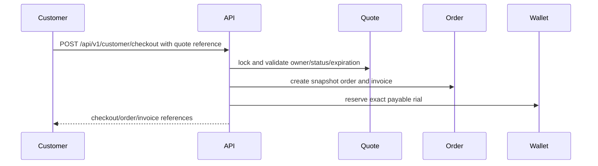
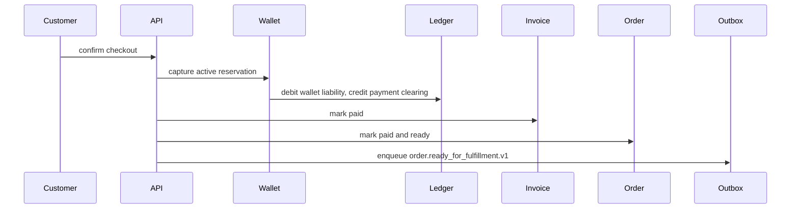
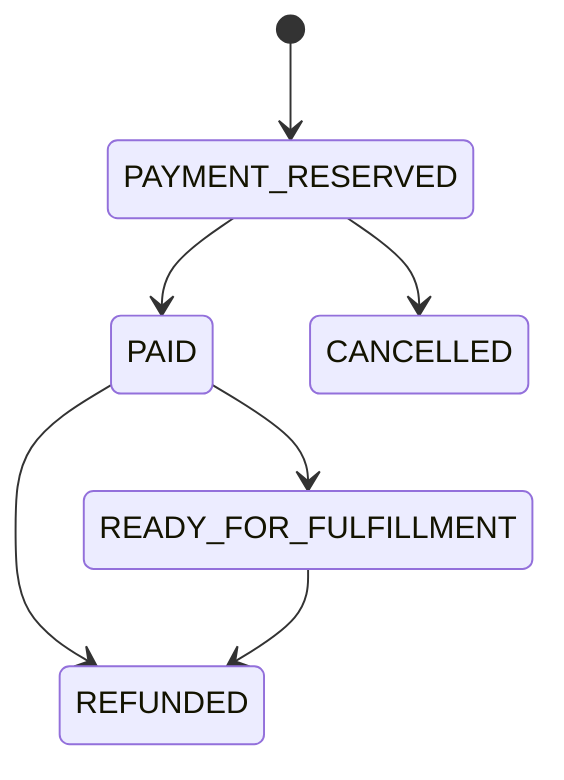
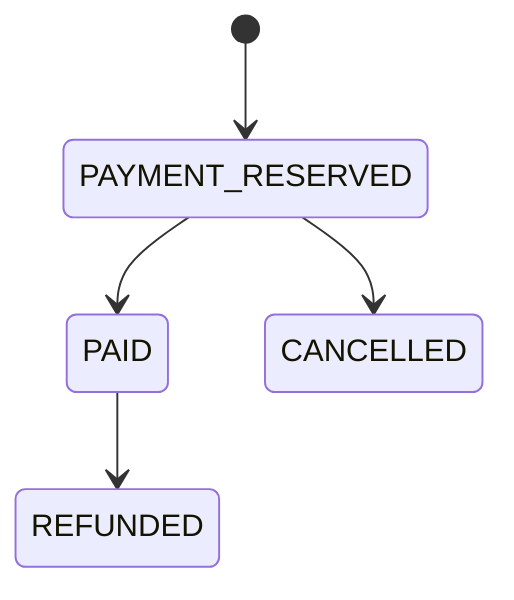
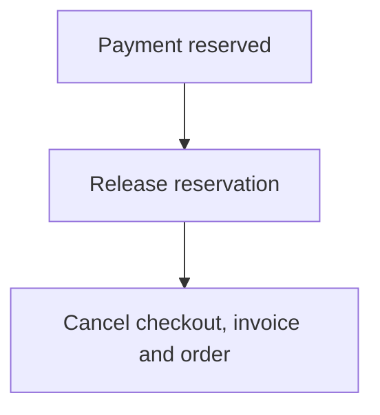
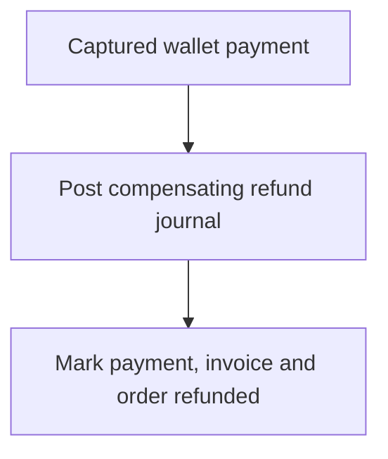
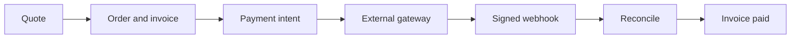
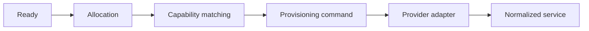

# Milestone 3-B1 Plan — Order, checkout and invoice backend

## Scope
Backend-only commerce orchestration: quote-to-order conversion, immutable order and invoice snapshots, wallet reservation/capture payment, cancellation with reservation release or compensating refund, customer/admin order and invoice APIs, checkout idempotency, transactional outbox, and reconciliation foundation.

## Non-goals
No customer or administrator UI, external gateways, payment webhooks, card/bank/crypto data, provider instances, allocation, provisioning, services, subscriptions, QR/config delivery, coupons, referrals, reseller settlement or analytics.

## Terminology
- **Quote**: immutable server-priced catalog offer owned by a customer.
- **Order**: durable commercial commitment copied from a quote snapshot.
- **Checkout session**: bounded wallet-only payment orchestration record.
- **Invoice**: immutable payable snapshot with immutable lines.
- **Wallet payment**: internal funding record linked to reservation and ledger journals.
- **Outbox event**: normalized future fulfillment command boundary.

## Checkout sequence

## State machines

## Financial invariants
Money is integer rial. Client prices are ignored. Invoice totals come from the quote/order snapshot. Capture and refund use balanced journals; original journals remain immutable. Orders cannot become paid without successful wallet capture and cannot be ready without a transactional outbox record.

## Idempotency and concurrency
Checkout idempotency scope is customer + quote + operation + payment method + hashed key. Same request returns the original result; mismatched fingerprints return `IDEMPOTENCY_CONFLICT`. Quote/order, checkout, reservation and cancellation paths use row locks plus unique constraints.

## Cancellation and compensation

## Expiration
Due checkout sessions are queryable by `status, expires_at`; scheduled execution is intentionally left to worker orchestration. Expiration releases active reservations and cancels unpaid commercial records.

## Transactional outbox

The outbox excludes provider URLs, server IPs, inbound IDs, credentials, tokens, subscription links and config URIs.

## Future payment flow

## Future provisioning flow

## Acceptance criteria
A valid quote creates one economic order; snapshots reference the exact product version; wallet reservation/capture are atomic and balanced; invoices are immutable; customer/admin APIs enforce ownership/permissions; cancellation releases or compensates; ready orders emit a normalized outbox event; no provider/payment-gateway/UI scope is implemented.
