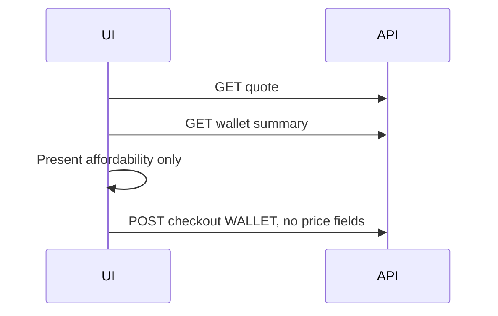
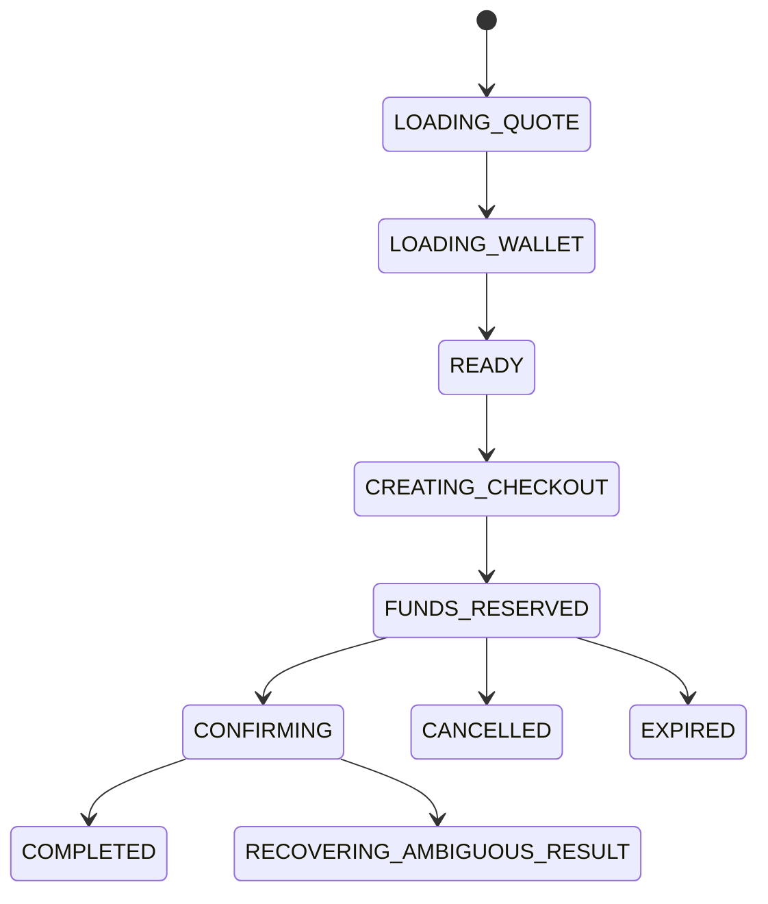
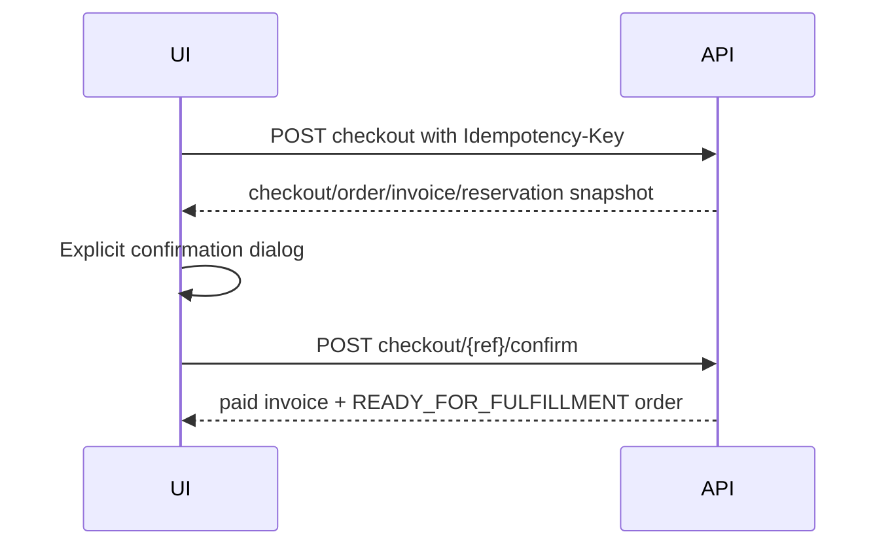
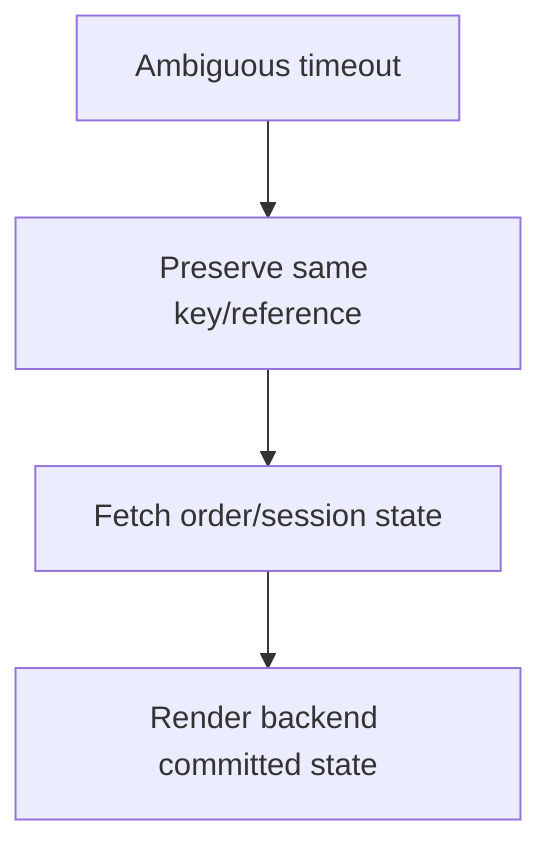
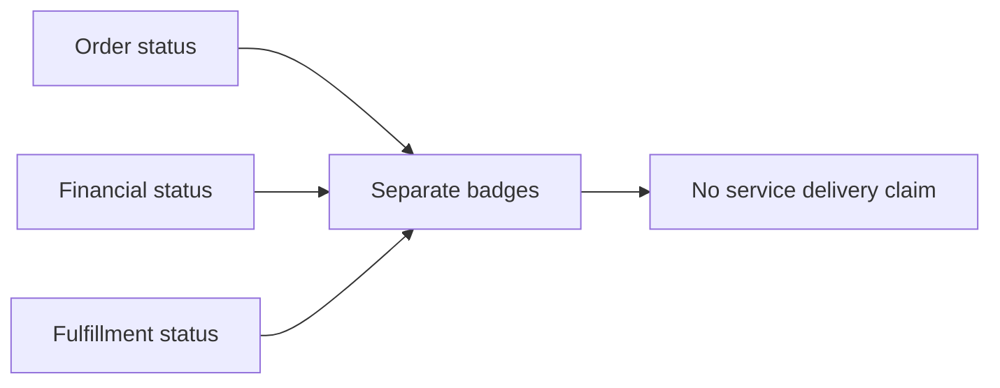
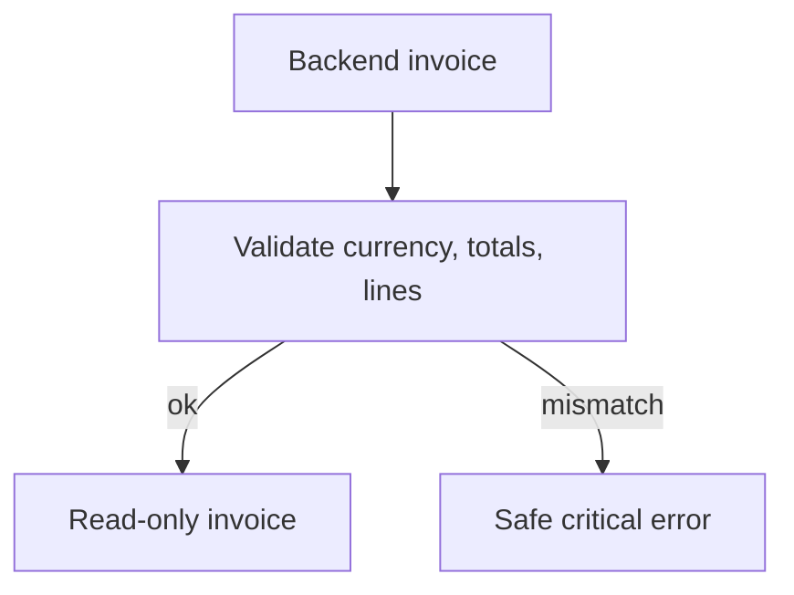
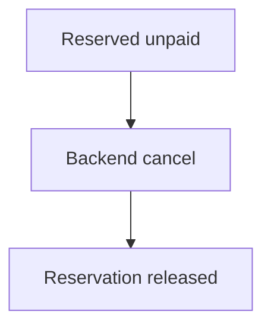
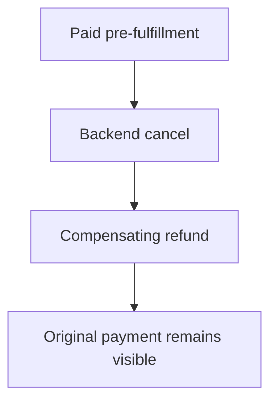
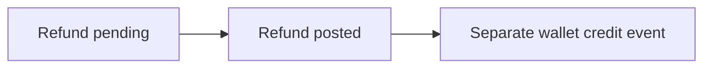
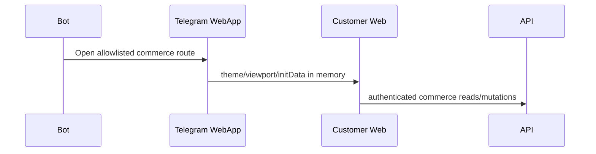

# Milestone 3-B2A Plan — Customer checkout interface

## Page inventory
Customer-web adds authenticated commerce routes `/checkout/[quoteReference]`, `/orders`, `/orders/[orderReference]`, `/orders/[orderReference]/timeline`, `/invoices`, and `/invoices/[invoiceReference]`. A wallet-payment detail page remains unavailable until a customer-safe backend endpoint exists. No service, subscription, gateway, provider, QR or configuration-delivery routes are added.

## Quote-to-checkout flow
An ACTIVE server quote shows a wallet checkout entry. The checkout page reloads the quote and wallet summary, displays the immutable quote/product-version snapshot, and sends only quote reference, payment method `WALLET`, and a memory-only idempotency key to the checkout API.

```mermaid
flowchart TD
  Quote[Quote detail] --> Active{ACTIVE?}
  Active -- yes --> Checkout[/checkout/reference]
  Active -- no --> Recalculate[Recalculate from product]
  Checkout --> Reload[Reload quote + wallet]
  Reload --> Review[Immutable review]
```

## Wallet-only payment policy and affordability
Wallet is the only functional method. The UI displays backend available, reserved and posted balances and a clearly non-authoritative projected remaining balance. Frozen/closed/insufficient wallets block confirmation in the browser, while the backend rechecks atomically.



## Checkout idempotency and state
The idempotency controller creates one memory-only value for a deliberate checkout operation and preserves it across retries/ambiguous failures until a successful confirmation clears it. Duplicate buttons are disabled while mutations are pending.



## Reservation and confirmation
Checkout creation reserves funds through the backend and displays reservation status/expiration. Confirmation uses the checkout reference and never marks orders, invoices or wallet payments paid locally.





## Order, financial and fulfillment states
Order, financial and fulfillment states render as separate badges with text/icons, not color alone. `READY_FOR_FULFILLMENT` means paid and queued for future service creation; no delivered-service claim is made.



## Invoice immutability
Invoice pages validate integer-rial totals and line sums before rendering. Inconsistency produces a critical safe state rather than repaired display.



## Cancellation and refund-state presentation
Eligible pre-fulfillment orders expose a confirmation-based cancellation action through the checkout/order API. Unpaid cancellation presents reservation release after backend confirmation; paid cancellation presents refund states as separate compensating financial operations.







## Telegram Mini App behavior
Commerce routes reuse the existing Mini App shell, safe-area CSS, theme adapter, memory-only authentication, refresh/CSRF lifecycle and browser fallback. Raw initData is not stored, logged or placed in URLs.



## Storage and security policy
No auth, CSRF, initData, checkout, order, invoice, wallet-payment, quote, wallet summary or idempotency data is stored in localStorage, sessionStorage, IndexedDB or URLs. No provider/server/panel/inbound/subscription fields are displayed.

## Non-goals
Administrator order UI, external payments, bank/card/crypto flows, mixed payments, coupons, referrals, providers, allocation, provisioning, services, subscriptions, QR/config delivery, tickets, broadcasts, resellers and analytics remain out of scope.

## Acceptance criteria
Customers can enter checkout from an ACTIVE quote, review immutable quote/product data, reserve and confirm wallet-funded checkout exactly once, see paid invoices and READY_FOR_FULFILLMENT orders without service-delivery claims, browse order/invoice history and timelines, cancel eligible orders, see refund/cancellation states, use RTL Telegram/browser flows, and pass validation without persisting sensitive commerce data.
