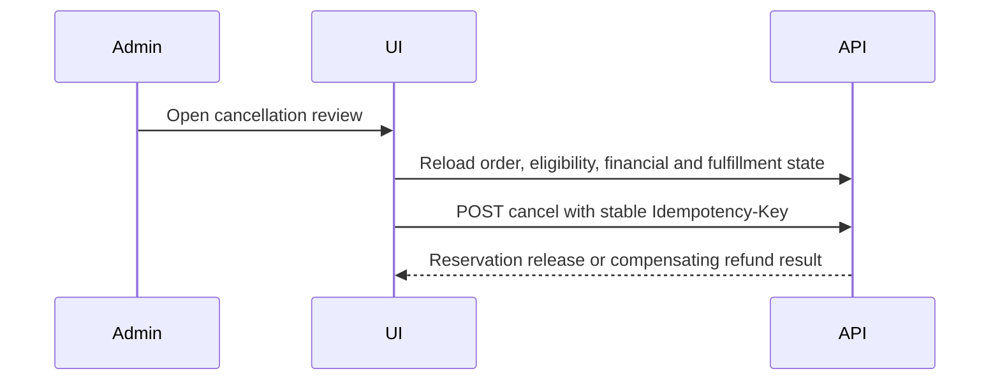
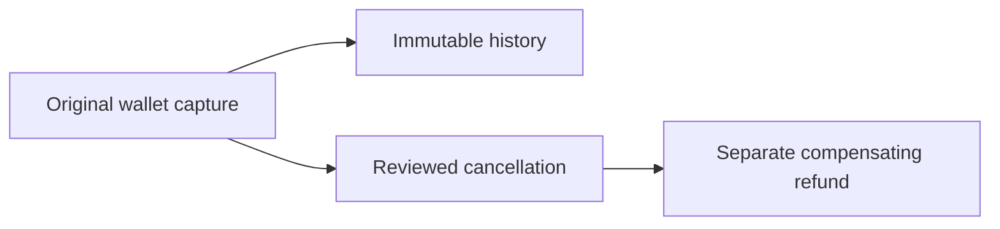
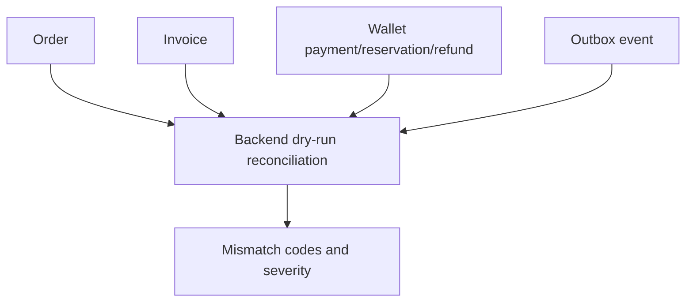
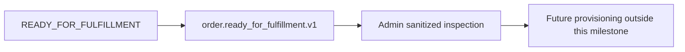
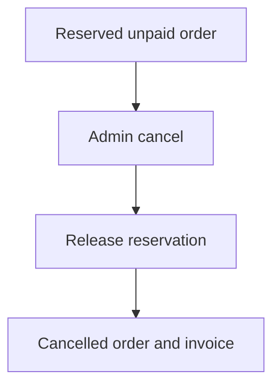
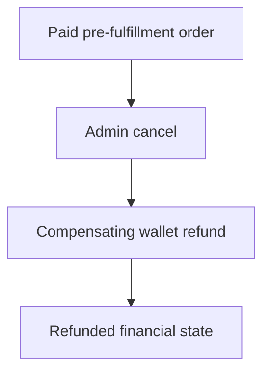
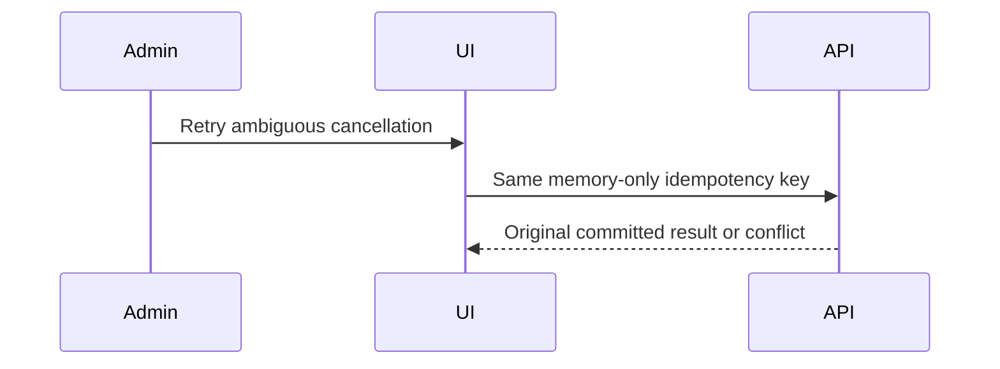
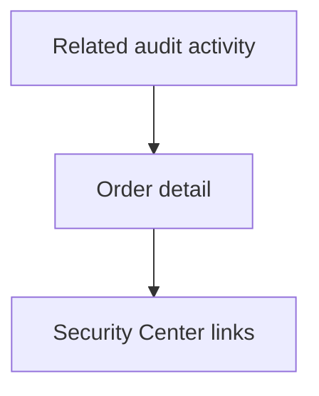

# Milestone 3-B2B Plan — Administrator order administration interface

## Page inventory
Admin-web adds `/management/commerce`, `/management/orders`, `/management/orders/[orderReference]`, `/management/orders/[orderReference]/timeline`, `/management/orders/[orderReference]/reconciliation`, `/management/invoices`, `/management/invoices/[invoiceReference]`, `/management/checkout/[checkoutReference]`, `/management/wallet-payments/[paymentReference]`, `/management/wallet-reservations/[reservationReference]`, `/management/fulfillment-outbox`, and `/management/fulfillment-outbox/[eventReference]`. The pages include controlled unauthorized, unavailable, generic commerce-error, mismatch and not-found states through the shared commerce shell.

## API coverage
Typed admin-web commerce clients target real Milestone 3-B1 admin APIs for orders, invoices, checkout sessions, wallet payments, wallet reservations, order timeline, administrator cancellation, order reconciliation and sanitized fulfillment outbox inspection. Compatibility backend additions are read-only or reviewed-command endpoints only: invoice list, checkout detail, wallet-payment detail, wallet-reservation detail, outbox list/detail, commerce overview and dry-run order reconciliation.

## Permission model
Navigation and actions use backend concepts `orders.read`, `orders.cancel`, `invoices.read`, `checkout.read`, `wallets.read`, `ledger.read`, `ledger.reconcile`, `audit.read` and security-event read permission. `orders.read` does not imply cancellation; invoice reads do not imply ledger internals; checkout reads do not imply cancellation. Hidden controls are usability only and backend authorization remains authoritative.

## State separation
Order status, financial status and fulfillment status are rendered as three separate non-color-only badges. `READY_FOR_FULFILLMENT` is labelled as ready for future fulfillment, not delivered. `READY` and `QUEUED` outbox/fulfillment values are not presented as successful provisioning.

## Administrator cancellation policy
Cancellation always uses the backend cancellation command with a bounded reason code, sanitized reason, CSRF protection and memory-only idempotency key. The UI reloads state before review, displays server-reported consequences and never authors refund amounts, order status, invoice paid state or wallet credits.



## Wallet refund presentation
Original wallet captures remain immutable and visible. Refunds are presented as separate compensating ledger references when supplied by the backend. Duplicate refund or missing compensation codes are critical reconciliation warnings and no frontend refund amount field exists.



## Immutable invoice policy
Invoices and invoice lines are read-only. The runtime validator checks integer-rial totals, line quantity times unit amount and invoice subtotal consistency; mismatch blocks normal success presentation rather than repairing values.

## Reconciliation workflow
Order reconciliation is a server-side dry run. It compares order, invoice, wallet reservation, capture, refund and outbox readiness values, emits mismatch codes and recommended safe operator actions, and never edits orders, invoices, ledgers or outbox rows.



## Outbox inspection policy
Fulfillment outbox pages are inspection-only and use allowlisted normalized payload rendering. Provider credentials, panel URLs, server IPs, inbound identifiers, tokens, subscription/configuration URIs, stack traces and raw internal payloads are not displayed. Suppression is documented but not enabled unless a reviewed backend endpoint exists.



## Security boundaries
Financial/commercial responses, idempotency values, cancellation reasons, tokens and CSRF values are memory-only and never stored in browser storage. Diagnostics are low-cardinality and exclude references, customer IDs, Telegram IDs, amounts, reason text, tokens, provider data and full responses. Safe metadata rendering filters secret-like keys defensively.

## Accessibility
The UI keeps Persian RTL flow, LTR technical references, visible focus indicators, responsive tables/card behavior, text plus icon status meaning, accessible filter forms, timeline lists, invoice tables, high-risk cancellation confirmation copy and reduced-motion-compatible styling.

## Mermaid diagrams

```mermaid
flowchart TD
  Overview[/management/commerce] --> Orders[/management/orders]
  Orders --> Detail[/management/orders/ref]
  Detail --> Snapshot[Immutable snapshot]
  Detail --> Timeline[Timeline]
  Detail --> Reconcile[Reconciliation]
```









## Non-goals
No customer checkout redesign, external gateways, payment intents, signed webhooks, card/bank/crypto data, mixed payments, provider instances, server/node/inbound management, allocation, provisioning, service creation, subscriptions, QR/config links, coupons, referrals, tickets, broadcasts, reseller settlement, analytics or fake revenue charts.

## Acceptance criteria
Authorized administrators can discover and inspect orders, invoices, checkouts, wallet payments, reservations, timeline events, reconciliation results and outbox messages. States remain separate, snapshots and invoices are immutable, cancellation/refund behavior uses backend commands and stable idempotency, outbox payloads are sanitized, audit/security links are present, no commerce/auth data is stored in browser storage, and documentation matches the implementation.
