# Milestone 4-A1 Plan: Provider-Neutral Payment Core Backend

## Scope
Milestone 4-A1 adds a backend-only payment foundation. It deliberately excludes payment UI, real gateways, merchant credentials, card/bank data, cryptocurrency, VPN provisioning, subscriptions and analytics.

## Implemented foundation
- Provider-neutral payment tables for methods, localizations, policies, intents, attempts, verifications, settlements, webhook inbox items, refunds, refund attempts, idempotency records and reconciliation runs.
- Explicit provider code plus adapter version on every payment method and webhook correlation path.
- Deterministic fake adapter for tests and development only; the registry rejects fake registration in production.
- Domain state machines for intents and attempts with terminal-state protection.
- Normalized adapter contracts for create, return parsing, verification, query, webhook verification/parsing, refund creation/query and health.
- Customer-safe method listing and payment intent stubs for wallet top-up and external order payment.
- Admin-safe payment method inspection/creation, dry-run reconciliation endpoint and bounded webhook ingestion endpoint.

## Diagrams

### Intent creation
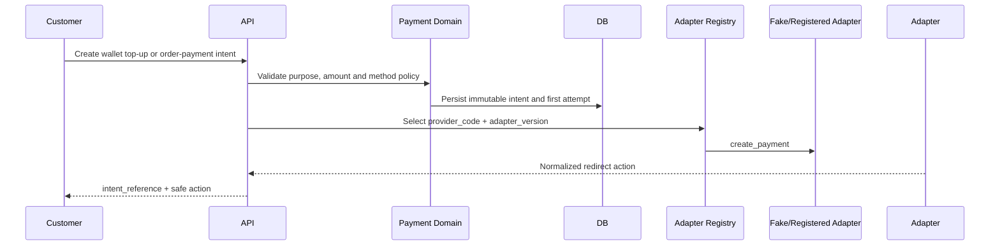

### Redirect flow
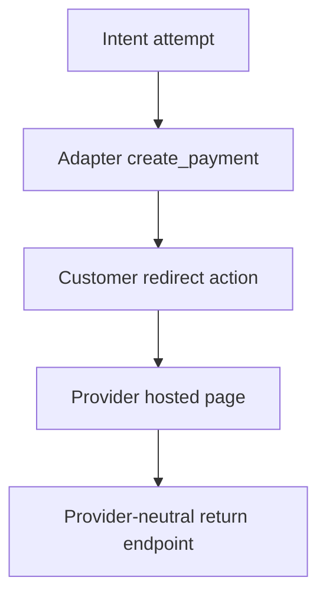

### Return and verification
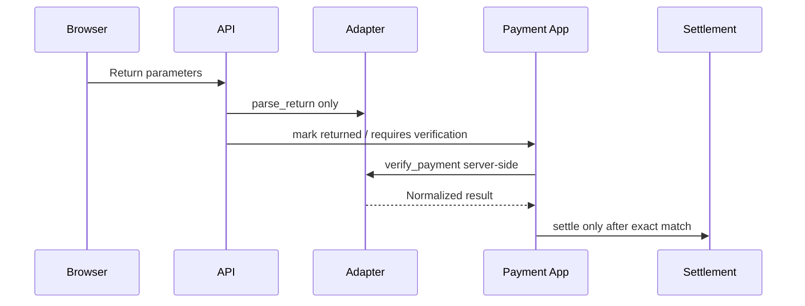

### Webhook ingestion
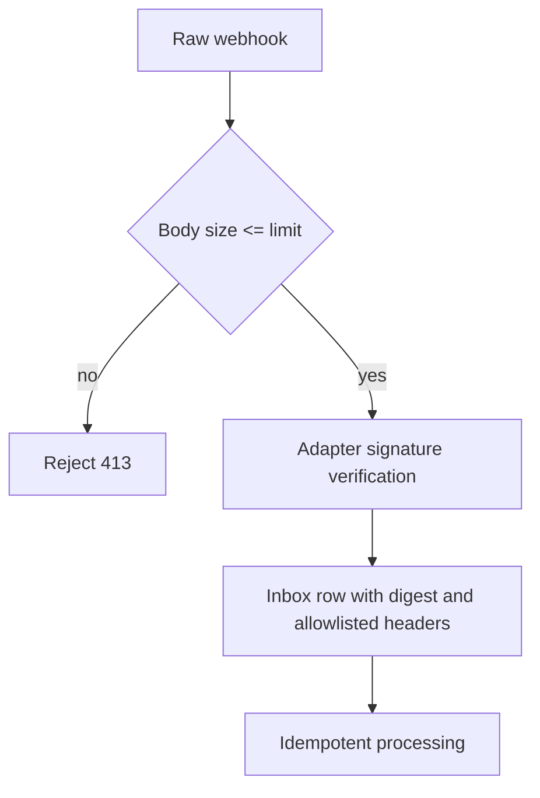

### Duplicate webhook
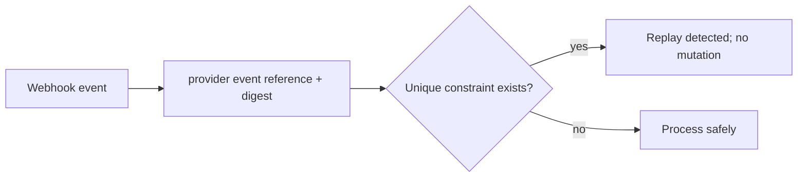

### Wallet top-up settlement
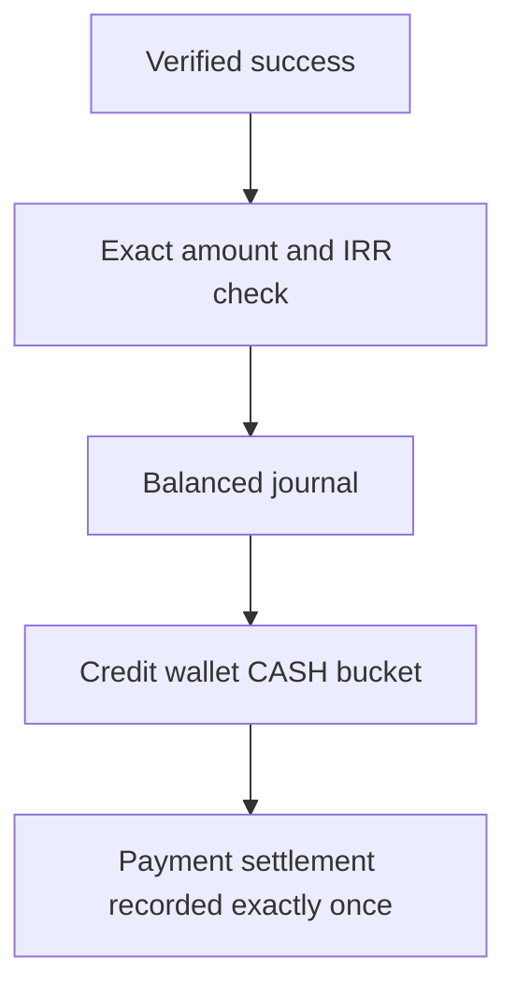

### External invoice settlement
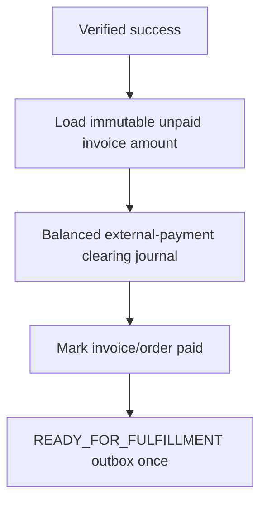

### Refund
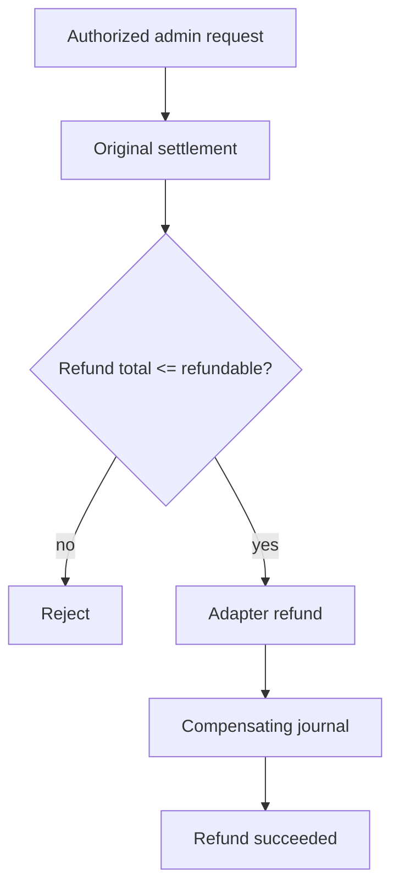

### Expiration and late settlement
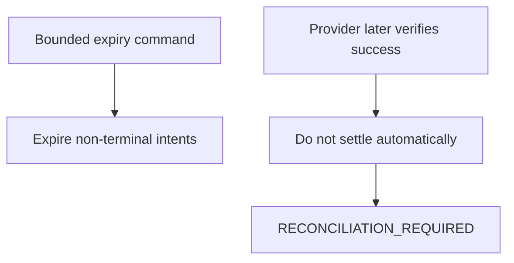

### Reconciliation
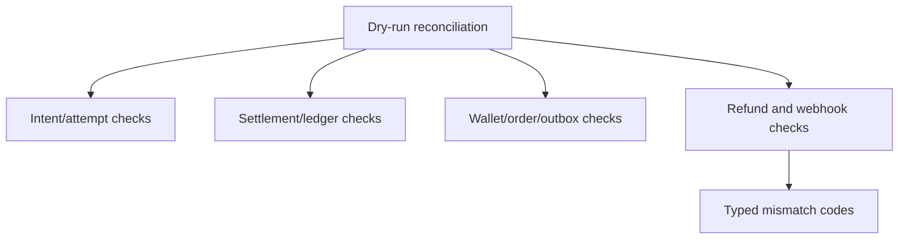

### Adapter-version selection
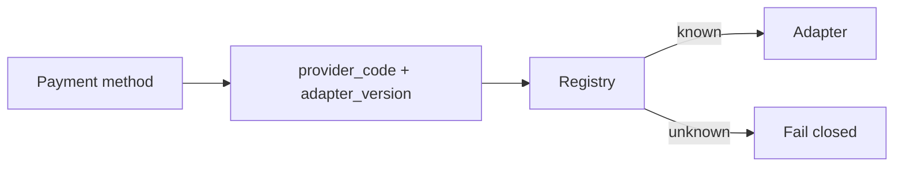

## Security and rollback notes
- Gateway credentials are represented only by secret references and credential state/version; no credential retrieval API is introduced.
- Raw webhook bodies and signatures are not returned by APIs.
- Migration downgrade drops only Milestone 4-A1 payment tables and payment permissions; it seeds no production payment data.
- Real provider integration remains a future decision pending exact API specs and test credentials.
