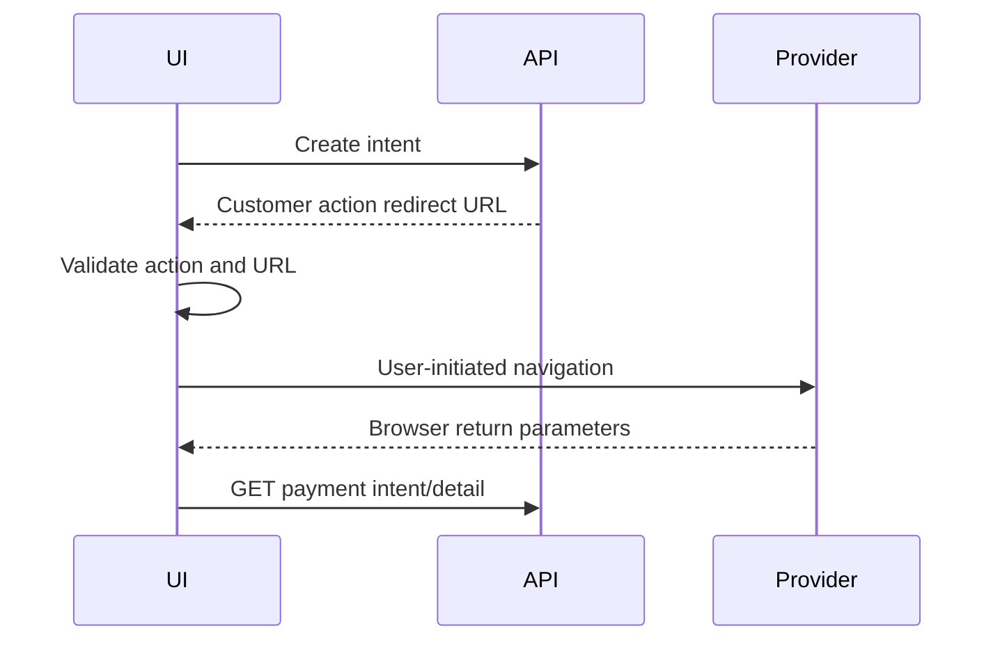
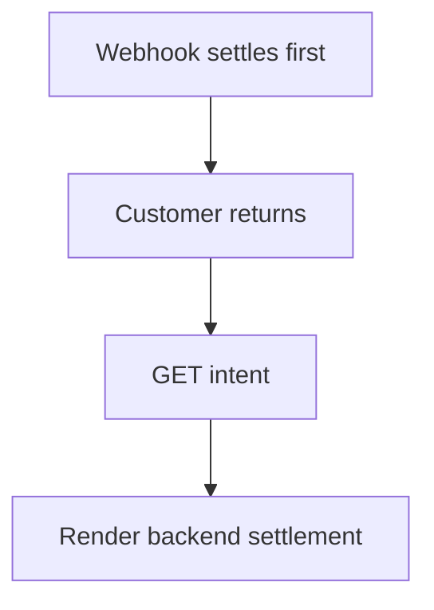
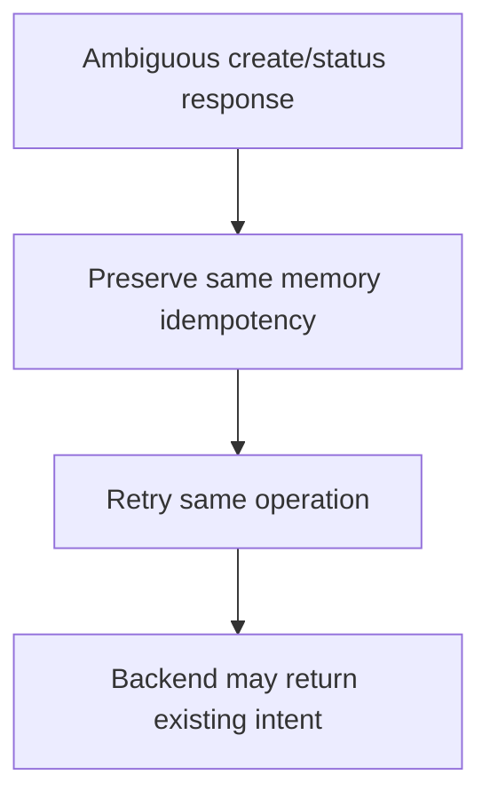
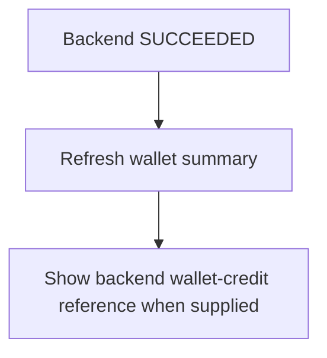
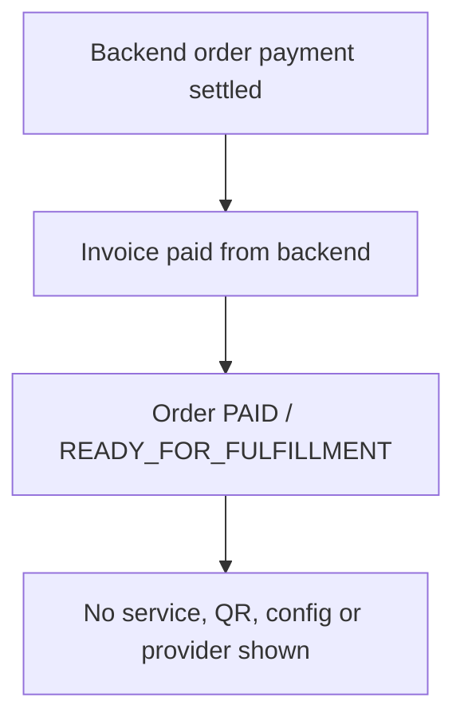

# Milestone 4-A2A Plan — Customer payment interface

## Route inventory
Customer-web adds authenticated routes `/wallet/top-up`, `/payments`, `/payments/[paymentReference]`, `/payments/return`, and `/orders/[orderReference]/pay`. Existing `/wallet`, `/orders`, and `/invoices` remain read-only entry points; payment pages never include customer IDs, wallet IDs, amounts, tokens, idempotency keys, or Telegram initData in URLs.

## Wallet top-up flow
The top-up page loads the real wallet summary, wallet policy, and active customer-visible methods for `WALLET_TOPUP`. Canonical input is integer rial only; toman is derived display. The review screen shows method limits, current balances, maximum wallet balance and a non-authoritative projected balance before creating a backend intent.

```mermaid
flowchart TD
  Page[/wallet/top-up] --> Load[Load wallet policy + summary]
  Load --> Methods[Load active top-up methods]
  Methods --> Amount[Integer rial input]
  Amount --> Validate[Min/max/max-balance validation]
  Validate --> Review[Explicit review]
  Review --> Intent[POST wallet top-up intent with memory idempotency]
```

## External order-payment flow
The order-payment page reloads the order and immutable invoice. It displays the payable total from the invoice only; the customer never supplies an amount or price component. Paid, cancelled, missing or otherwise non-payable invoices block intent creation.

```mermaid
flowchart TD
  Pay[/orders/reference/pay] --> Order[GET order]
  Order --> Invoice[GET immutable invoice]
  Invoice --> Eligible{Issued and unpaid?}
  Eligible -- no --> Block[Invoice not payable]
  Eligible -- yes --> Method[Select ORDER_PAYMENT method]
  Method --> Intent[POST order payment intent, no amount]
```

## Redirect and return behavior
The frontend accepts only backend `REDIRECT` actions, parses the URL with the browser URL parser, rejects unsafe protocols, and enforces backend-supplied allowed hosts when present. The return page reads only safe reference parameters and immediately loads backend status; browser `success`, amount or provider status parameters are ignored.



```mermaid
flowchart TD
  Return[/payments/return] --> Ignore[Ignore success/status/amount query]
  Ignore --> Detail[Fetch backend detail]
  Detail --> Pending[Verification pending]
  Detail --> Terminal[Render trusted terminal state]
```

## Payment status recovery
Payment detail and return screens render backend statuses: pending verification, processing, succeeded, failed, expired, cancelled and reconciliation-required. Manual refresh recovers webhook-before-return and return-before-webhook cases without treating the browser return as proof.





## Idempotency
Each deliberate top-up or order-payment operation receives one memory-only idempotency context. Duplicate clicks are disabled while the mutation is pending. The value is not displayed, logged, persisted, or placed in URLs; a new value is generated only by starting a distinct operation.

## Money and currency policy
IRR rial integers are canonical. The UI rejects decimal, scientific notation and negative values before submission and the backend revalidates. Toman is labelled as derived presentation.

## Settlement results
Successful wallet top-up and external order-payment results are displayed only from backend payment detail fields. The UI never credits a wallet, marks an invoice paid, or claims VPN service delivery. `READY_FOR_FULFILLMENT` is explained as queued for future service creation.





## Telegram Mini App behavior
Payment routes reuse the existing customer shell, memory-only Telegram authentication bootstrap, safe-area variables, theme updates and browser fallback. Bot payment entries, if added later, must use the modular registry and centralized Mini App URL builder.

## Storage and security policy
No auth token, refresh token, CSRF token, raw initData, wallet summary, invoice/order detail, payment intent, redirect action or idempotency key is stored in localStorage, sessionStorage, IndexedDB or service-worker cache. Payment APIs use `cache: no-store` and safe correlation IDs.

## Non-goals
Administrator payment console, real gateways, merchant credentials, card-to-card, receipt upload, cryptocurrency, mixed wallet/gateway payment, coupons, provider infrastructure, provisioning, services, subscriptions, QR/config delivery, tickets, live chat, resellers and analytics are out of scope.

## Acceptance criteria
Customers can view active backend payment methods, create wallet top-up intents in integer rial, validate wallet policies, create external order-payment intents for eligible invoices without editable amount, follow validated redirects, return safely without trusting query parameters, view payment history/detail/statuses, and use the flow in RTL Telegram/browser contexts without exposing fake gateway controls or payment secrets.
