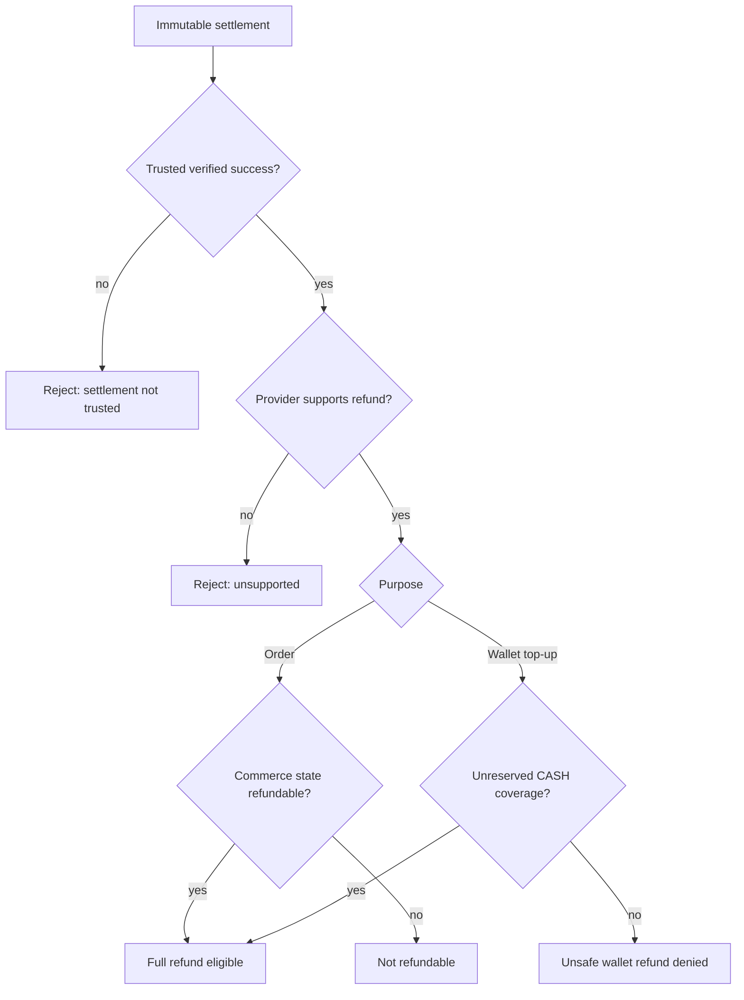
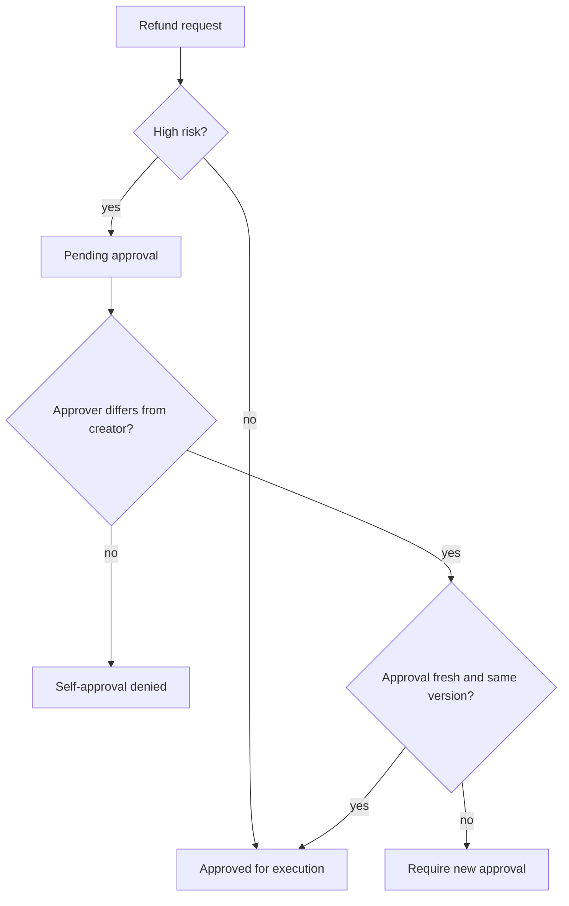
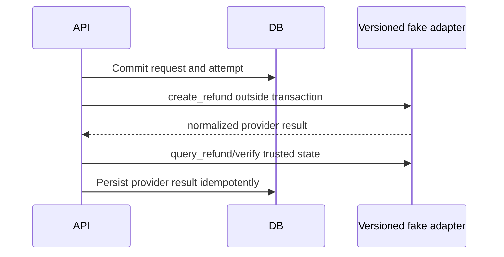
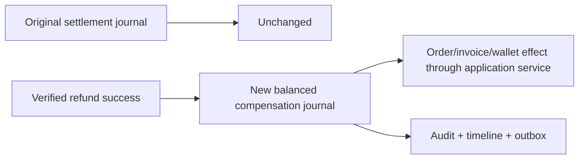
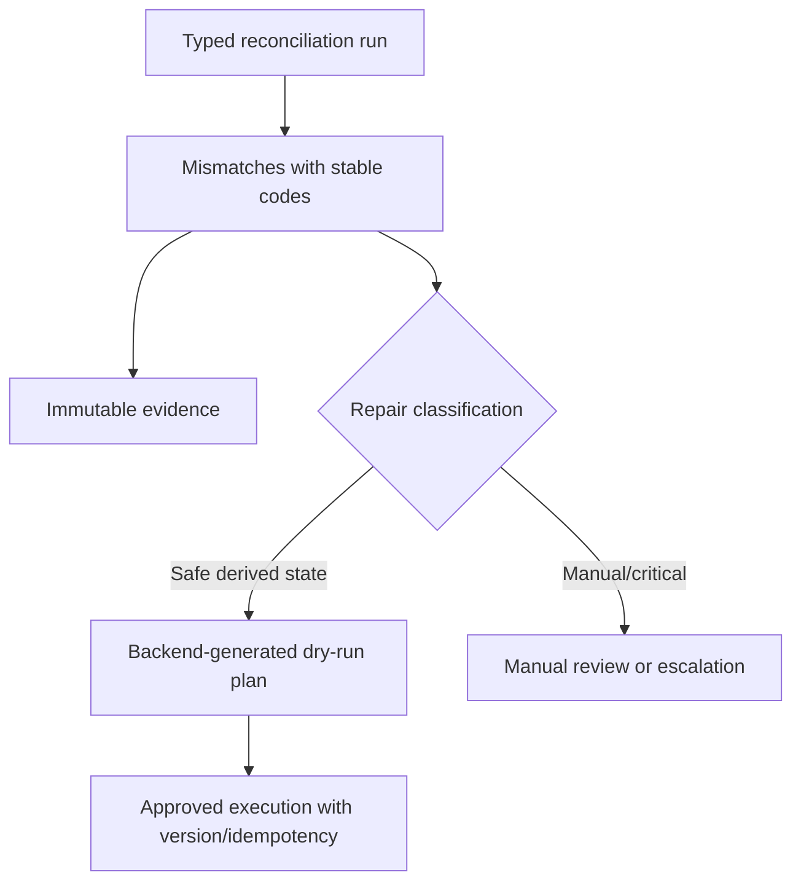
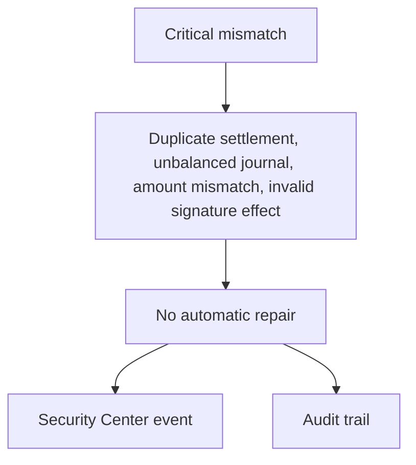
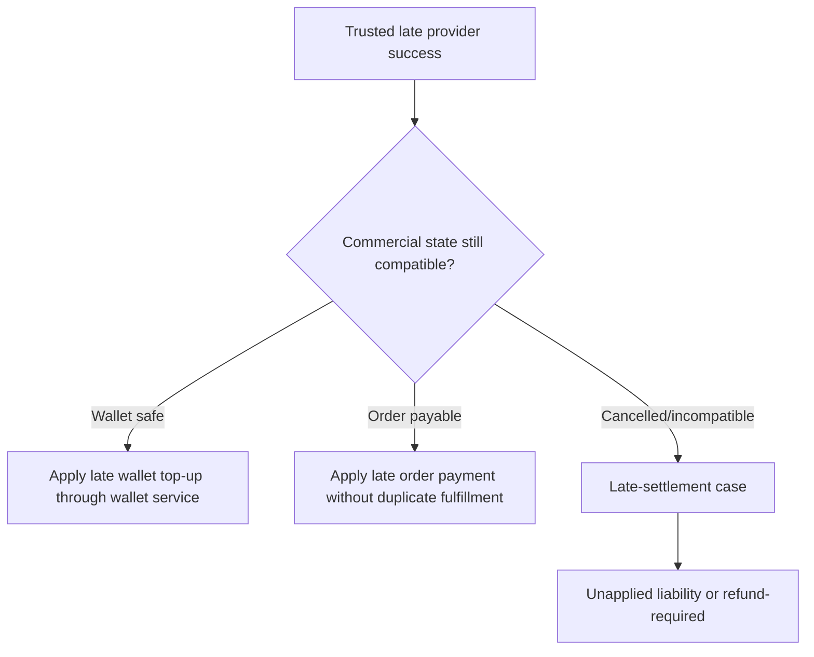
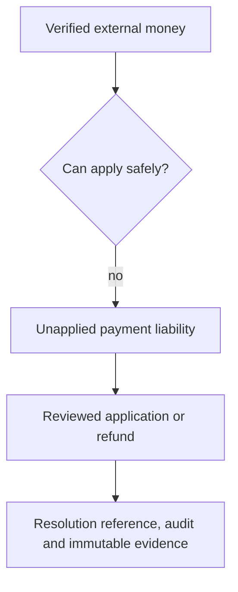
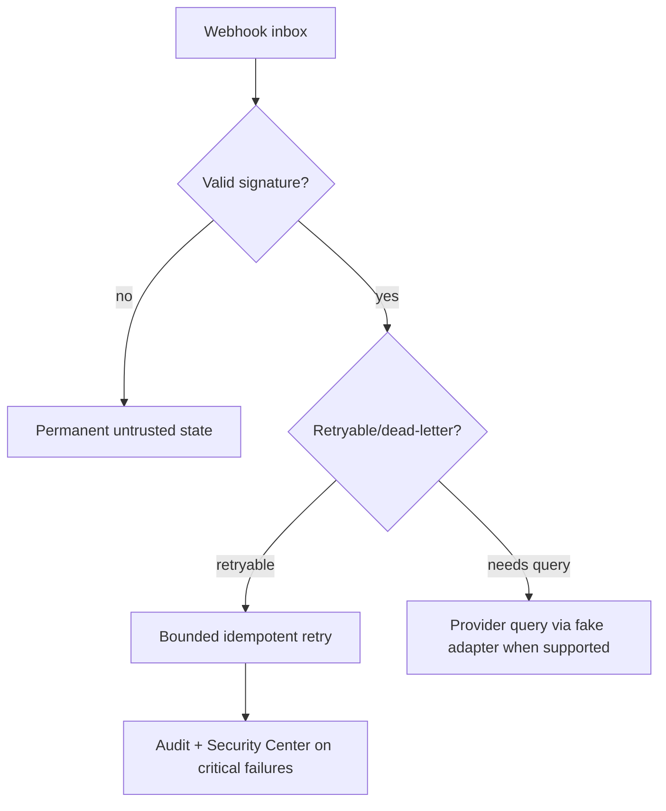

# Milestone 4-A2B2 Plan — Payment recovery operations

## Scope
Milestone 4-A2B2 completes the recovery layer around the provider-neutral payment core: refunds, two-person approvals, compensating journals, reconciliation, safe repairs, late settlements, unapplied payments and webhook dead-letter recovery. It keeps the existing fake-adapter-only boundary: no real gateway, card-to-card, provider provisioning, reseller or support integration is introduced.

## Financial invariants
- Rial integers with explicit `IRR` currency remain authoritative.
- Original intents, attempts, settlements, journals and webhook evidence are immutable.
- Refunds are new compensating effects and never rewrite the original settlement.
- Trusted server-side provider verification is required before a refund can be successful.
- Administrators can request, approve, retry, reconcile and execute safe repair plans, but cannot mark payments/refunds successful, credit wallets directly or mark invoices paid.
- Invalid-signature webhooks are permanently untrusted.

## Permissions
New permission codes are seeded idempotently: `payment_refunds.read`, `payment_refunds.manage`, `payment_refunds.approve`, `payments.reconcile`, `payments.repair`, `payments.late_settlement.manage`, `payments.unapplied.read`, `payments.unapplied.manage` and `payment_webhooks.recover`.

## Refund eligibility

## Refund approval

## Provider refund verification

## Compensating ledger

## Reconciliation and safe repair

## Critical blocked repair

## Late settlement

## Unapplied payment

## Dead-letter recovery

## Administrator UI
Admin-web extends payment operations with Persian RTL pages for refund management, reconciliation/safe repair, late settlements, unapplied payments and webhook recovery. The UI uses real backend API client methods, shows rial plus derived toman where relevant, uses LTR technical references, avoids browser persistence for financial state and never exposes credentials or raw webhook payloads.

## Tests and operations
Deterministic coverage is added at the domain/API/UI boundaries for refund eligibility, wallet-top-up safety, two-person approval, provider verification, mismatch repair boundaries, late/unapplied states and webhook recovery denial for invalid signatures. Migration downgrade removes only this milestone’s recovery tables/columns and permissions.
