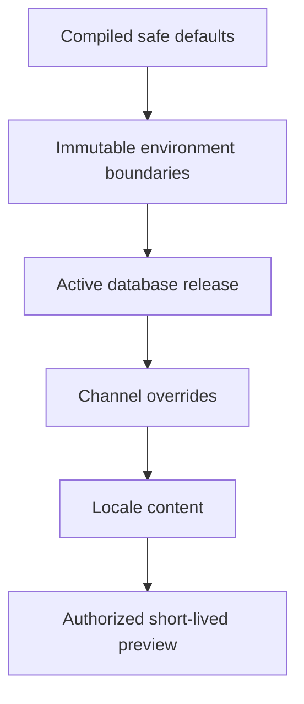
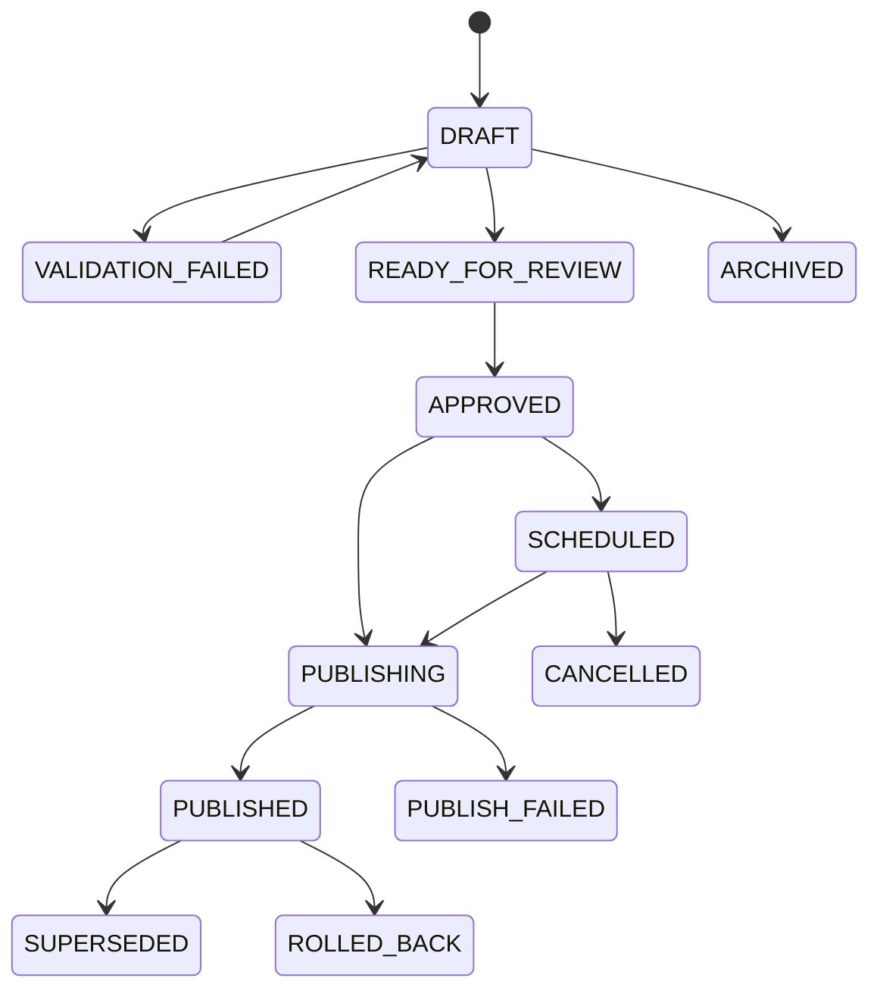
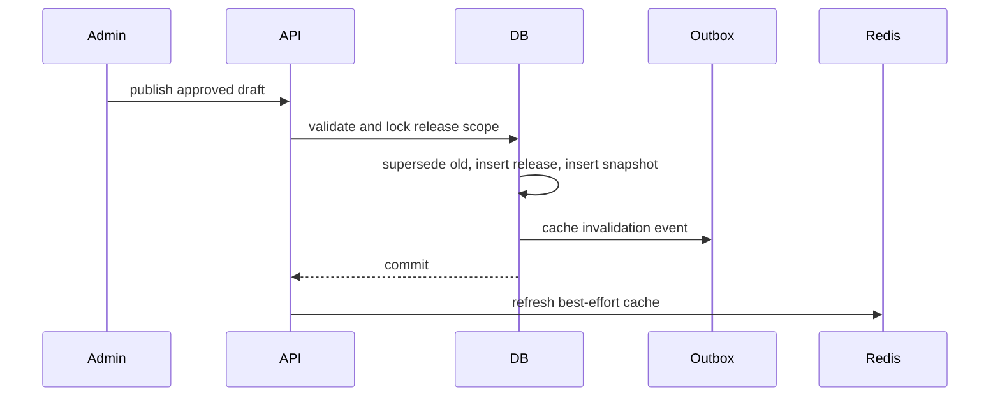
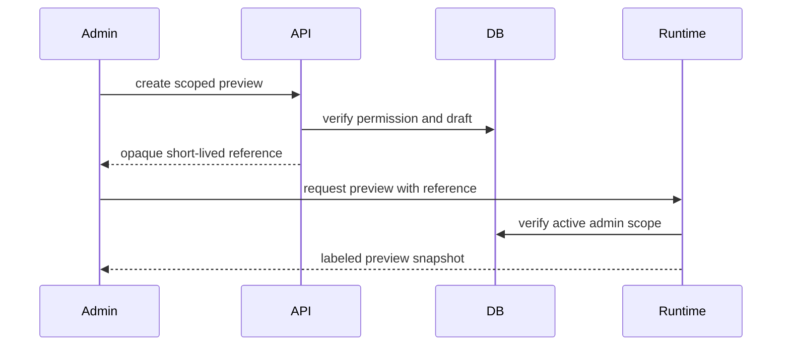
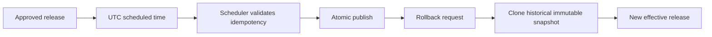
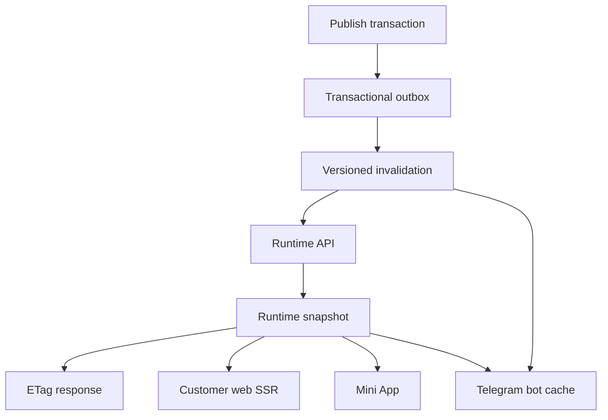
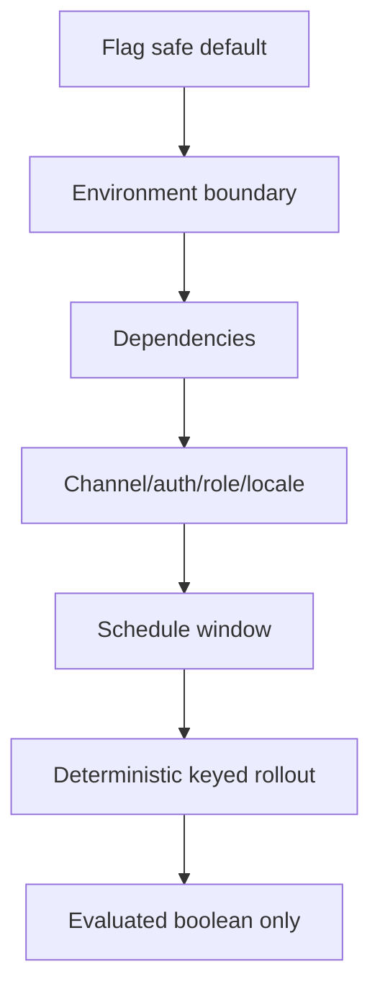
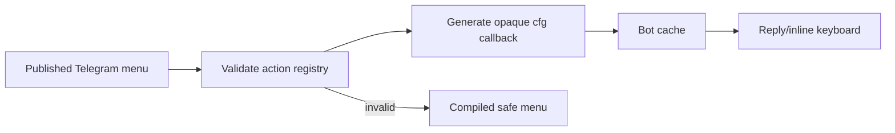
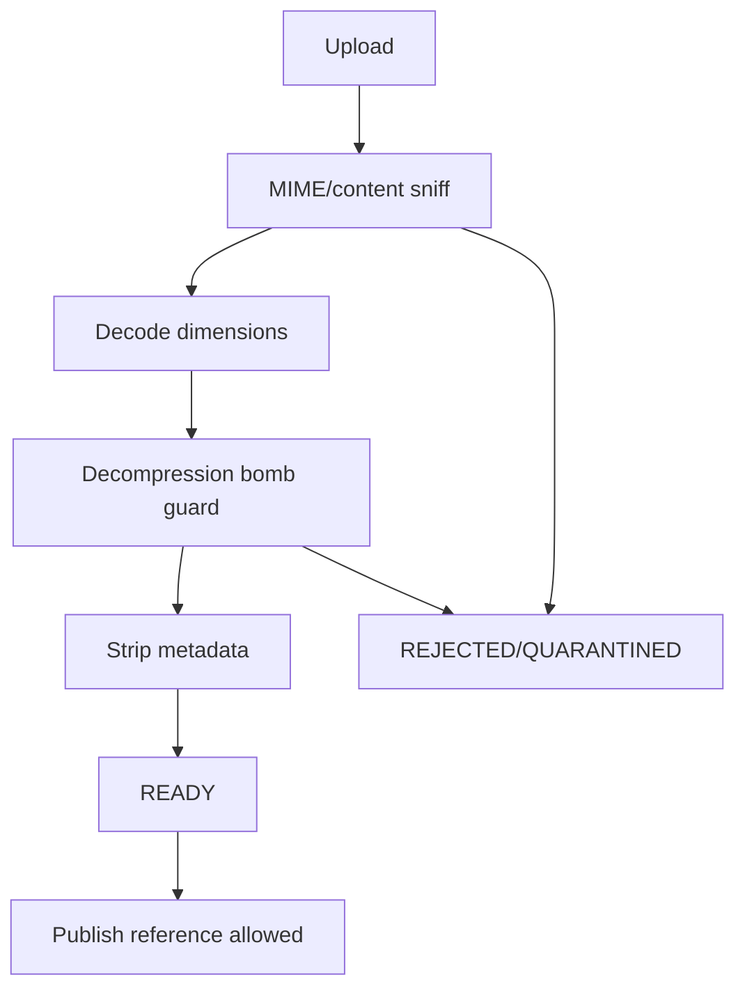

# Milestone 5-A Configuration and Branding Platform

Milestone 5-A introduces a production-grade runtime configuration platform for branding, themes, localized templates, feature flags, safe navigation, Telegram menus, media assets, previews, publishing, scheduling, rollback, caching and audit.

## Scope

Included: typed backend configuration domains, immutable releases, admin configuration center, runtime APIs, customer/Mini App consumption, safe Telegram menus/templates, media asset governance, permissions, migrations, tests and documentation.

Excluded: customer-management operations, resellers, support/live chat, knowledge base, VPN panels, provisioning, subscriptions, real gateways, coupons, referrals and analytics.

## Configuration precedence

## Draft, validation and publish lifecycle

## Atomic release

## Preview

## Schedule and rollback

## Runtime delivery and cache invalidation

## Feature evaluation

## Telegram menu rendering

## Media processing

## Validation and security

Publication blocks executable templates, unknown placeholders, raw CSS/JS/HTML, unsafe URLs, unregistered actions, callback injection, low-contrast themes, invalid feature dependencies, secret-like public values and non-ready assets.
