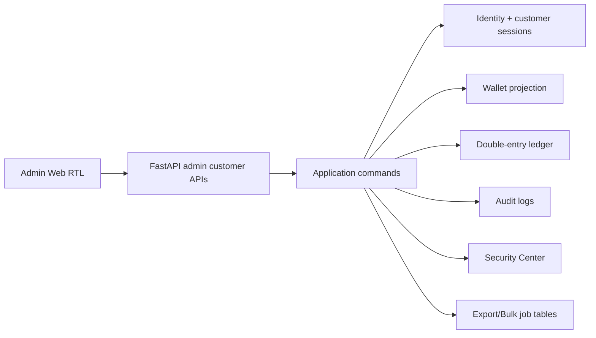
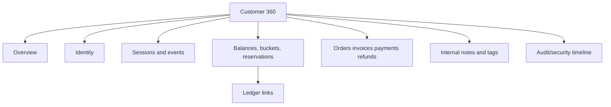
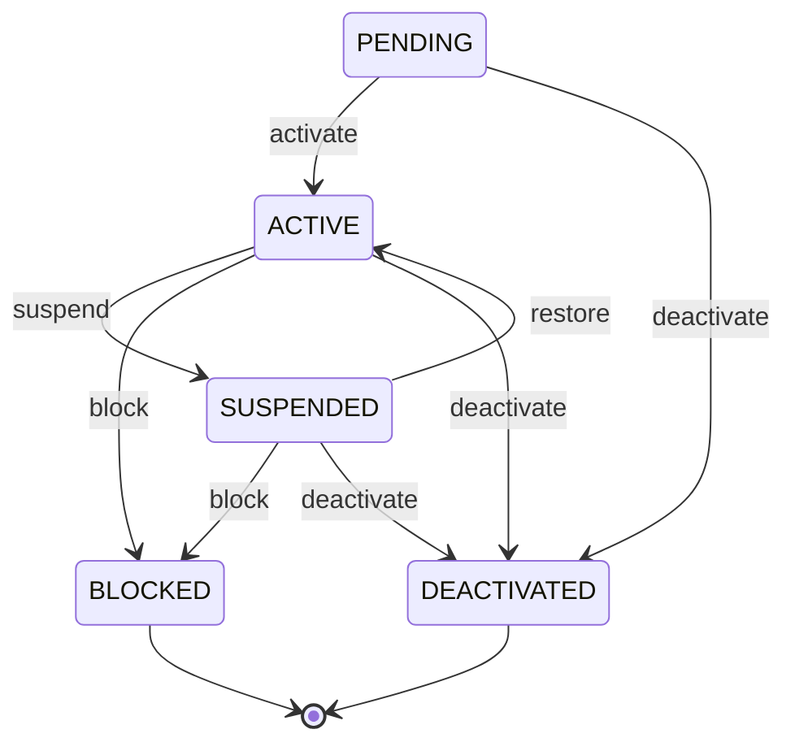
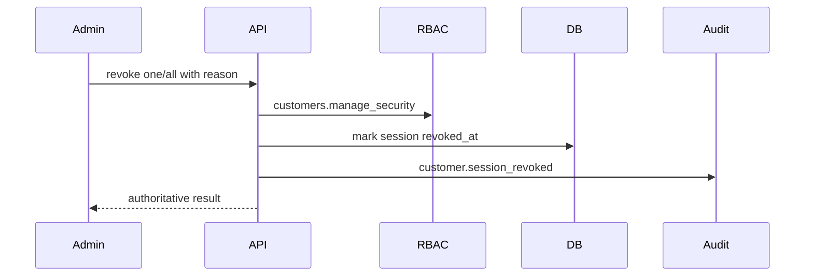
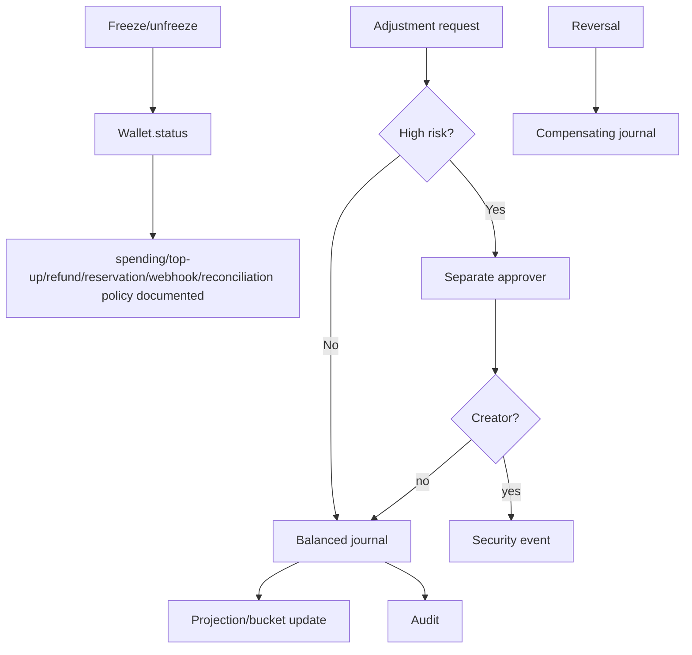
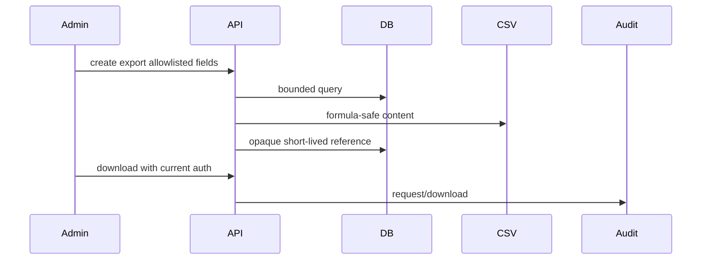
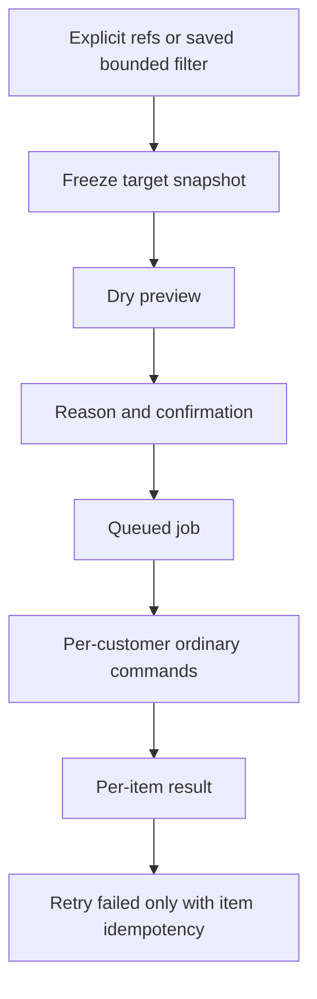

# Milestone 5-B Plan — Customer Administration Platform

## Scope
Milestone 5-B adds a production-grade administrator surface for existing customer, session, wallet, ledger, order/payment history, audit and Security Center data. It intentionally excludes reseller, support chat/knowledge base, VPN provider, provisioning, subscription delivery, coupon, referral, marketing and customer impersonation work.

## Architecture

## Customer 360

## Lifecycle

All lifecycle commands require permission, reason code, idempotency header where applicable, expected version, audit and session revocation on restrictive transitions.

## Session revocation

## Wallet freeze and adjustments

## Exports

## Bulk execution and retry

## Permissions
Milestone 5-B adds `customers.*` and `customer_wallets.*` permissions. Super Admin receives them via idempotent migration seeding. Read, lifecycle, security, notes, tags, bulk, export, wallet-freeze, adjustment, cash-adjustment and approval rights remain separate.

## Security, privacy and masking
Raw tokens, CSRF, Telegram initData, token hashes and credentials are never returned. Telegram IDs are masked in directory rows and only exposed in detail paths for authorized administrators. Notes are internal only. Exports use allowlisted fields, short-lived opaque references and CSV injection protection.

## Rollback
Downgrade drops only Milestone 5-B customer-admin tables and seeded permissions. It does not delete or mutate customers, sessions, wallets, ledger entries, invoices, payments, settlements or refunds.
