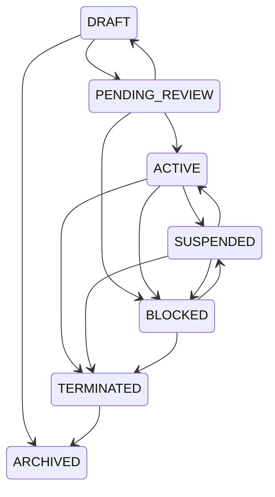
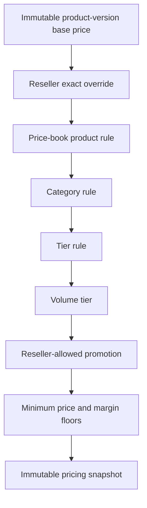
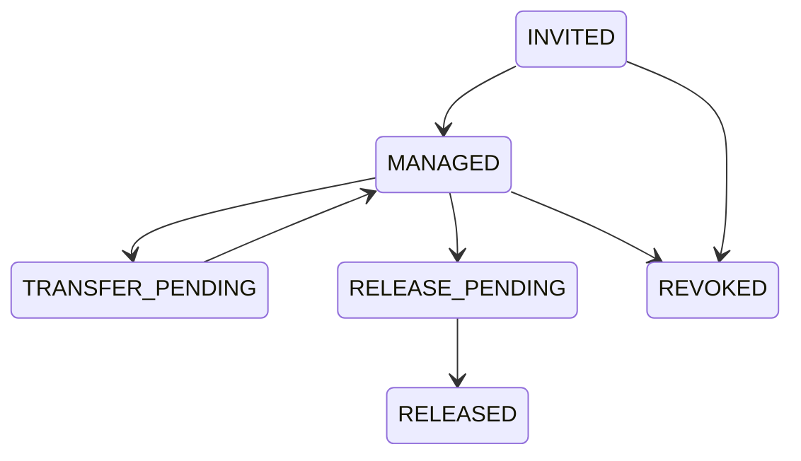
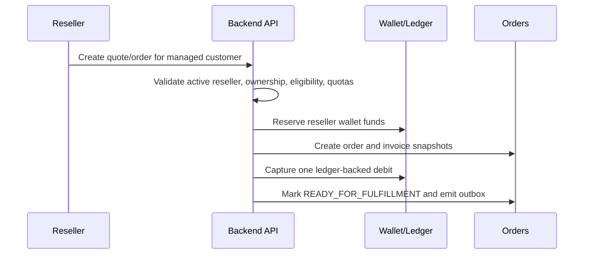
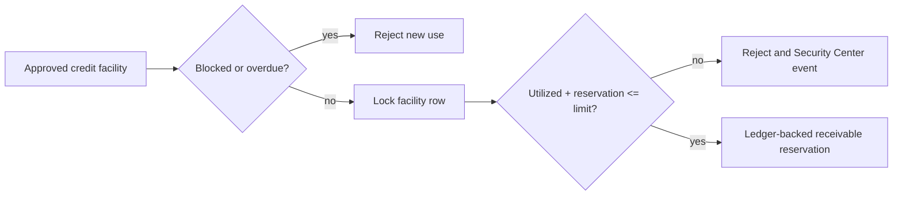
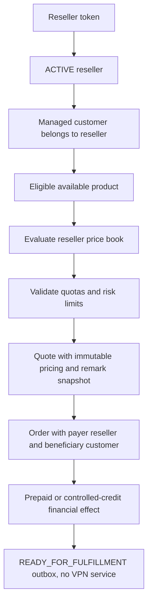
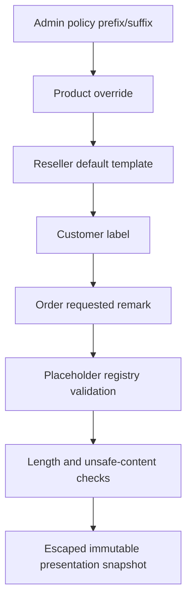
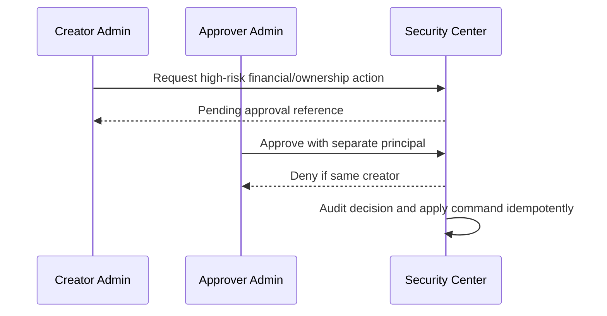

# Milestone 5-C — Reseller Core and Administrator Controls

Milestone 5-C adds the production-grade reseller domain, administrator management console foundations, reseller-facing backend API foundations, migrations, tests and documentation. It deliberately excludes the full reseller-web portal, VPN provisioning, panel adapters, provider data, live support, referrals, coupons and payment gateways.

## Scope

- Reseller accounts use opaque references, linked independent customer principals, stable tiers, lifecycle status, settlement mode, price-book references, financial-account references, credit terms, quota overrides, remark policy, timestamps and optimistic versions.
- Lifecycle commands are legal transitions only: draft, review, active, suspended, blocked, terminated and archived. There is no arbitrary status setter.
- Tiers use stable internal codes: `STARTER`, `STANDARD`, `PROFESSIONAL`, `ENTERPRISE`. Account-specific overrides are stricter than tier defaults.
- Wholesale pricing is backend-authoritative and integer-rial only. Quotes/orders must snapshot the evaluated wholesale price, discounts, floors, optional retail metadata and explanation.
- Financial accounts support prepaid wallet funding and controlled credit. Credit is a ledger-backed receivable concept with explicit limits; it is not an unrestricted negative wallet.
- Managed customers are tenant-isolated and never grant impersonation. Transfers and releases require versioned workflows and approval where high risk.
- Reseller-funded orders distinguish beneficiary customer from paying reseller and emit one normalized fulfillment outbox request without creating VPN services.
- Remark templates are presentation labels only. They cannot alter UUIDs, credentials, Host, SNI, Address, Path, protocol, transport or security settings.

## Lifecycle

## Pricing precedence

## Managed customer ownership

## Prepaid checkout

## Credit reservation

## Reseller-funded order

## Remark resolution

## Approval workflow

## Rollback

The Alembic downgrade drops only reseller-owned tables and seeded reseller permissions. It does not rewrite historical catalog, order, wallet, payment or customer migrations.
