# Milestone 5-E — Omnichannel Support Platform

## Scope
Milestone 5-E adds the production support boundary for customers, resellers, agents, managers, customer-web, Telegram Mini App, reseller-web, admin-web and the Telegram bot. It intentionally does **not** add knowledge-base publishing, tutorials, public status, VPN panel adapters, provisioning, delivery profiles, real payment gateways, coupons, referrals, voice/remote desktop or AI support decisions.

## Architecture
- `packages/domain/src/vpnsale_domain/support.py` owns lifecycle, participant isolation, idempotent message ordering, internal-note privacy, attachment validation, safe canned responses, merge rules and CSAT cycles.
- `apps/api/src/platform_api/support.py` exposes typed customer, reseller and admin support APIs. Routes are intentionally thin and convert domain errors to structured support error codes.
- `apps/api/alembic/versions/0014_milestone_5e_support.py` creates focused PostgreSQL support tables and seeds stable permissions for Super Admin.
- Frontend support entry points provide Persian RTL support home/inbox shells without browser persistence of messages, drafts, tokens, initData or attachments.
- Telegram bot menu integration opens the safe Mini App `/support` route; support business decisions remain in backend/domain services.

## Data model
The migration defines normalized tables for categories, business calendars, SLA policies, queues, teams, conversations, messages, revisions, deliveries, assignments, status history, attachments, canned responses, macros, tags, merges, CSAT, Telegram mappings, idempotency records and notifications. PostgreSQL remains the durable source of truth; Redis/realtime state is non-authoritative.

## Permissions
Stable permissions include `support.read`, `support.reply`, `support.assign`, status/priority management, separate internal-note and attachment capabilities, queue/category/SLA/canned-response/macro management, merge, escalation, CSAT reporting, Telegram bridge management and reporting read access. Normal customer/reseller actors are rejected from agent-only APIs.

## Invariants
- Requester type, actor and tenant are checked before every read/reply.
- Internal notes have `AGENT_ONLY` visibility and are filtered from customer/reseller history.
- Messages use server-assigned sequence numbers and scoped idempotency keys.
- Assignment claim uses expected version and rejects conflicting agents.
- Attachments are validated by content/MIME and can be quarantined before publication.
- SLA timestamps are UTC backend values; frontend only displays authoritative deadlines.
- CSAT is one response per resolution/reopen cycle.
- Merge requires same requester/tenant and preserves the secondary conversation as archived history.
- Telegram support uses verified backend identity and does not accept raw Telegram user IDs as ownership proof.
- Support messages and macros cannot mutate wallets, payments, orders, account status, services or VPN provider resources.

## Mermaid diagrams

### Conversation creation
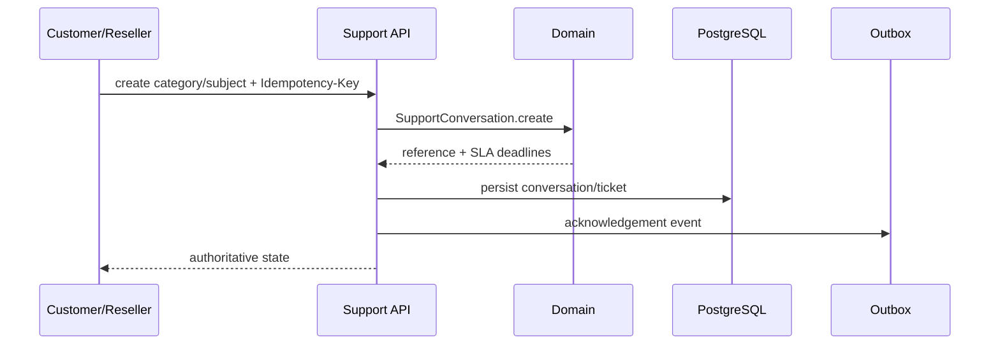

### Live chat
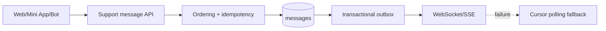

### Assignment
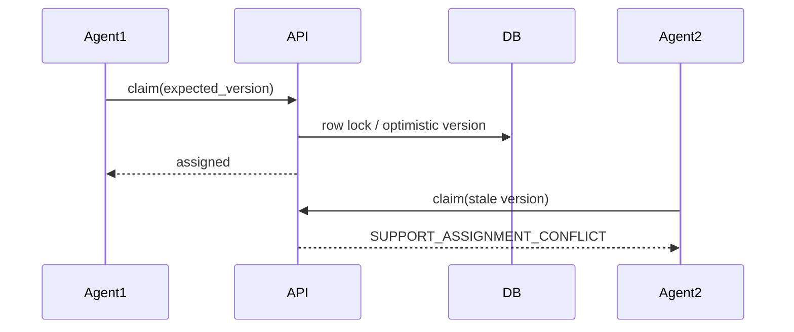

### Telegram customer bridge
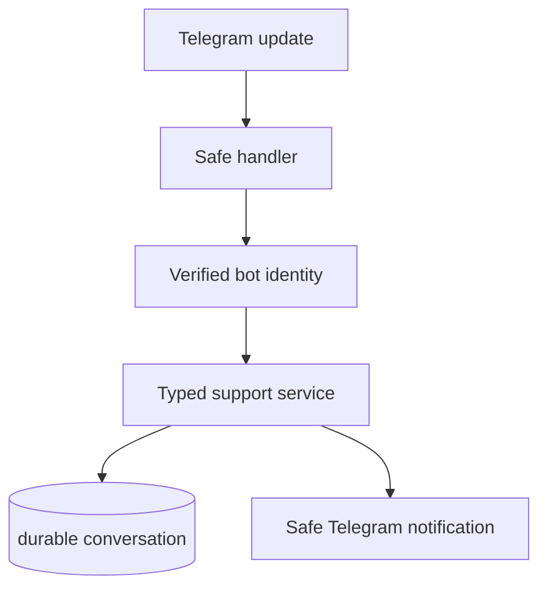

### Private support-team bridge
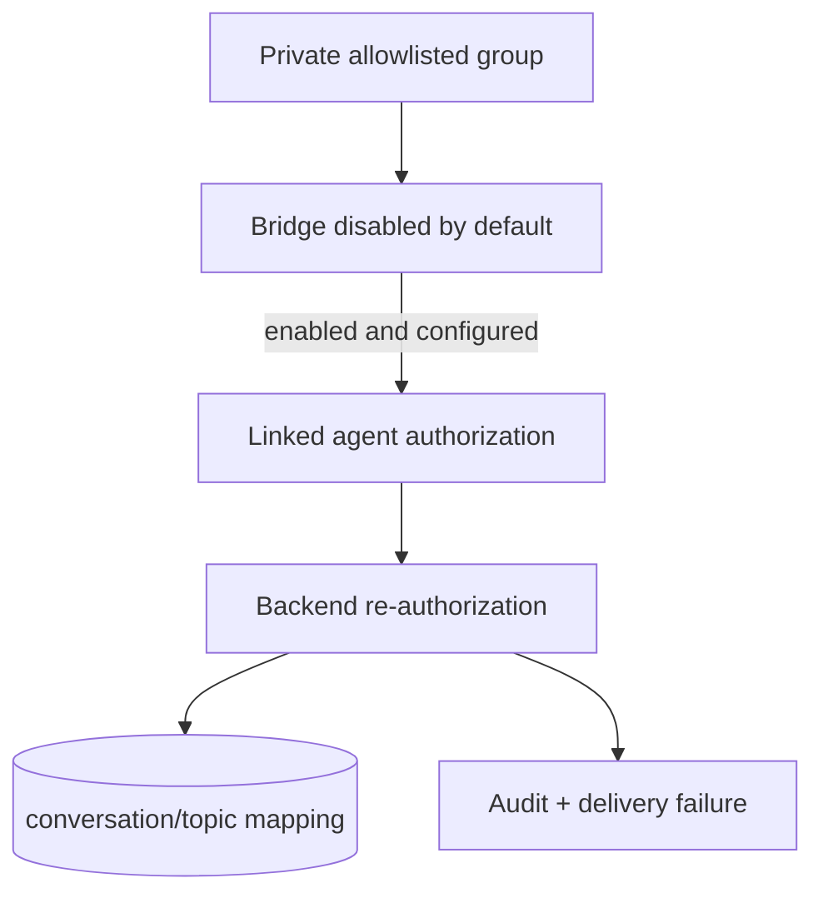

### Message/outbox/realtime delivery
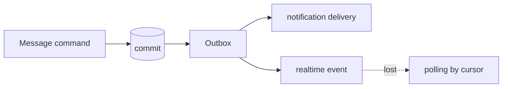

### Attachment processing
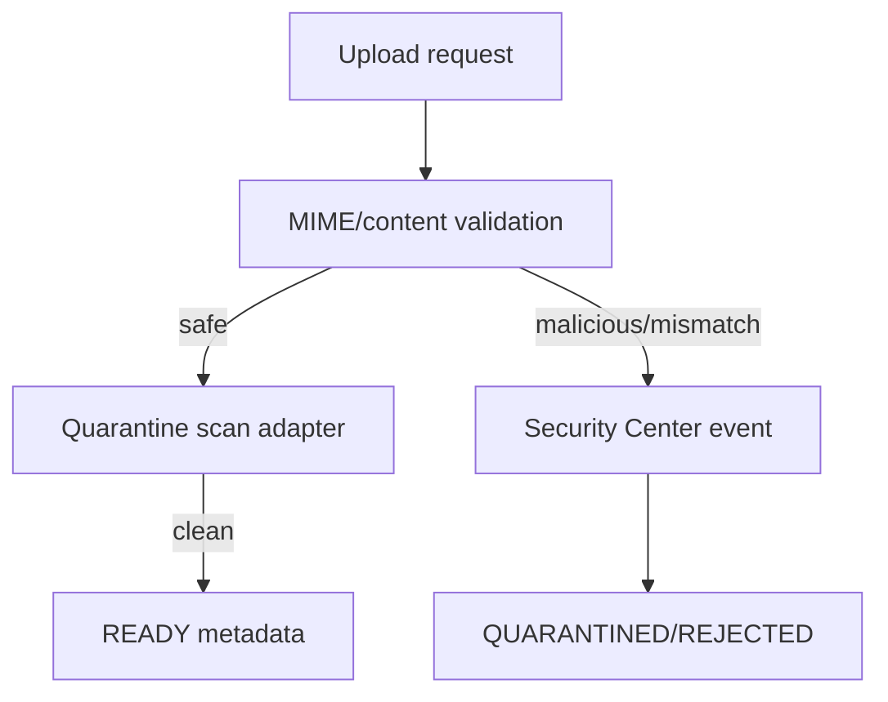

### SLA clock
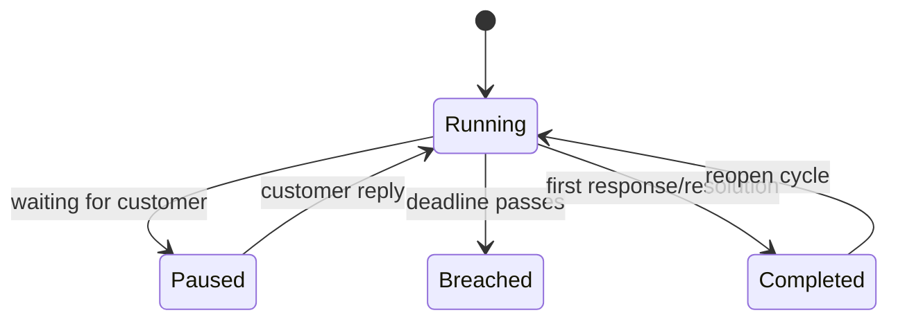

### Escalation
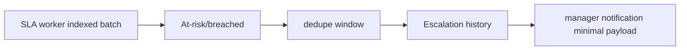

### Ticket merge
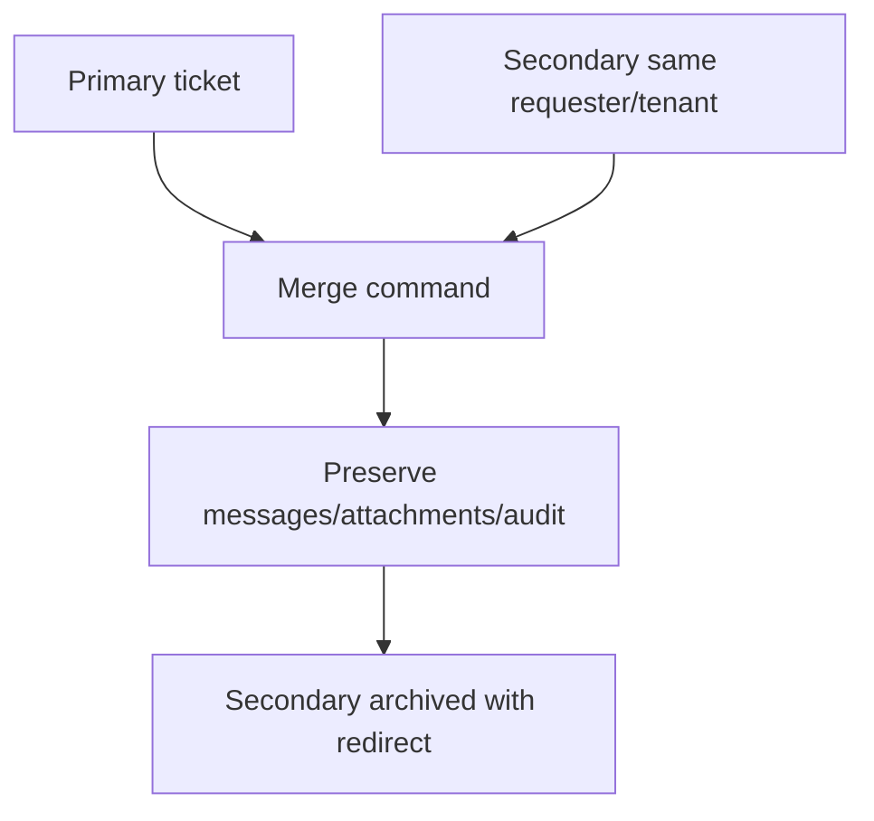

### CSAT
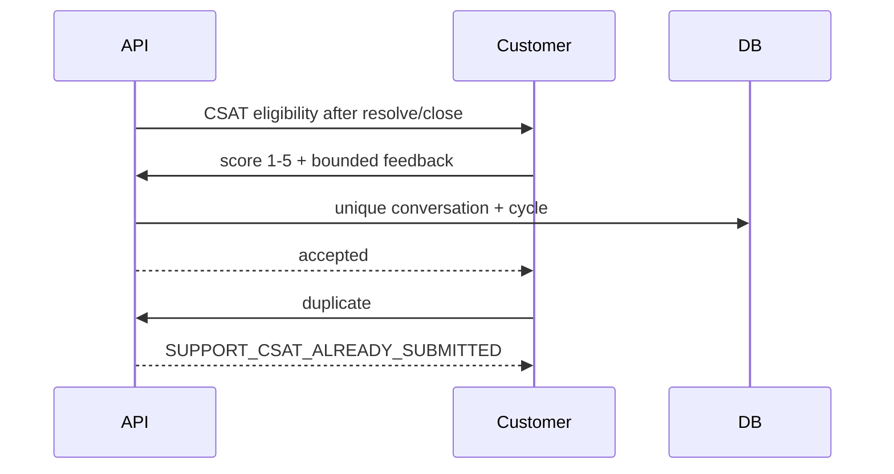

## Testing and E2E setup
Deterministic tests cover isolation, assignment conflicts, idempotent ordering, internal-note filtering, attachment quarantine/rejection, canned-response placeholders, lifecycle/SLA pause and resume, merge rules and CSAT cycles. E2E environments must seed only deterministic customers, resellers, agents, categories, queues and SLA policies; no provider/payment network calls are permitted.

## Rollback
Downgrade drops support tables in dependency order and removes support permission grants/seeds. Existing customer, reseller, wallet, payment and order tables are not modified.

## Known limitations
Realtime publication, storage adapters, malware scanner adapters and Telegram private group delivery are represented by durable schema/API/domain boundaries in this milestone and must be connected to production infrastructure only after validated environment configuration. Full-text message search remains deferred until a privacy/indexing policy is approved.
