# Milestone 5-F Plan — Knowledge, Education and Status Platform

## Scope
Milestone 5-F adds a production-grade, safe knowledge-base and public status platform. It includes versioned articles/tutorials, structured blocks, educational media validation, FAQ, troubleshooting, Persian-ready search, contextual guide recommendations, feedback, status components, incidents, maintenance and notification boundaries across backend, customer web, Telegram Mini App, reseller web, Telegram bot and admin web.

## Non-goals
No VPN panel adapters, server/node/inbound models, provisioning, subscription delivery, real payment gateways, fabricated service health, fabricated uptime, unverified third-party download URLs, arbitrary HTML/JavaScript/CSS/SQL/scripts/plugins, arbitrary AI answers or executable content are implemented.

## Architecture
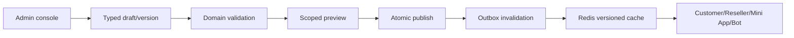

## Article lifecycle
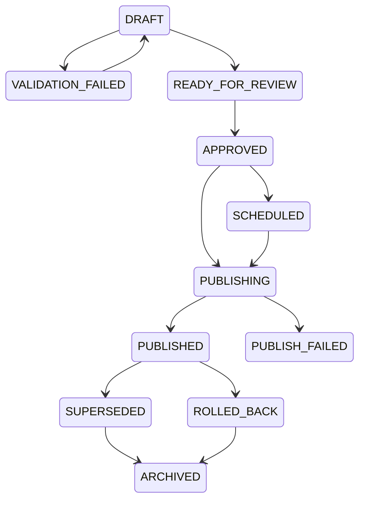

## Media processing
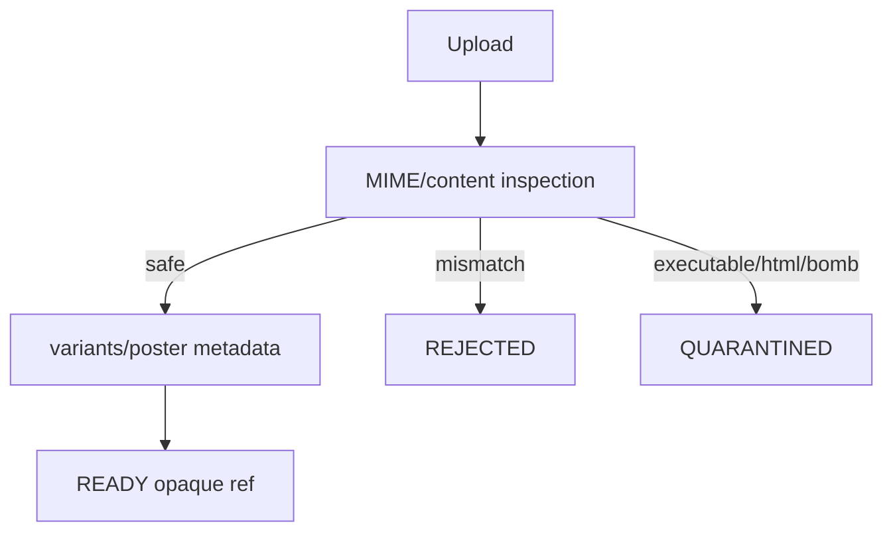

## Search
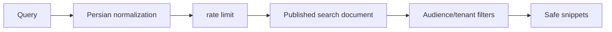

## Guide recommendation
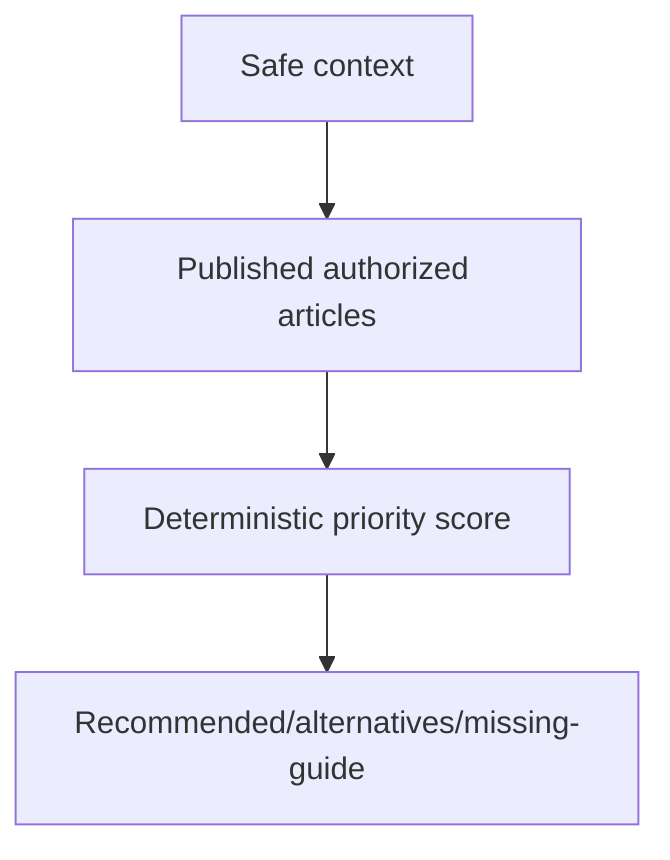

## Troubleshooting flow
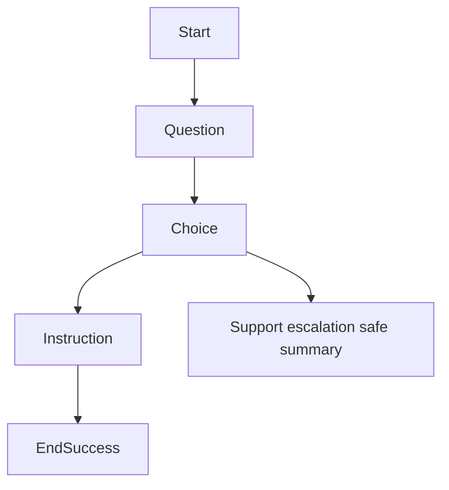

## Support escalation
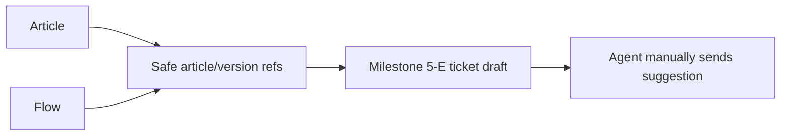

## Cache invalidation
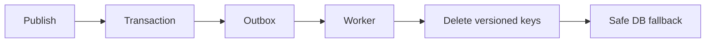

## Incident lifecycle
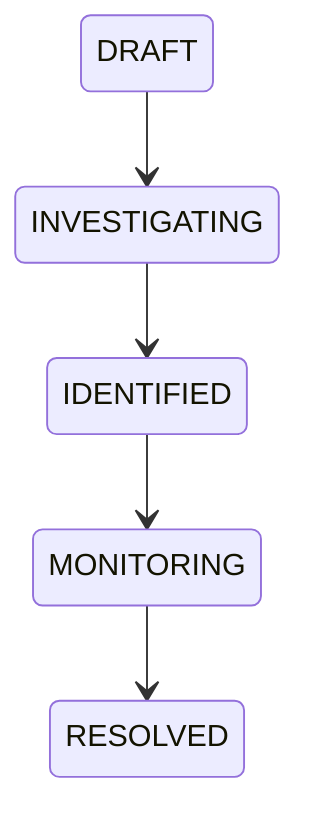

## Maintenance
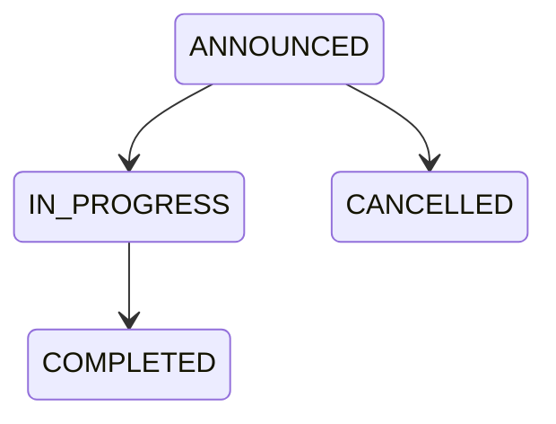

## Status notifications
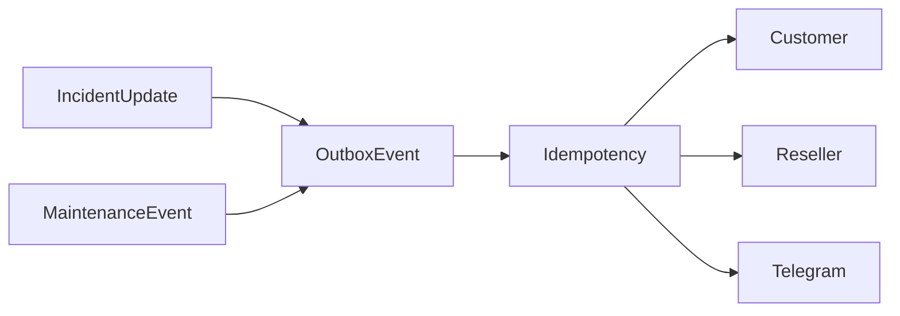

## Validation
Required checks remain `docker compose config`, `ruff format --check .`, `ruff check .`, `pyright`, `pytest`, `npm run lint`, `npm run typecheck`, `npm run test` plus focused knowledge/status/bot tests and migration verification.
