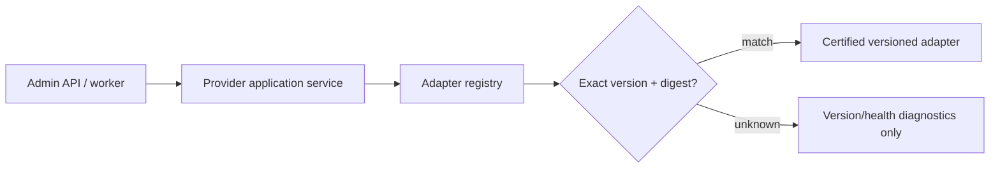
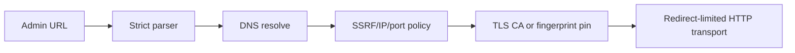
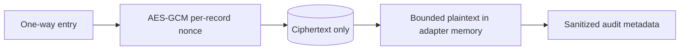
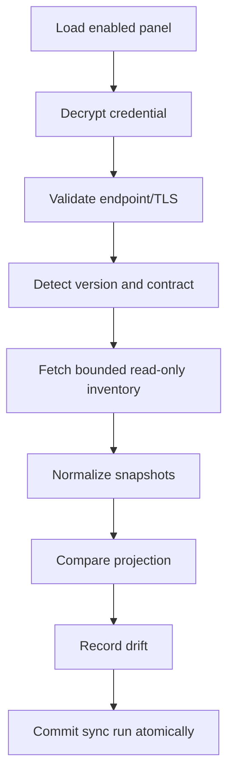
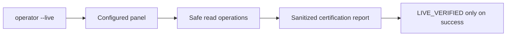

# Milestone 6-A1 — Production provider core and read-only certified adapters

Extraction date: 2026-07-18. Official GitHub release pages were rechecked on 2026-07-18; stable latest releases remained MHSanaei/3x-ui v3.5.0, alireza0/x-ui v1.11.3 and PasarGuard/panel v4.0.2 after Milestone 6-A2A correction; the prior v5.1.0 target is invalidated. Development builds and prereleases were ignored.

## Scope

Milestone 6-A1 implements safe connectivity, exact version detection, read-only inventory normalization, capability discovery, health, drift, credential encryption, endpoint security, administrator console surfaces, deterministic mocks/tests and operator-only live certification scaffolding. Provider writes, provisioning, allocation, subscription generation, QR/config delivery and service operations remain explicitly disabled.

## Mermaid flows

### Adapter resolution

### Secure connection

### Credential handling

### Read-only synchronization and drift

### Live certification

## Validation policy

CI uses deterministic mock servers only. Real staging panels are certified through an explicit live command/action requiring an acknowledgement flag and never printing credentials, cookies, raw users or full URLs.
