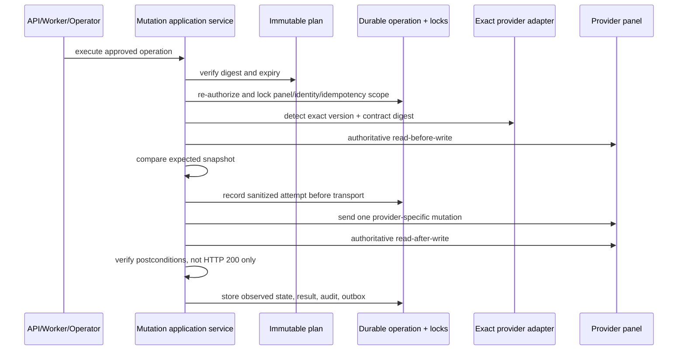
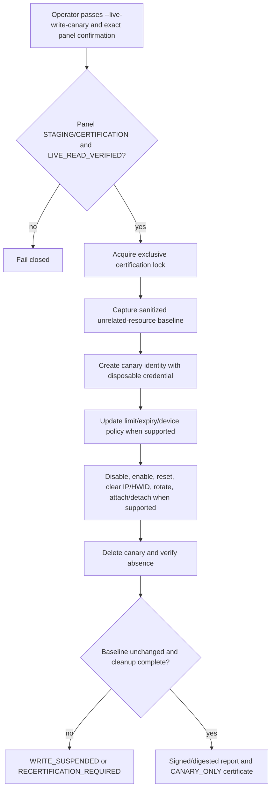
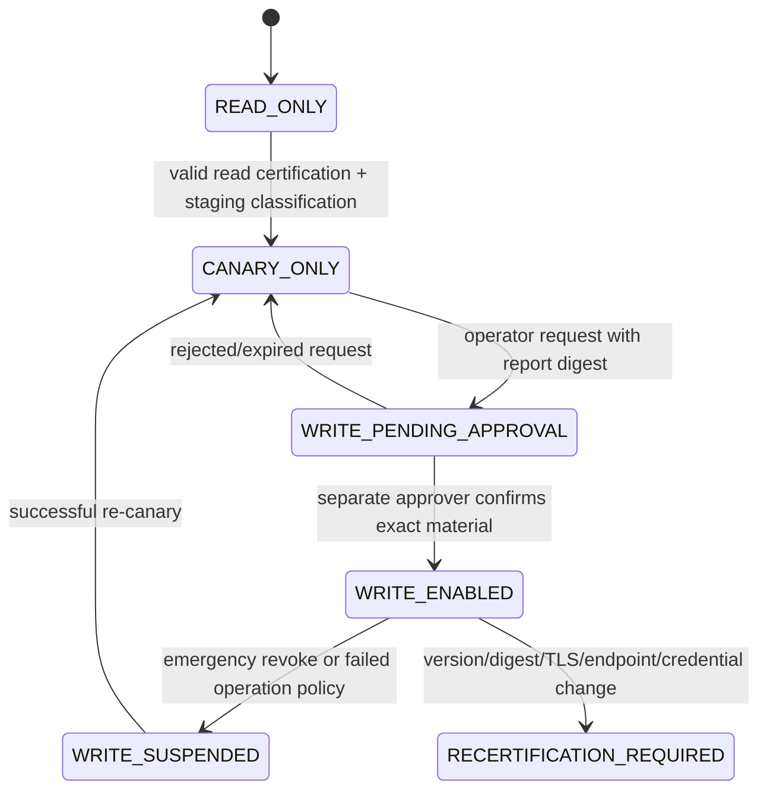
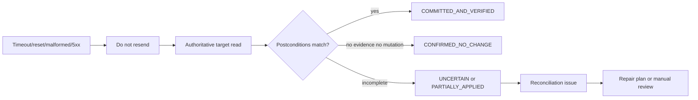
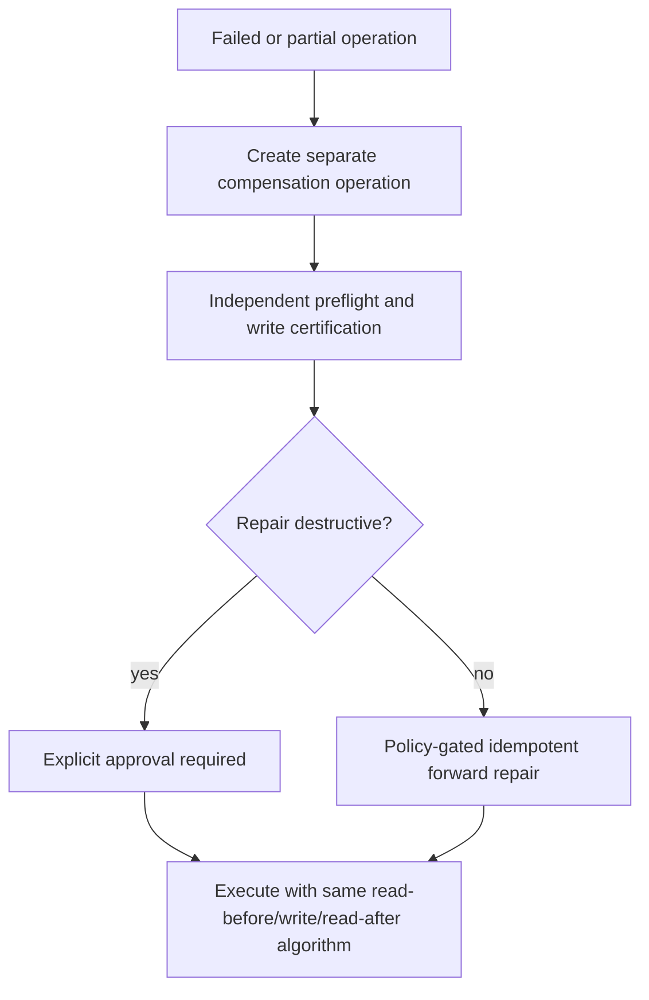
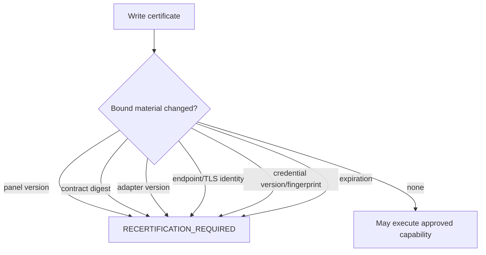

# Milestone 6-A2B — Provider mutation executor and write enablement

Date: 2026-07-18.

## Upstream release inspection

Official GitHub release pages were checked at task start. `MHSanaei/3x-ui` has stable `v3.5.0` as latest while `dev-latest` is a rolling development build and is ignored. `alireza0/x-ui` has stable `v1.11.3` as latest. `PasarGuard/panel` release listing shows `v4.0.2` as the panel contract target, while other PasarGuard repositories can publish unrelated newer artifacts; those do not certify panel writes.

Certified source targets remain:

| Provider | Tag | Release commit inspected | Write status |
| --- | --- | --- | --- |
| Sanaei 3X-UI | `v3.5.0` | `4e928a1` | exact contract only; production disabled until staging canary certificate and approval |
| Alireza X-UI | `v1.11.3` | `419fce7` | exact contract only; production disabled until staging canary certificate and approval |
| PasarGuard panel | `v4.0.2` | `0b0ddaa9a5a9a3d7402f5f5a274a1a77f743d4bf` | v5/API-key assumptions rejected; exact v4.0.2 only |

Unknown versions or digest mismatches return `PROVIDER_REQUIRES_RECERTIFICATION`/`PROVIDER_CONTRACT_MISMATCH` before transport.

## Scope implemented in this milestone

Milestone 6-A2B adds the domain write-safety engine and durable schema that production repositories, workers, APIs and exact adapters use:

- provider write modes: `READ_ONLY`, `CANARY_ONLY`, `WRITE_PENDING_APPROVAL`, `WRITE_ENABLED`, `WRITE_SUSPENDED`, `RECERTIFICATION_REQUIRED`;
- two-person write enablement with no self-approval;
- credential generation for certified VLESS/VMess UUID, Trojan password and Shadowsocks password material, sealed through the vault boundary and represented by non-reversible fingerprints;
- immutable provider operations with idempotency scope, request digest, plan digest, expected snapshot, attempts and verifications;
- read-before-write, single mutation send, read-after-write postconditions and ambiguous-result classification;
- reconciliation issue generation without destructive automatic repair;
- database tables for write enablement, operations, attempts, verification records, reconciliation issues and encrypted credential material;
- permission seeding for canary, write enablement, operations, reconciliation and compensation review;
- an RTL operator console surface that exposes write status, canary sequence, uncertain operations and safe reports without raw payloads or secrets.

Automatic order provisioning, allocation, subscription links, QR/configuration generation, inbound/node modification and customer delivery remain out of scope.

## Provider differences and supported operations

### Sanaei 3X-UI v3.5.0

Supported by contract evidence: create/update/enable/disable/delete client identity, traffic reset, client IP clear and multi-inbound attach/detach. The executor preserves the distinction between global client identity and inbound relationships. MTProto and WireGuard write credential rotation remain disabled until strict v3.5.0 multi-client DTO evidence is re-certified.

### Alireza X-UI v1.11.3

Supported by contract evidence: create/update/full client replacement, enable/disable, delete and reset traffic through `/xui/API/inbounds` routes with session authentication and custom base-path preservation. Multi-inbound attach/detach and clear-IP are unsupported unless exact official evidence exists.

### PasarGuard panel v4.0.2

Supported by contract evidence: create/update/enable/disable/delete user and reset traffic where the official panel user aggregate supports it. Groups, protocols, hosts, templates, nodes, periodic traffic rules and HWID policy are preserved as typed provider options. Credential rotation, IP clearing, host/template changes and subscription revocation are explicit unsupported operations.

## Mutation execution

## Canary certification

Unsupported canary steps are recorded as skipped with capability evidence; they are never faked.

## Production enablement

## Ambiguous outcomes and reconciliation

## Compensation

Compensation never rewrites or hides the original operation.

## Certificate invalidation

## Security notes

- Operation plans, attempts, verification and reports store only sanitized endpoint identifiers, digests and normalized snapshots.
- Credentials are generated with cryptographically secure randomness, encrypted through the existing vault boundary and represented by HMAC fingerprints.
- Browser UI never includes raw provider payloads, cookies, full panel URLs or credential material.
- No mutation is exposed through GET or arbitrary endpoint/method/body APIs.
- Customer/reseller/admin tokens do not gain arbitrary provider mutation rights; internal provisioning execution remains reserved for later milestones.

## Staging certification still required

Real production writes remain disabled until each real staging panel completes the live canary sequence and a separate approver enables an exact capability set. The code path intentionally fails closed for uncertified versions, expired certificates, stale snapshots, idempotency conflicts, unsupported provider operations, contract mismatch and ambiguous unreconciled outcomes.
