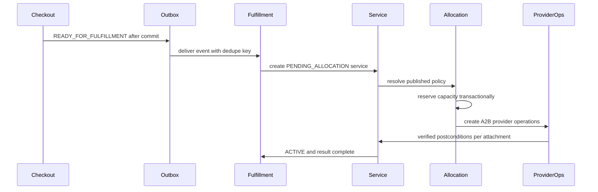
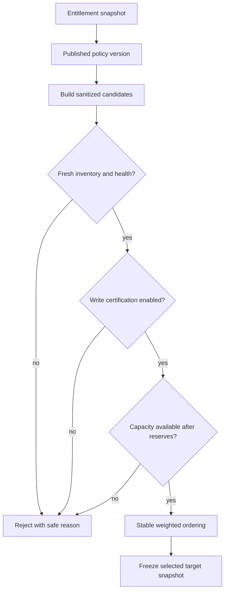
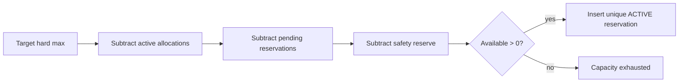
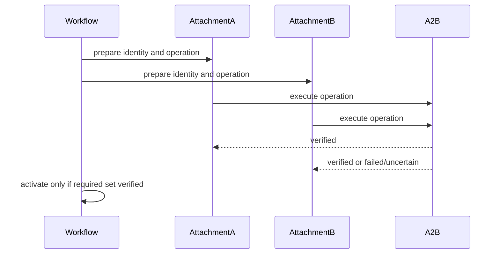
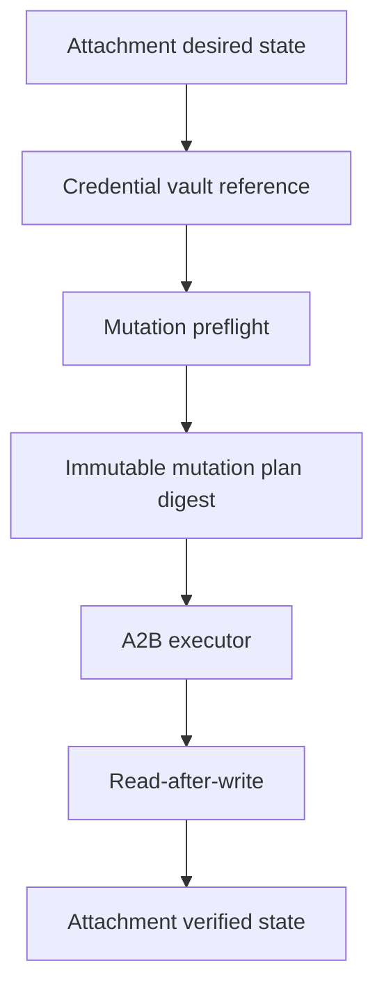
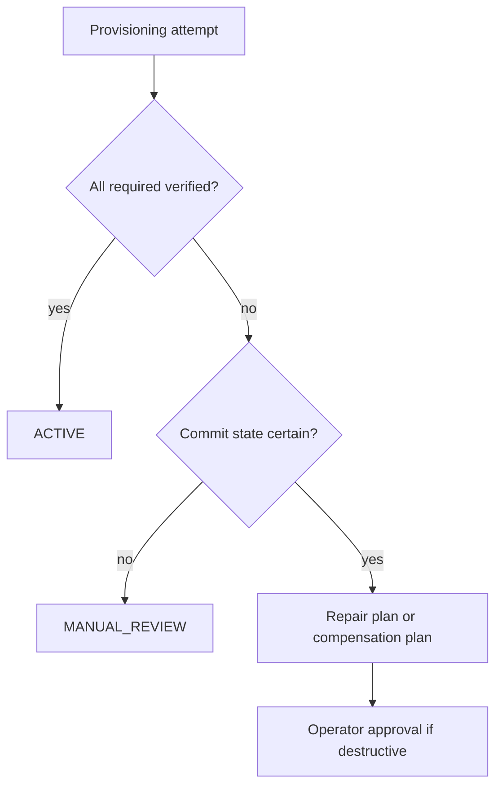
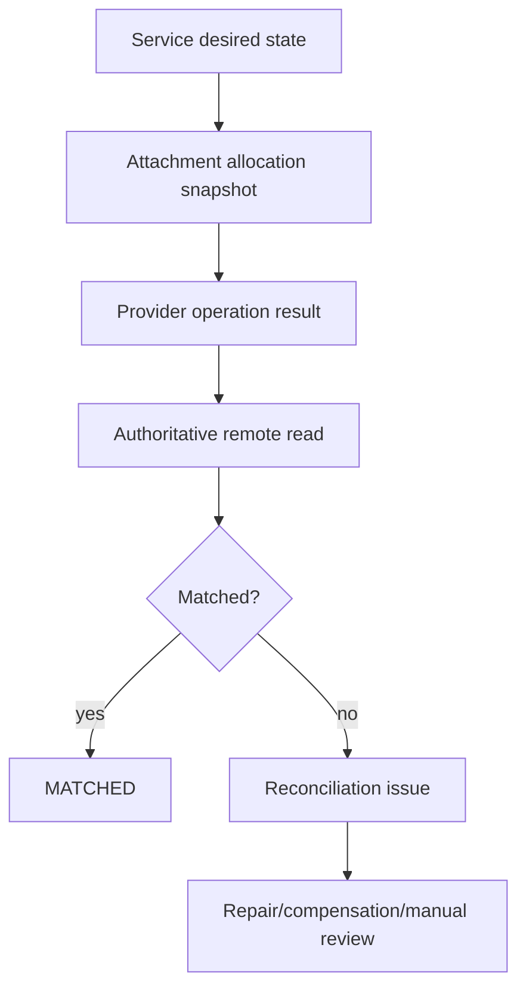
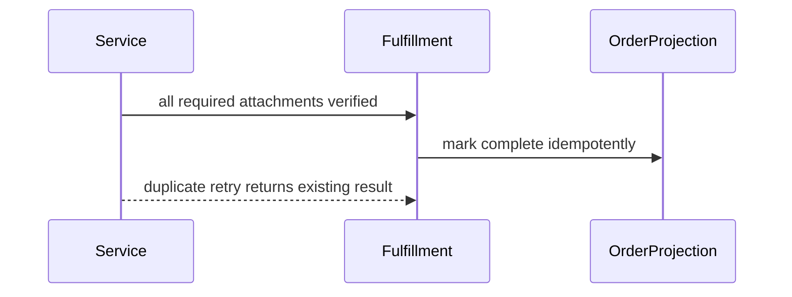

# Milestone 6-B1 Plan — Service Provisioning Core

## Scope

Milestone 6-B1 connects paid commerce to the certified provider-write layer without delivering customer configuration material. It introduces durable service records, immutable entitlement snapshots, fulfillment request ingestion, allocation policy versions, pools, targets, capacity reservations, multi-inbound attachments, provisioning workflow references, reconciliation issues, repair/compensation planning placeholders, permissions and operator surfaces.

## Invariants

- Only `READY_FOR_FULFILLMENT` orders with paid financial state and captured payment may create a service.
- The `(order_item_id, unit_index)` pair is unique across fulfillment requests and services.
- Service `ACTIVE` requires every required attachment to be verified by Milestone 6-A2B postconditions.
- Allocation policy versions are immutable once published; services retain a snapshot.
- Capacity is local and conservative: hard maximum minus active attachments, pending reservations and reserves.
- Provider mutations are represented only by provider-operation references; service code does not call panel adapters.
- Customer/reseller status APIs must not expose provider kind, panel, node, inbound, credentials, subscription links or configuration.

## Paid order to service

## Allocation selection

## Capacity reservation

## Multi-inbound provisioning

## Provider-operation orchestration

Service provisioning creates provider-operation plans and records their IDs on attachments. The operation executor, write gates, canary certificates, contract/version checks and postcondition verification remain owned by Milestone 6-A2B.

## Partial failure, reconciliation and compensation

## Order fulfillment projection

## Operator runbook

1. Publish allocation policy versions only after validation confirms every referenced pool target exists and is certified.
2. Monitor fulfillment, provisioning and reconciliation queues using bounded cursor filters.
3. Retry only workflows marked retry-eligible; uncertain provider operations must reconcile before another create.
4. Approve destructive compensation only after ownership evidence is verified.
5. Treat provider version or contract drift as recertification-required for new provisioning.

## Limitations before 6-B2

No delivery profiles, URI generation, QR codes, subscription links, customer configuration display, renewals, add-ons, migrations between targets or full suspend/resume/terminate operations are implemented in this milestone.
