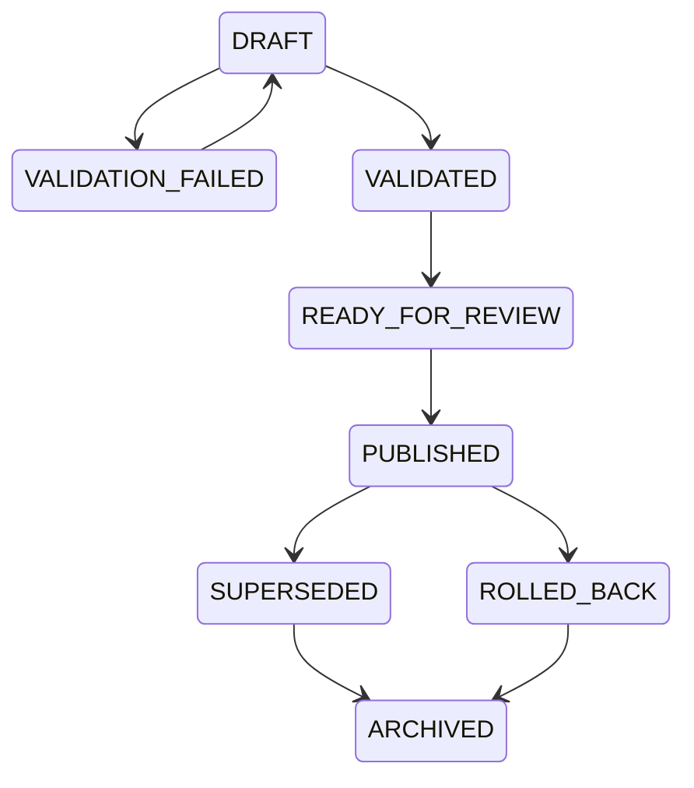
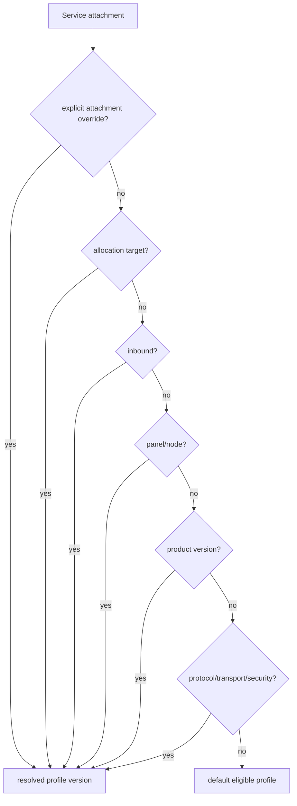
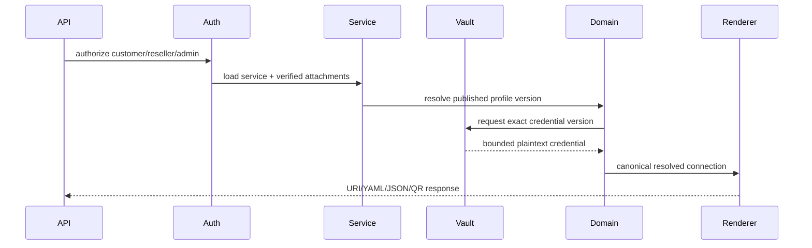
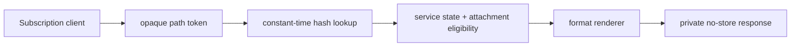
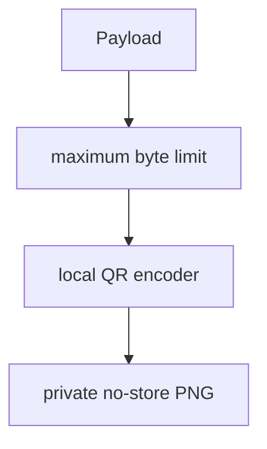

# Milestone 6-B2 — Configuration delivery platform

Date: 2026-07-18.

## Official compatibility sources inspected

- Project X / Xray transport and protocol documentation, checked 2026-07-18: VLESS, VMess, Trojan, Shadowsocks, TLS, REALITY, WebSocket, gRPC, XHTTP and HTTPUpgrade are treated as renderer inputs, not provider links.
- Shadowsocks SIP002/SIP022 documentation, checked 2026-07-18: `ss://` userinfo is URL-safe Base64 of `method:password`; SIP003 plugins are allowlisted.
- MetaCubeX/mihomo official docs and GitHub release `v1.19.28`, checked 2026-07-18: Mihomo is its own YAML schema and is not legacy Clash.
- SagerNet/sing-box official configuration docs and stable release notes, checked 2026-07-18: JSON outbounds use typed protocol schemas and `sing-box check` remains the validation command.

Renderer behavior is pinned by `delivery-uri-2026-07-18`; upstream changes require a new renderer version and compatibility review.

## Scope

6-B2 makes verified ACTIVE services usable by customers through shop-owned canonical connection material. Provider-generated links are never authoritative. Delivery combines verified service attachments, credential-vault material, observed remote identities and immutable Delivery Profile versions into canonical resolved connections consumed by renderers.

## Delivery Profile lifecycle

Published versions are immutable. Publication validates typed public address, port, protocol, transport, security and renderer compatibility, writes an audit/outbox event and atomically marks the prior published version superseded.

## Profile resolution precedence

Equal-priority matches fail with `DELIVERY_PROFILE_AMBIGUOUS`; archived/unpublished profiles cannot render.

## Dynamic fields and compatibility validation

The admin editor is protocol/transport/security-aware. Required fields are enforced and optional blank fields are omitted. Server-only values such as REALITY private keys, certificate private keys, panel sessions and provider tokens are rejected. TLS certificate verification is enabled by default and renderers do not set insecure verification.

## Canonical connection creation

Delivery revisions store service, attachment/profile version references, renderer versions, credential fingerprints, compatibility state and safe remarks. They never store plaintext credentials, complete URIs, YAML/JSON configs or QR bytes.

## Renderers

- VLESS URI: deterministic query ordering, UUID validation, TLS/REALITY/WebSocket/gRPC/XHTTP/HTTPUpgrade fields, IPv6 authority and percent-encoded fragments.
- VMess compatibility URI: deterministic UTF-8 JSON, Base64 payload, explicit `v=2`, `alterId=0` unless a reviewed compatibility contract says otherwise.
- Trojan URI: password percent-encoding, deterministic query ordering, TLS/REALITY and transport parameters.
- Shadowsocks SIP002: URL-safe Base64 userinfo, encoded fragment and allowlisted plugins; AEAD-2022 ciphers are represented explicitly by method.
- Mihomo: safe YAML serialization for single/list/provider output using typed fields.
- Legacy Clash-compatible: separate target; VLESS, REALITY and XHTTP are rejected instead of downgraded.
- sing-box: deterministic JSON outbounds with typed TLS/REALITY and V2Ray transport mappings.

## Subscription retrieval

Tokens contain at least 256 bits of entropy, are URL-safe, stored only as secure hashes, scoped to one service or explicit aggregate, and can be rotated with bounded grace or revoked immediately. Format routes are authoritative: `/subscriptions/{opaqueToken}`, `/links`, `/mihomo`, `/clash`, `/sing-box`.

## QR generation

QR contents are never sent to a third-party endpoint and are not persisted as media files.

## Authorization and security

Customer/reseller/admin delivery APIs must authorize before vault access. Reseller access is limited to managed customers with delivery capability. Credential-bearing responses use `Cache-Control: private, no-store`; access events use safe references only. Logs, metrics and audit records must not contain complete URIs, credentials, tokens, QR payloads, YAML/JSON configurations, panel URLs or raw vault material.

## UI surfaces

Customer-web and Mini App surfaces expose service delivery status, deliberate reveal, copy, QR, subscription rotation/revocation and format downloads in Persian RTL without browser persistence. Reseller-web exposes the same for authorized managed customers. Admin-web exposes Delivery Profile management, compatibility, service delivery resolution and subscriptions.

## Known unsupported combinations

- Legacy Clash-compatible output rejects VLESS, REALITY and XHTTP.
- XHTTP output is emitted only for renderers whose pinned compatibility target has an explicit field mapping.
- Private REALITY keys, certificate private keys and provider-generated links are rejected as input.
- Unsupported plugins for Shadowsocks fail with `DELIVERY_RENDERER_UNSUPPORTED`.
