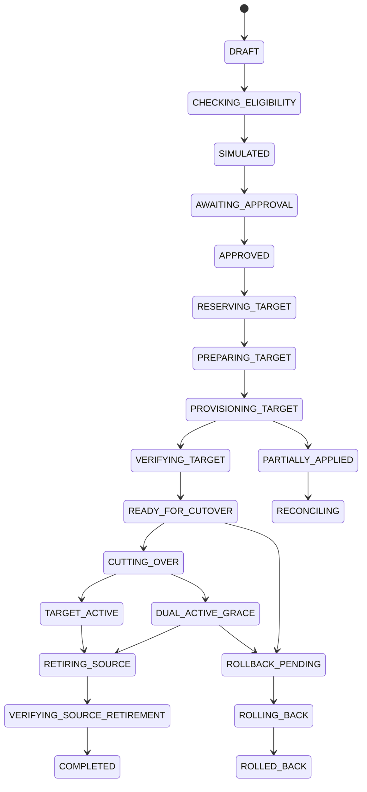
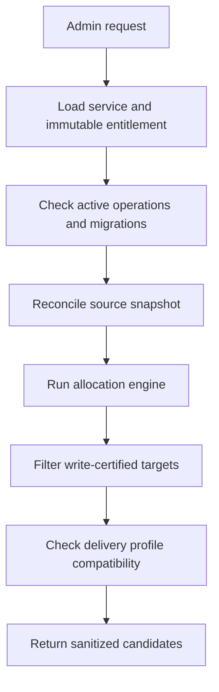
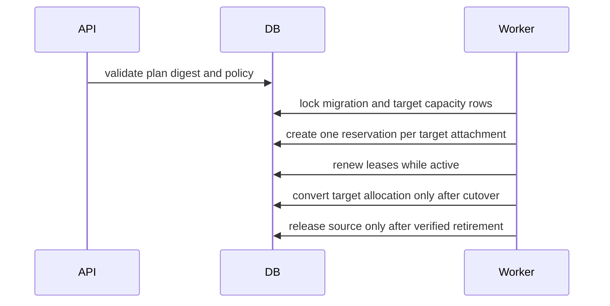
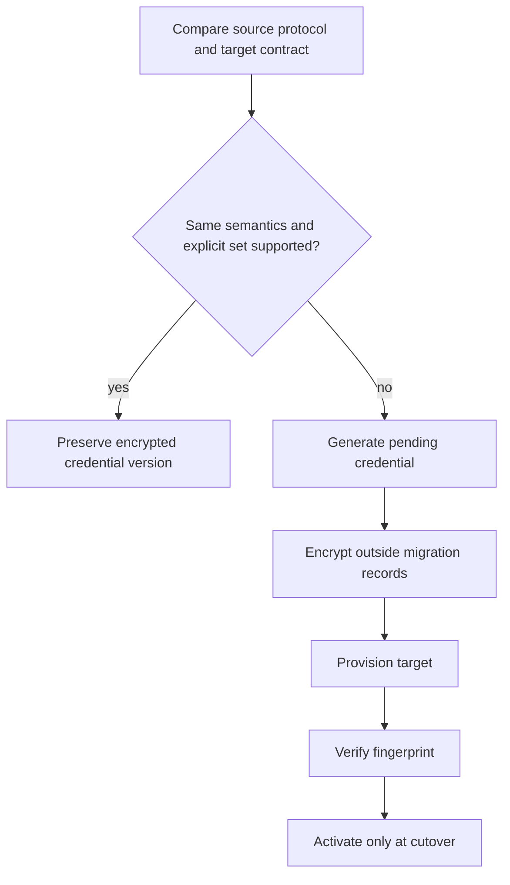
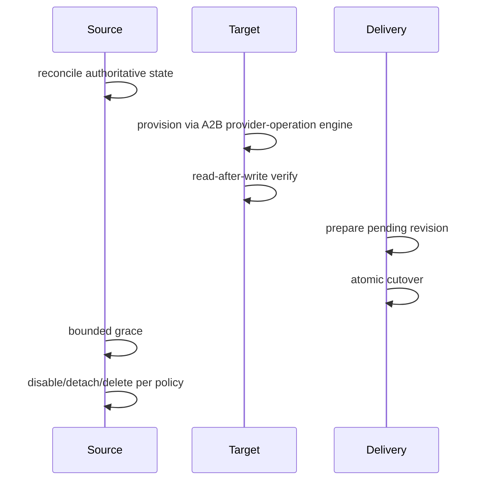
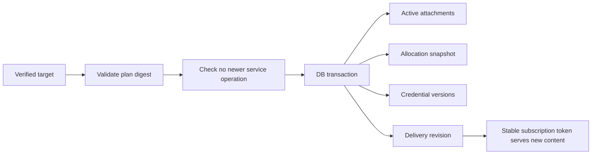
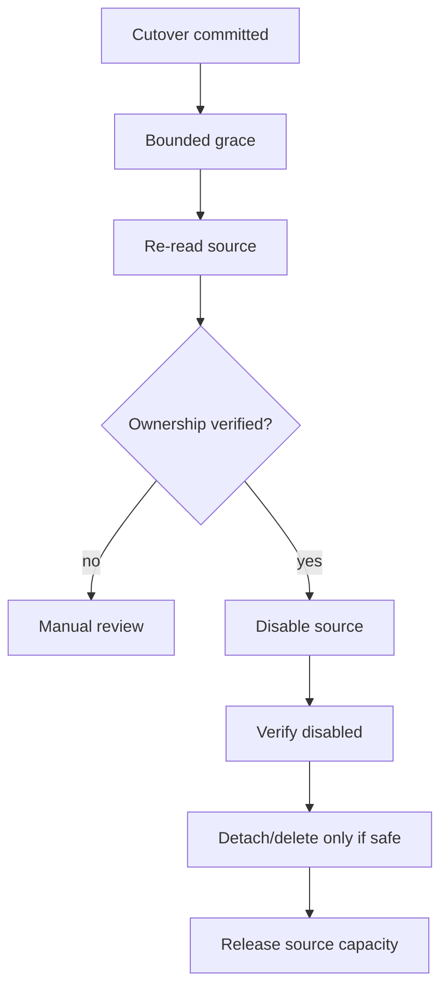
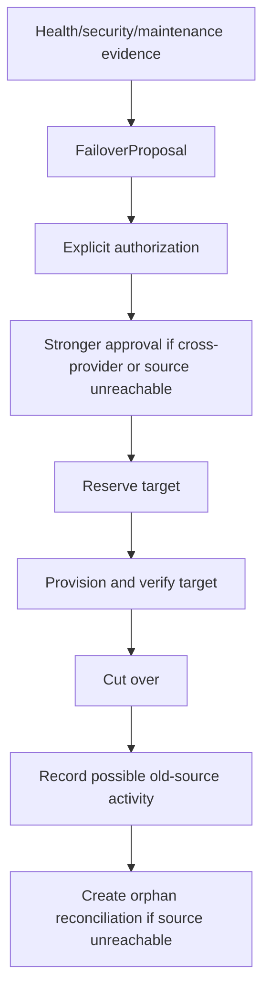
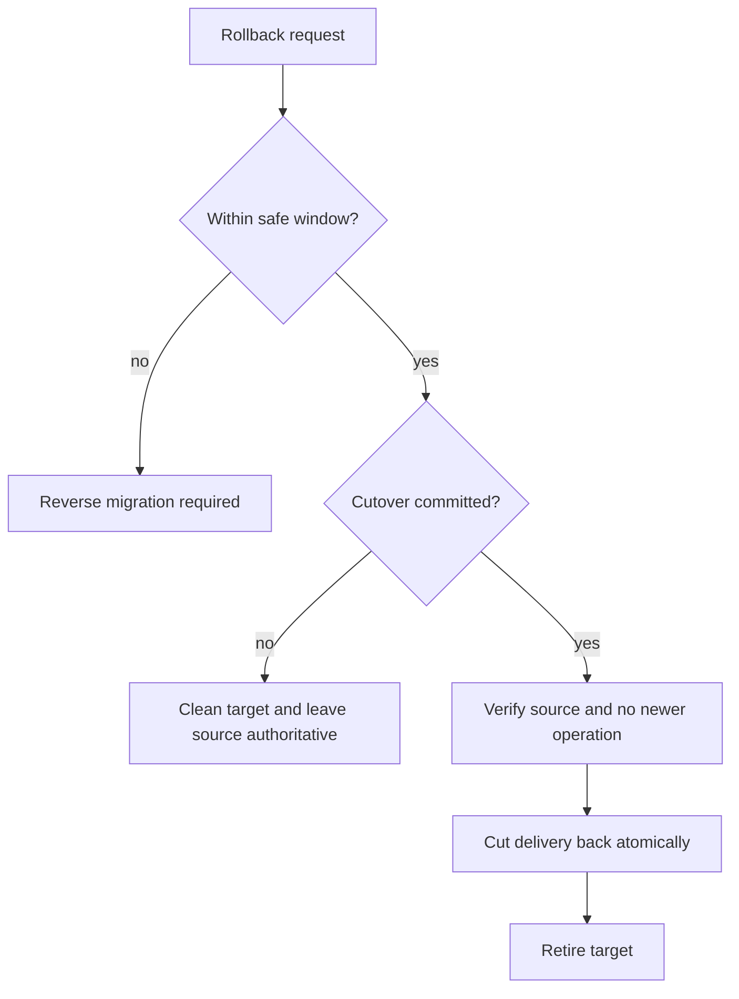
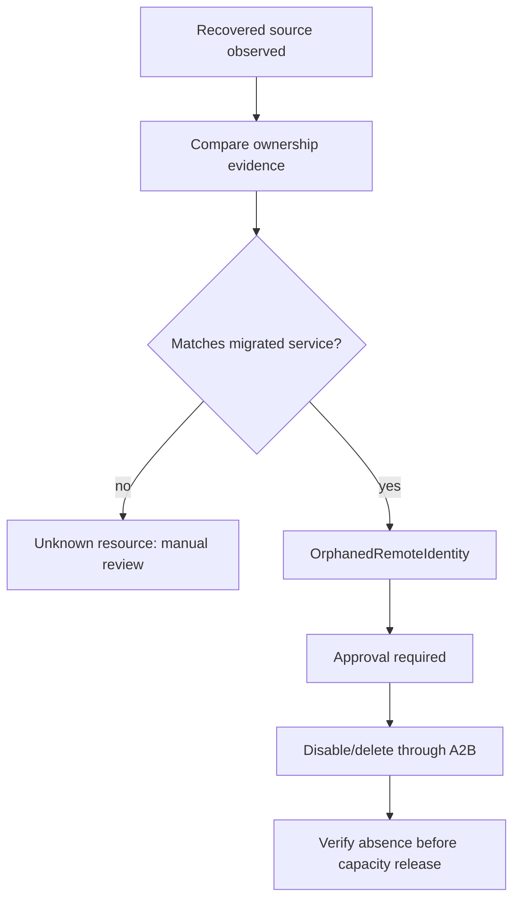

# Milestone 6-C2 Plan: Production service migration and controlled failover

## Scope
Milestone 6-C2 adds controlled migration of an existing service attachment or complete service across inbounds, nodes, panels, certified providers, allocation pools and delivery profile versions. It does **not** create a new commercial service, change payer attribution, rewrite orders/invoices/payments, expose raw infrastructure to customers, or perform unattended mass failover.

## Lifecycle

Every transition validates current status, actor permission, optimistic version and immutable plan digest, then emits audit/outbox work from the application layer.

## Eligibility and target selection

Eligibility performs no remote mutation and returns typed outcomes such as `ELIGIBLE`, `SOURCE_UNCERTAIN`, `TARGET_CAPACITY_UNAVAILABLE`, `RECERTIFICATION_REQUIRED` or `CONFLICTING_OPERATION`.

## Target reservation

During dual-active grace, both source and target consume capacity.

## Credential preservation and rotation

Credentials are never blindly converted between protocols and plaintext never enters migration records, logs, audit, metrics or browser storage.

## Warm migration

## Atomic delivery cutover

No provider HTTP call occurs inside the cutover transaction.

## Dual-active grace and source retirement

## Controlled failover

Health events may propose failover but never execute it automatically.

## Rollback

Rollback never rewrites history and cannot silently overwrite newer service operations.

## Orphan-source reconciliation

## APIs and UI
Administration APIs provide eligibility, simulation, draft creation, approval, reservation, execution, cutover, cleanup, rollback, reconciliation, failover proposals and orphan cleanup review. Customer/reseller APIs expose only safe migration state and delivery refresh guidance. The admin console adds RTL routes for service migrations, failover proposals and orphaned identities.

## Known provider limitations
Only certified provider contracts may be used. Cross-provider credential preservation is blocked unless exact protocol identity semantics and target write contracts support setting the same credential. Provider-specific unsupported device/IP/HWID semantics block migration or require explicit policy approval.
