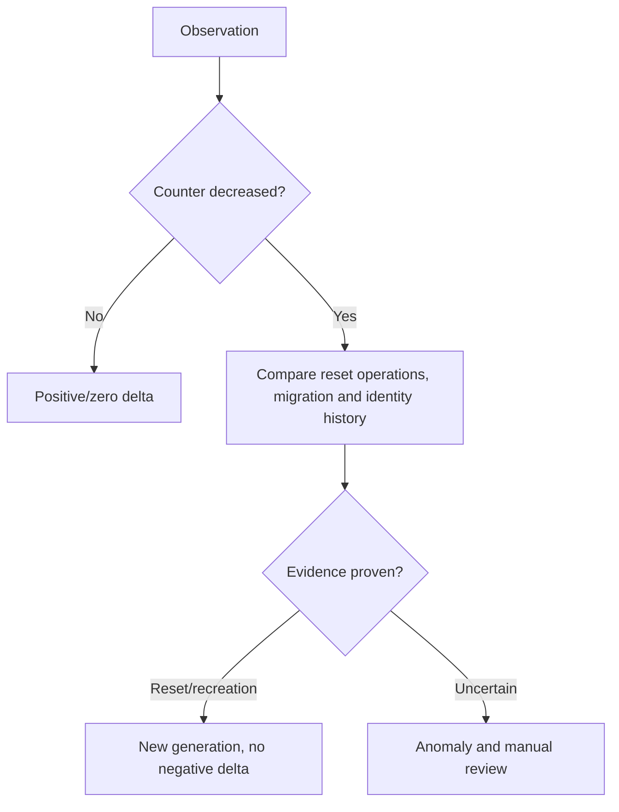
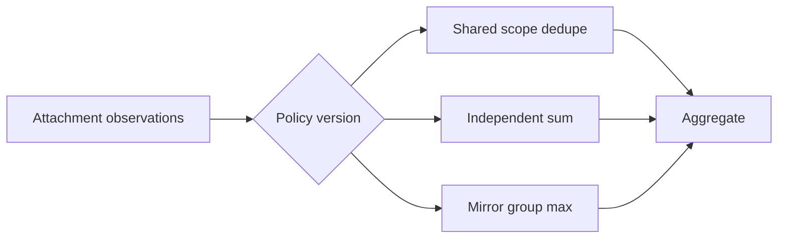
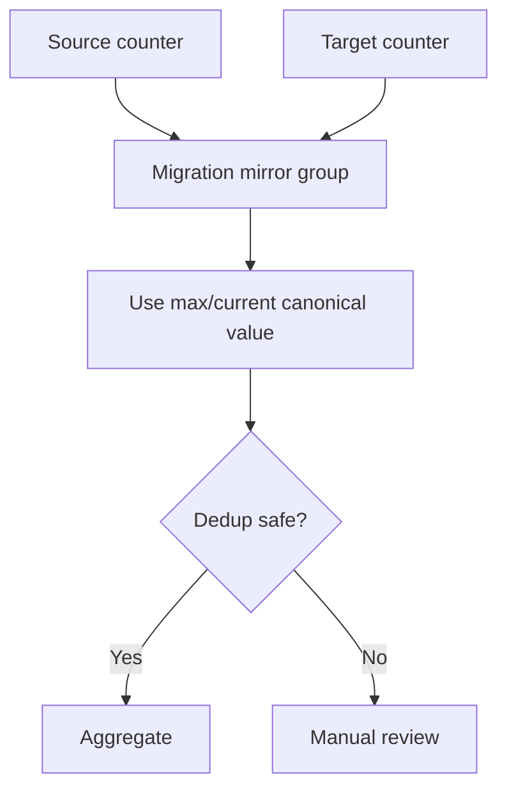
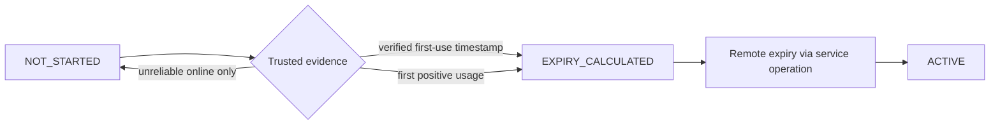
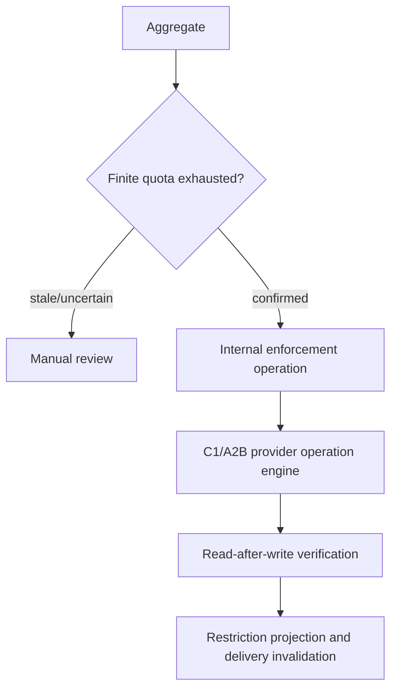
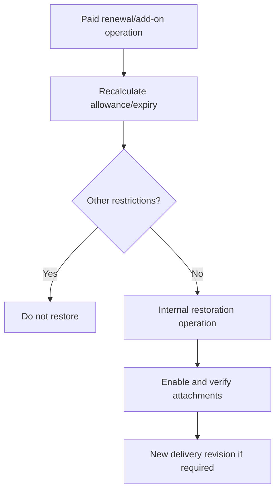
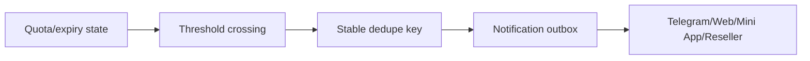
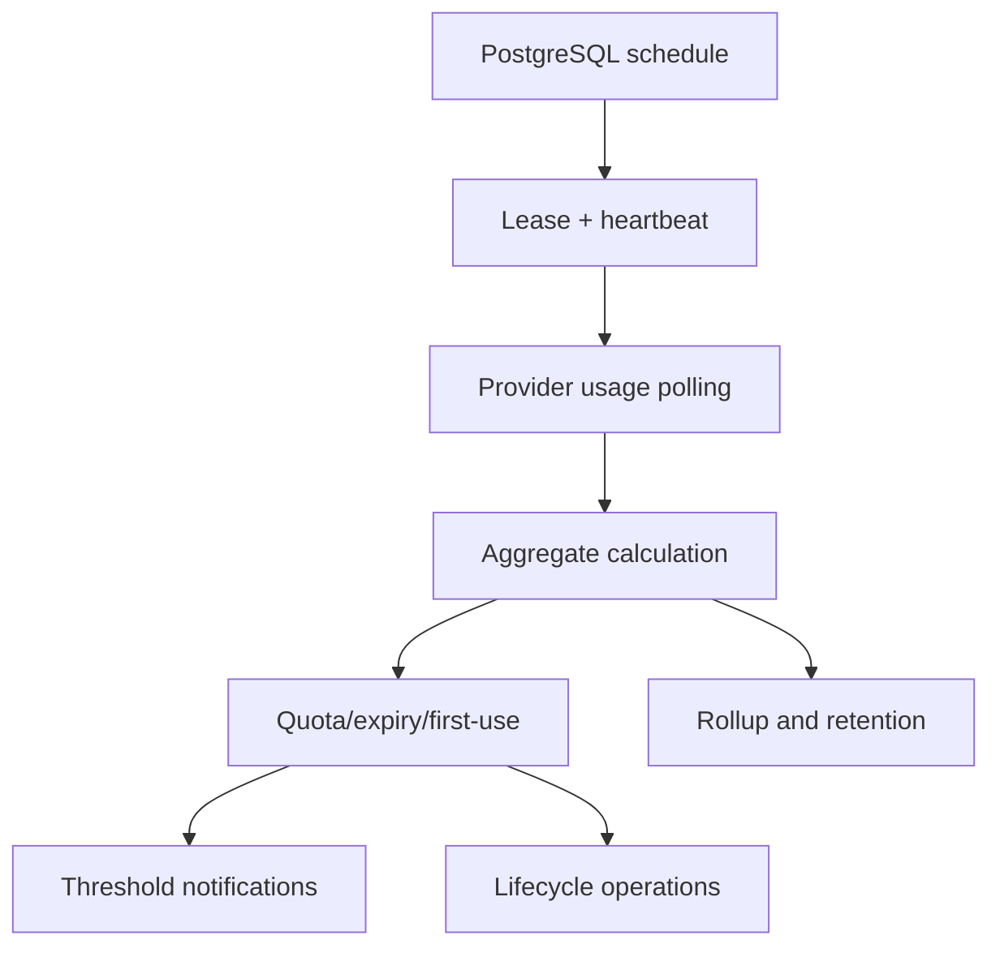

# Milestone 6-D1 Plan: Usage Synchronization and Lifecycle Automation

Milestone 6-D1 implements authoritative service usage accounting, provider traffic/expiry synchronization, quota and expiry lifecycle automation, threshold notifications, bounded workers, retention/rollups and safe customer/reseller/admin surfaces.

## Provider counter semantics

| Provider | Certified contract | Counter field | Scope | Reset/recreation | Expiry/online limitations |
|---|---|---|---|---|---|
| Sanaei 3x-ui | `sanaei-3x-ui-read-v1` | verified `up + down` bytes | inbound client | reset operation starts a new local generation | online flag is not first-use evidence |
| Alireza x-ui | `alireza-x-ui-read-v1` | normalized `total` bytes | client | counter decrease needs operation/history comparison | online flag is not first-use evidence |
| PasarGuard | `pasarguard-read-v1` | `traffic_bytes` | panel user | reset/recreation changes generation | verified first-use expiry is supported |

Provider DTOs stay in adapters. Usage services consume only normalized observations and never raw payloads, URLs, credentials, cookies, inbound IDs or complete remote identity values.

## Accounting model

Purchased allowance is derived from immutable entitlements and successful service-operation revisions. Provider counters are observations. Local lifetime usage is append-only positive deltas and approved corrections. Current-cycle usage is calculated from the active usage cycle. Remaining allowance is finite purchased bytes minus authoritative current-cycle usage; unlimited and unknown are distinct states.

## Counter generations

## Aggregation strategies

Supported deterministic strategies are `SINGLE_ATTACHMENT`, `PRIMARY_ATTACHMENT_ONLY`, `SHARED_IDENTITY_DEDUPLICATED`, `SUM_INDEPENDENT_IDENTITIES`, `MAX_MIRRORED_IDENTITIES`, `PROVIDER_CANONICAL_USER_COUNTER` and `MIGRATION_OVERLAP_DEDUPLICATED`.

## Migration overlap

## Usage cycles and reset generations

Cycles support service lifetime, purchase period, renewal period, manual reset period and provider periodic limit where officially certified. A traffic reset creates a provider counter generation but does not automatically reset purchased allowance.

## First-use expiry

## Quota and expiry enforcement

Expiry follows local entitlement first, consumes committed renewals before enforcement, respects grace policy and never deletes service or financial history.

## Renewal and add-on restoration

## Threshold notifications

## Worker scheduling

Intervals are bounded by safe minimums; active finite services poll more often than unlimited or suspended services, and provider rate limits apply Retry-After/backoff.

## APIs and interfaces

Customer and reseller APIs expose service usage summaries, rollups, freshness and safe operation links only. Admin APIs expose dashboards, detail, observations, cycles, generations, anomalies, policies, sync runs, enforcement/restoration and notification delivery. Routes are thin and use typed schemas.

UI routes added for review:
- Customer: `/service-usage`
- Reseller: `/service-usage`
- Admin: `/management/service-usage`, `/management/usage-policies`, `/management/usage-anomalies`, `/management/lifecycle-automation`

## Permissions and security

Milestone permissions are seeded with UUID values for service usage read/sync/policy/threshold/anomaly/correction and lifecycle automation read/manage/retry. No credential, subscription token, full configuration, raw provider payload, panel URL, Telegram ID or remote infrastructure identifier is stored in usage records or exposed in API/UI.

## Retention and rollups

Raw immutable observations are retained for a bounded policy period; hourly/daily rollups and lifetime checkpoints are retained longer. Cleanup is separate from polling and skips unresolved reconciliation/anomaly references.

## Real-staging requirements

Before enabling production automation per provider, operators must verify exact counter fields, reset markers, disabled-user behavior, expiry drift, first-use evidence and eventual consistency against certified staging panels.
