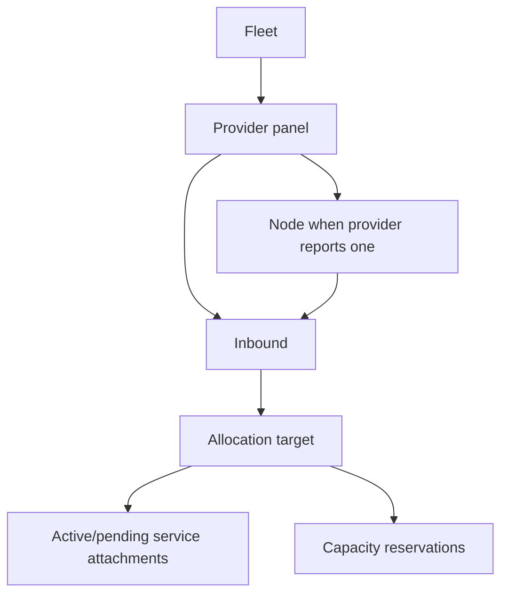
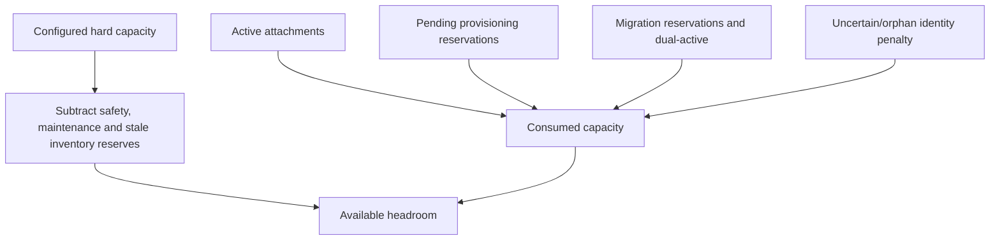
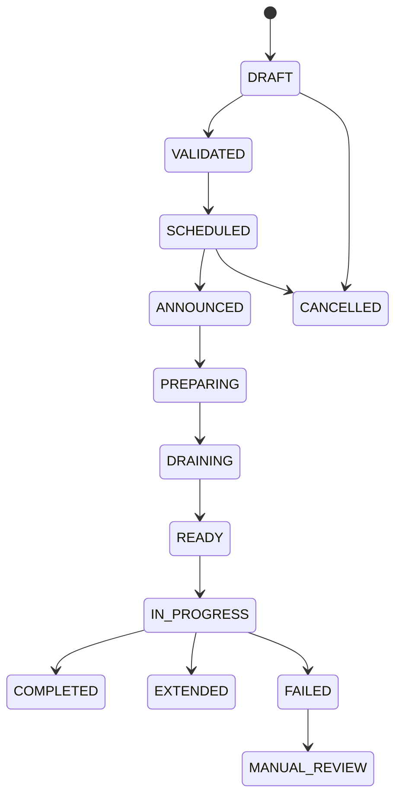
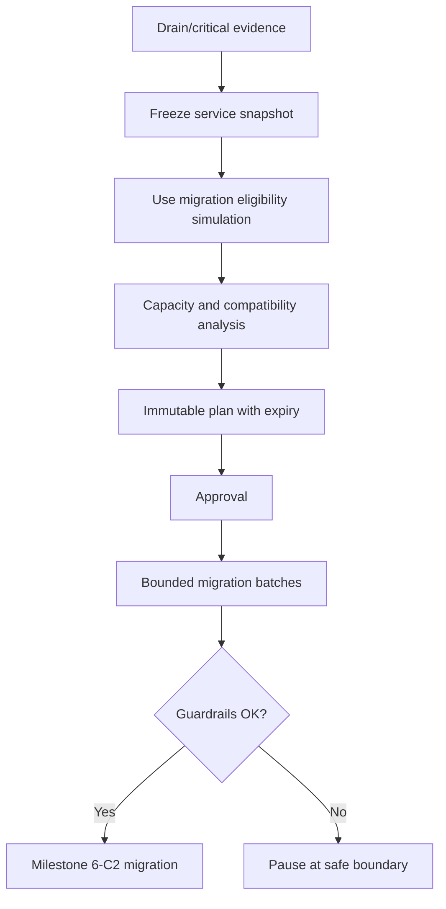
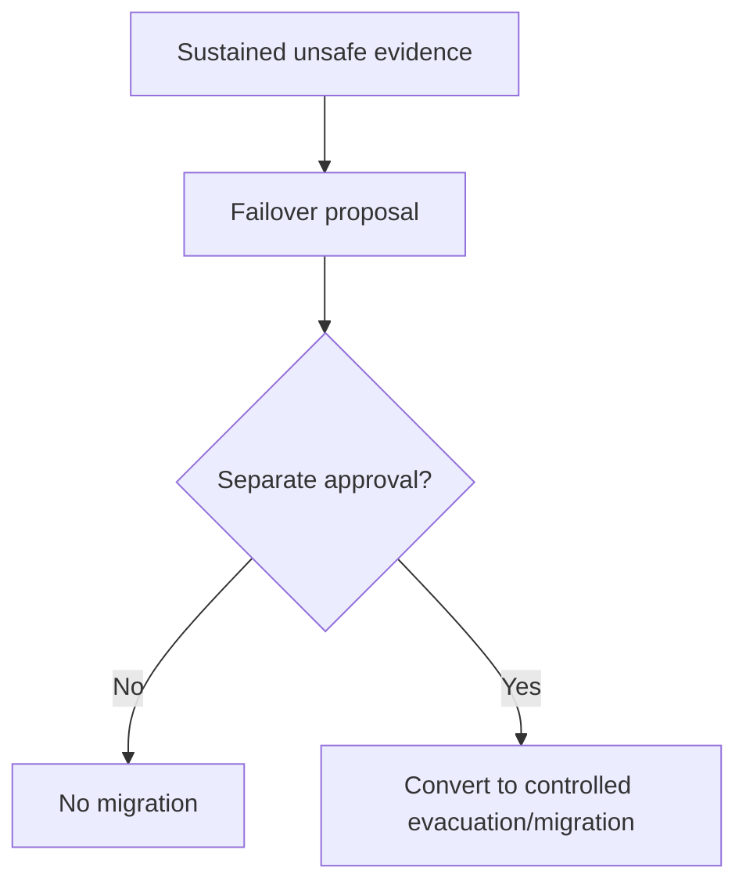
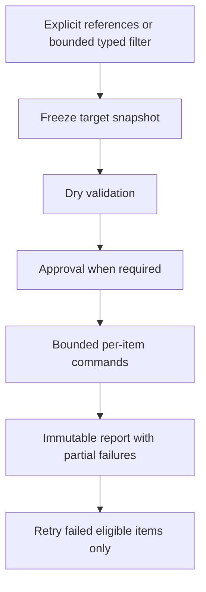
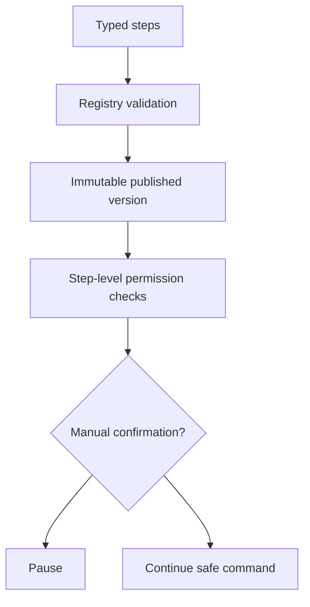

# Milestone 6-D2 Plan: Fleet Operations

Milestone 6-D2 adds the production operations layer for certified VPN providers. PostgreSQL is the durable source of truth; Redis/worker memory are lease/cache mechanisms only. Fleet code orchestrates existing provider sync, provisioning, service operations, migration/failover, usage automation, status, notification, audit and Security Center services and never calls provider adapters or raw HTTP transports directly.

## Fleet hierarchy

Resources preserve provider-specific topology, keep remote identifiers scoped to their panel, retain history when archived, and expose only opaque safe labels to administrators. Customer and reseller APIs show impact only, never panel/node/inbound identifiers.

## Health evidence and limitations

Health signals include panel API reachability, authentication, TLS, certificate pinning, version, contract, read/write certification, inventory and usage freshness, circuit breaker, node/inbound reported state, drift, ownership conflicts, capacity warnings and worker backlog. Evidence stores source, observed time, freshness window, state, confidence, safe evidence reference and sanitized details only.

Control-plane availability, provider API availability, provider-reported node state, inbound enabled state, customer data-plane connectivity, customer-perceived latency and successful configuration import are explicitly different. This milestone exposes control-plane and provider-reported health only.

## Capacity accounting

All authoritative capacity values are non-negative integers. Missing capacity is unknown, not unlimited. Remote identity uncertainty reduces headroom conservatively. Allocation and migration must reserve transactionally and cannot allocate to archived or draining targets.

## Capacity forecasting

Forecasts use deterministic integer arithmetic over real snapshots. Insufficient data never fabricates an exhaustion date. Forecasts are advisory; allocation still uses current transactional capacity.

## Maintenance and drain

Maintenance uses UTC timestamps, overlap validation, explicit impact, rollback policy and safe notifications. Draining blocks new allocations and migration targets while existing services remain until migration or approved exception.

## Evacuation planning and execution

Strategies are typed and bounded: low risk first, expiring last, high priority first, balance target headroom, maintain location, maintain provider when possible, and cross-provider only when required. No provider mutation occurs during planning.

## Failover proposal and approval

Signals may create proposals but never execute failover automatically. Self-approval is denied for high-risk actions.

## Recovery proposal

Recovery does not move services back automatically and requires fresh version, contract, health and write-certification evidence.

## Bulk operation execution

Only allowlisted operations are supported. Arbitrary provider commands, remote delete, credential reveal, balance changes and entitlement reductions are forbidden.

## Runbook execution

Runbooks have no shell, HTTP, Python, JavaScript, SQL, secret access or unregistered provider operation steps.

## Operator procedures

1. Inspect health evidence and freshness before changing allocation state.
2. Schedule maintenance with safe customer/reseller notice.
3. Start drain only after validating capacity and active operations.
4. Simulate evacuation and resolve manual-review blockers.
5. Obtain separate approval for high-risk or cross-provider moves.
6. Execute bounded migration batches and pause on guardrails.
7. Verify source cleanup before releasing capacity.
8. Use recovery proposals after resources recover; do not automatically reverse migrate.

## Real-staging requirements and limitations

Operators must validate provider-specific inventory freshness, capacity identity counts, migration cleanup verification, rate limits, certification invalidation and notification templates against certified staging panels before production enablement. End-to-end VPN connectivity probes are out of scope and must be designed separately before any customer-connectivity health claim.
