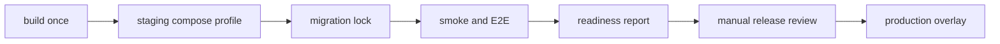

# Milestone 7-A1 plan: production-staging readiness

Milestone 7-A1 adds production-like staging boundaries, strict startup validation, operational evidence records, health probes, release metadata, SLO/alert/dashboard definitions, backup/restore tooling, provider certification gating, operations UI links, runbooks, and validation tests. It does **not** launch production or mark the system `PRODUCTION_READY`.

## Verified provider targets

Rechecked on 2026-07-18 against official release pages: MHSanaei/3x-ui stable line, alireza0/x-ui releases, and PasarGuard/panel releases. Existing repository contract targets remain unchanged: Sanaei 3x-ui `v3.5.0`, Alireza x-ui `v1.11.3`, PasarGuard `v4.0.2`. Newer upstream releases require a later contract review before target changes.

## Implementation map

## Acceptance boundaries

* Live provider certification defaults to `NOT_RUN` until explicit staging credentials and acknowledgements are supplied.
* Production configuration fails closed when secrets, HTTPS origins, cookie, CORS, backup, or Telegram requirements are missing.
* Backups and restore drills use synthetic data in CI and require exact confirmation for production restore.
