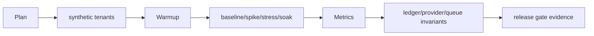
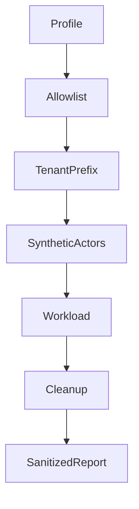
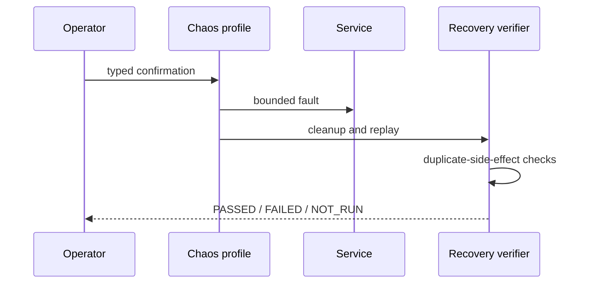
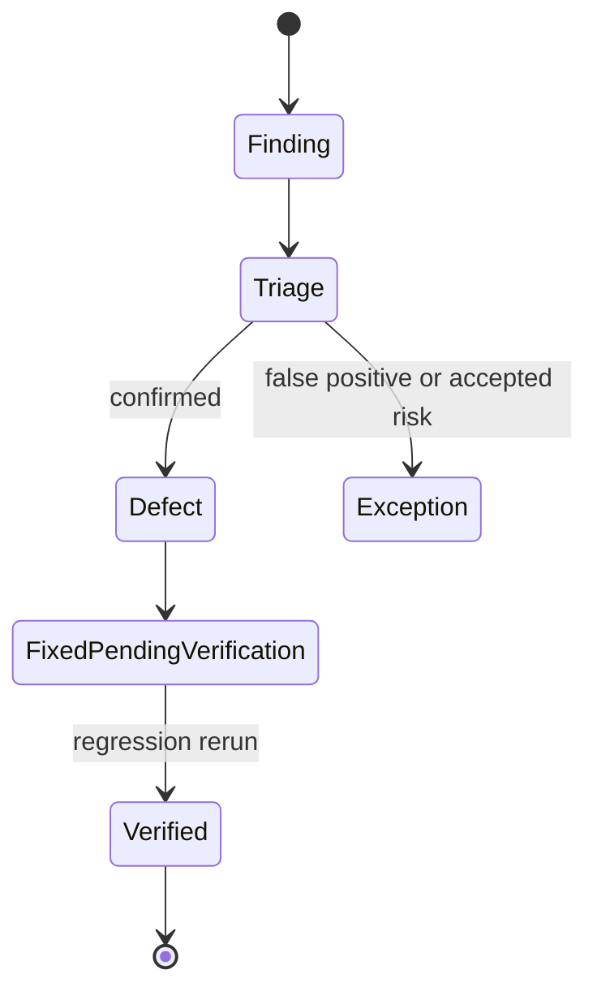
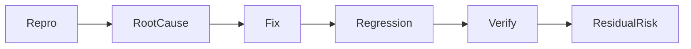
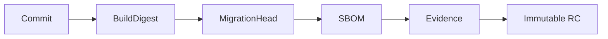
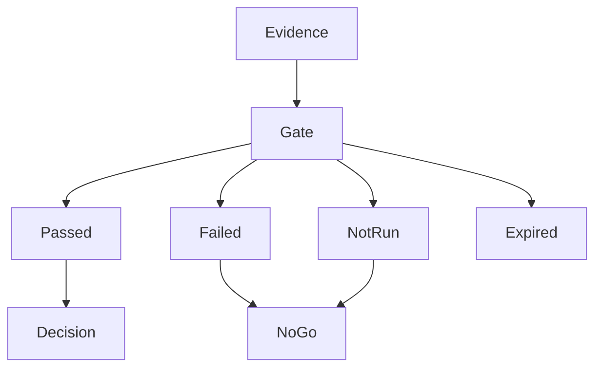
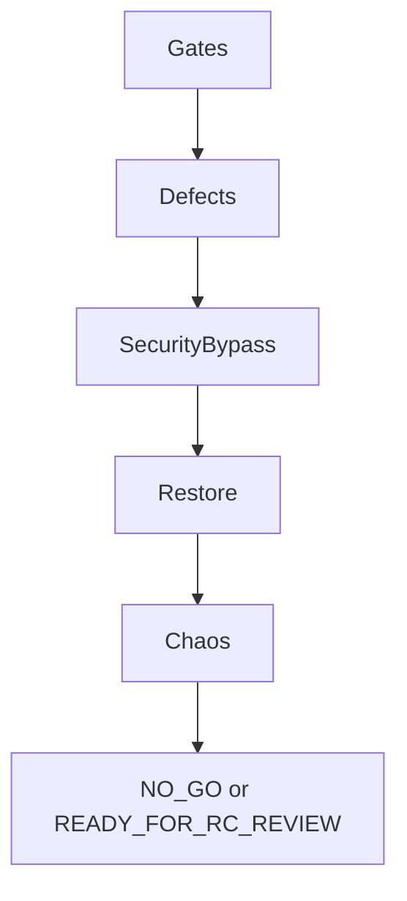

# Milestone 7-A2 — Release Candidate hardening plan and evidence

## Scope
Milestone 7-A2 adds reproducible quality evidence for performance, load, spike, stress, bounded soak, chaos/reliability, isolated security assessment, authorization/tenant isolation, bug bash, accessibility, Release Candidates, release gates and Go/No-Go review. It does not deploy production, add business features, or mark the platform production-ready.

## Execution profiles
| Profile | Purpose | Default PR behavior |
| --- | --- | --- |
| `CI_SAFE` | Bounded parser, authorization, gate and invariant checks | Runs in ordinary PRs |
| `LOCAL_ISOLATED` | Developer stack baseline and restore drills | Opt-in locally |
| `STAGING_STANDARD` | Smoke, provider mock certification and readiness evidence | Manual |
| `STAGING_LOAD` | Baseline/spike/stress/soak at staging scale | Manual with typed confirmation |
| `STAGING_SECURITY` | Isolated DAST and manual security review | Manual with allowlist |
| `STAGING_CHAOS` | Fault injection and recovery drills | Manual with typed confirmation |

Production origins are rejected. Provider writes require dedicated certified staging instances. Missing environment-dependent evidence remains `NOT_RUN`.

## Workload profiles
- Public/read-heavy: landing, status, catalog, plan details, knowledge, safe subscription retrieval.
- Authentication: Telegram/customer bootstrap, admin/reseller login, refresh, revocation and expired sessions.
- Commerce: quotes, custom validation, checkout, wallet/reseller orders, invoice retrieval and duplicate webhook bursts.
- Service lifecycle: fulfillment ingestion, allocation, provider mock operation, activation, rendering, renewal, suspend/resume, usage and migration.
- Support: conversation, messages, agent inbox, realtime/polling, SLA worker and safe attachment metadata.
- Operations: inventory sync, usage polling, outbox, notifications, reconciliation, fleet health and dashboards.
- Mixed CI-safe: deterministic read/write/worker/subscription traffic with bounded data.

## Budgets and safety stops
Budgets are versioned against Milestone 7-A1 SLOs and staging resources. A run records throughput, success/error rate, p50/p95/p99, timeout rate, CPU, memory, DB waits, Redis latency, queue depth, outbox lag, provider mock rate and frontend vitals where available. Stress stops automatically on excessive error rate, DB pool pressure, memory threshold, queue lag, provider mock overload or environment instability.

## Diagrams

## Current Codex evidence
CI-safe deterministic domain and migration tests were added. Long staging load, DAST, chaos and live-provider certification were not executed in Codex and must be recorded as `NOT_RUN` until credentials, allowlisted origins and typed confirmations are supplied.

## Blockers before controlled canary
- Execute staging baseline/load and compare to budgets.
- Execute required restore drill with workload-generated backup.
- Execute bounded chaos recovery against isolated staging.
- Complete isolated DAST review and triage confirmed findings.
- Complete live provider certification independently for 3X-UI, Alireza X-UI and PasarGuard, or approve explicit pre-canary blockers.
