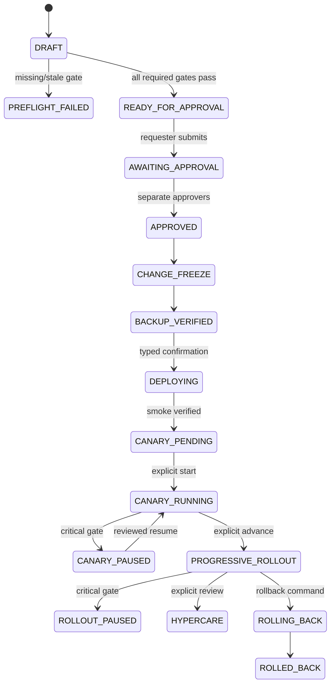
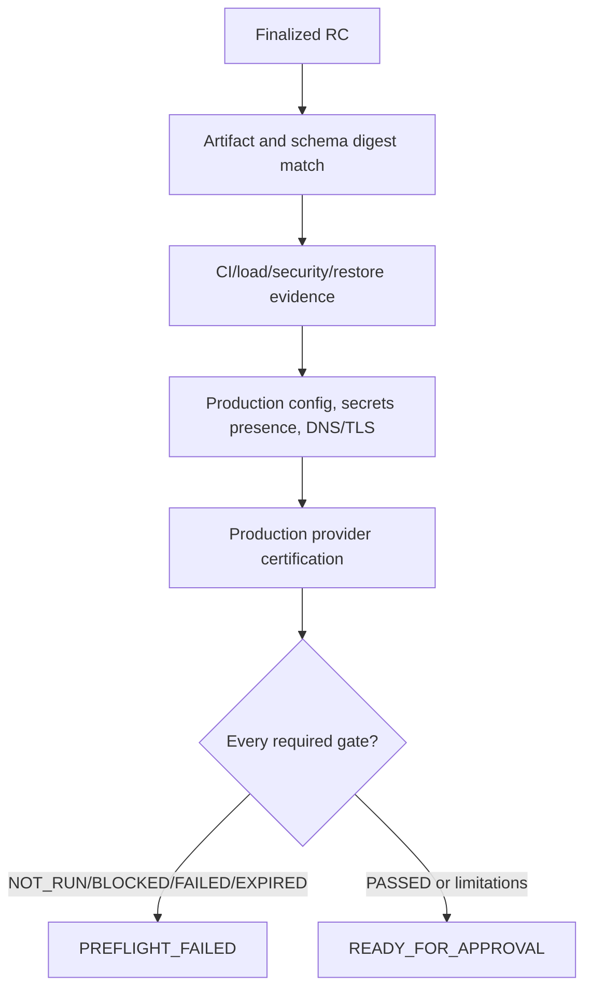
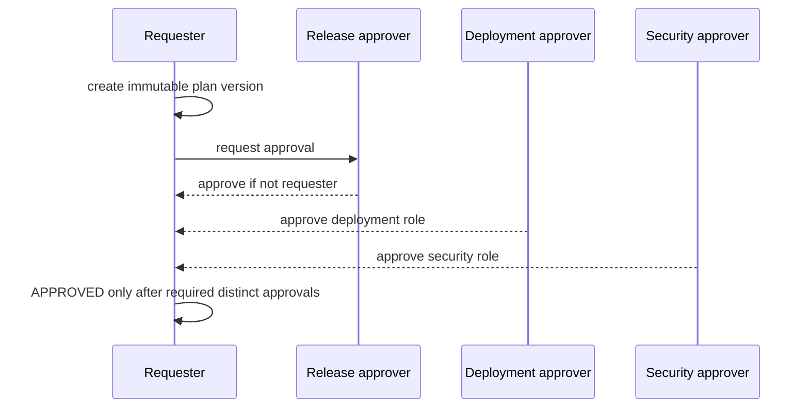
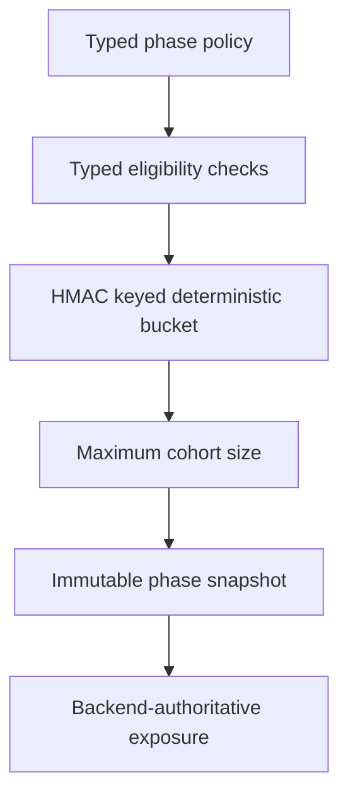
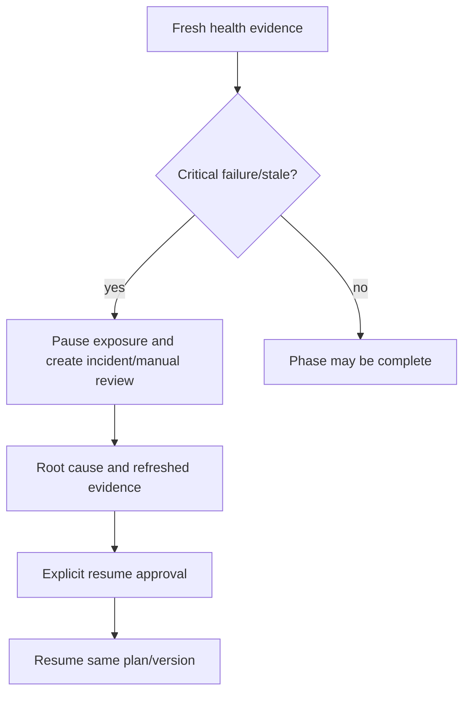
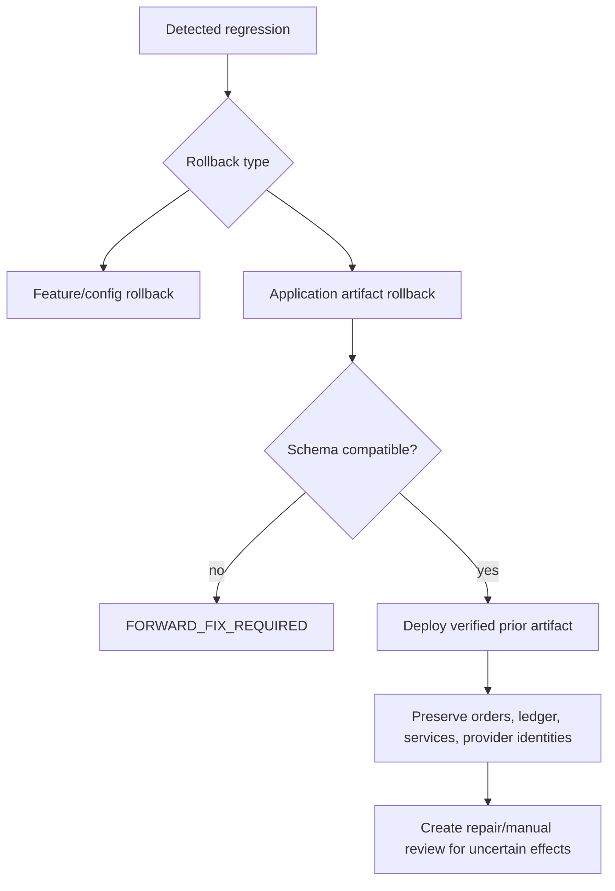
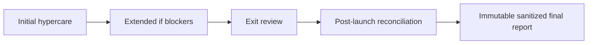

# Milestone 7-B plan: controlled production rollout

Milestone 7-B implements the release-control platform for production-style rollout without performing a real production launch. Normal CI and Codex runs cannot deploy, access production secrets, enable real payments, register real provider credentials, select real customers, migrate real customers or mark launch success. Missing production access remains `NOT_RUN`, `BLOCKED` or `EXPIRED`.

Provider target compatibility was rechecked on 2026-07-18 against official GitHub release listings: MHSanaei/3x-ui `v3.5.0`, alireza0/x-ui `v1.11.3`, and PasarGuard/panel `v4.0.2` remain the certified target names from Milestone 7-A1. No certified target is changed by this milestone.

## Domain scope

The domain model adds typed production release plans, immutable plan versions bound to one finalized Release Candidate, artifacts, preflight gates, approvals, phase policies, cohorts, provider production certification, health pause/resume, rollback types, reconciliation outcomes and sanitized final reports.

Required gates are evaluated independently: `NOT_RUN`, `PASSED`, `PASSED_WITH_LIMITATIONS`, `FAILED`, `BLOCKED`, and `EXPIRED` are visible states. No aggregate ready flag may hide failed or missing evidence.

## Lifecycle

## Production preflight

## Approval separation

## Deployment orchestration

```mermaid
flowchart LR
  Validate[Validate plan/RC/environment] --> Freeze[Verify change freeze]
  Freeze --> Backup[Verify recent encrypted backup]
  Backup --> Lock[Acquire deployment lock]
  Lock --> Artifact[Deploy immutable artifacts]
  Artifact --> Migration[Run migrations once]
  Migration --> Smoke[Startup/readiness/smoke]
  Smoke --> Evidence[Deployment evidence]
  Evidence --> Wait[Wait for explicit canary start]
```

The GitHub workflow is opt-in `workflow_dispatch`, bound to the `production` environment, requires typed confirmation, requests no secrets by default and reports blocked when no external protected production runner is configured.

## Canary phases and cohort selection

Phases include deployment smoke, synthetic internal, staff, provider canary, allowlisted customer, percentage phases and full exposure. Real-customer canary remains disabled by default and requires separate approval.

## Health-gate pause and resume

## Rollback and service reconciliation

## Hypercare and completion report

Final decisions are bounded: `ROLLED_BACK`, `PARTIALLY_DEPLOYED`, `HYPERCARE_REQUIRED`, `COMPLETED_WITH_LIMITATIONS`, or `CONTROLLED_ROLLOUT_COMPLETED`. There is no unconditional production success state.

## Deferred production-only checks

Real production preflight, deployment, canary, rollback, DNS/TLS mutation, provider certification against live panels, real payment enablement, customer migration and real completion reporting require protected operator action and production evidence outside Codex.
